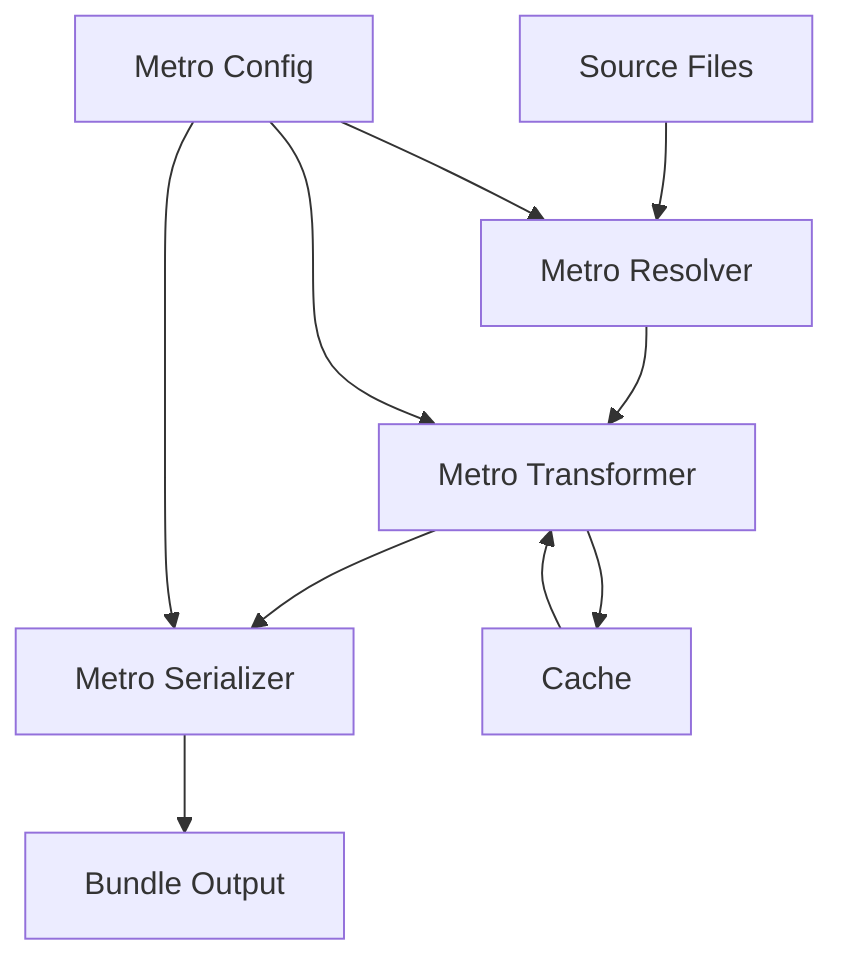

# 🚀 **Metro Config & Bundling**

> **Master Metro bundler configuration, bundle optimization, and build processes for React Native applications**

<link rel="stylesheet" href="../../common-styles.css">

---

## 📚 **Table of Contents**

- [Metro Bundler Overview](#-metro-bundler-overview)
- [Metro Configuration](#-metro-configuration)
- [Bundle Optimization](#-bundle-optimization)
- [Build Processes](#-build-processes)
- [Performance Monitoring](#-performance-monitoring)
- [Best Practices](#-best-practices)
- [Interview Questions](#-interview-questions)

---

## 🏗️ **Metro Bundler Overview**

### **What is Metro?**

Metro is the JavaScript bundler for React Native applications. It's responsible for:
- **Transforming** JavaScript and TypeScript code
- **Bundling** modules into a single file
- **Optimizing** code for mobile platforms
- **Hot reloading** during development

### **Metro Architecture**



---

## ⚙️ **Metro Configuration**

### **Basic Metro Config**

<button onclick="copyCode(this)" class="copy-btn">📋 Copy</button>
```javascript
// metro.config.js
const { getDefaultConfig } = require('metro-config');

module.exports = (async () => {
  const {
    resolver: { sourceExts, assetExts },
  } = await getDefaultConfig();

  return {
    transformer: {
      babelTransformerPath: require.resolve('react-native-svg-transformer'),
      getTransformOptions: async () => ({
        transform: {
          experimentalImportSupport: false,
          inlineRequires: true,
        },
      }),
    },
    resolver: {
      assetExts: assetExts.filter(ext => ext !== 'svg'),
      sourceExts: [...sourceExts, 'svg'],
    },
  };
})();
```

### **Advanced Metro Configuration**

<button onclick="copyCode(this)" class="copy-btn">📋 Copy</button>
```javascript
// metro.config.js
const { getDefaultConfig, mergeConfig } = require('metro-config');
const path = require('path');

const defaultConfig = getDefaultConfig(__dirname);

const config = {
  resolver: {
    alias: {
      '@': path.resolve(__dirname, 'src'),
      '@components': path.resolve(__dirname, 'src/components'),
      '@screens': path.resolve(__dirname, 'src/screens'),
      '@utils': path.resolve(__dirname, 'src/utils'),
      '@assets': path.resolve(__dirname, 'src/assets'),
    },
    platforms: ['ios', 'android', 'native', 'web'],
  },
  transformer: {
    minifierConfig: {
      keep_fnames: true,
      mangle: {
        keep_fnames: true,
      },
    },
    getTransformOptions: async () => ({
      transform: {
        experimentalImportSupport: false,
        inlineRequires: true,
      },
    }),
  },
  serializer: {
    getModulesRunBeforeMainModule: () => [
      require.resolve('./src/polyfills.js'),
    ],
  },
  watchFolders: [
    path.resolve(__dirname, '../shared'),
  ],
};

module.exports = mergeConfig(defaultConfig, config);
```

---

## 📦 **Bundle Optimization**

### **Code Splitting**

<button onclick="copyCode(this)" class="copy-btn">📋 Copy</button>
```javascript
// Dynamic imports for code splitting
import React, { useState, useEffect } from 'react';
import { View, Text, TouchableOpacity } from 'react-native';

const LazyComponent = () => {
  const [Component, setComponent] = useState(null);
  const [loading, setLoading] = useState(false);

  const loadComponent = async () => {
    setLoading(true);
    try {
      const { default: HeavyComponent } = await import('./HeavyComponent');
      setComponent(() => HeavyComponent);
    } catch (error) {
      console.error('Failed to load component:', error);
    } finally {
      setLoading(false);
    }
  };

  return (
    <View>
      <TouchableOpacity onPress={loadComponent}>
        <Text>Load Heavy Component</Text>
      </TouchableOpacity>
      {loading && <Text>Loading...</Text>}
      {Component && <Component />}
    </View>
  );
};

export default LazyComponent;
```

### **Bundle Analysis**

<button onclick="copyCode(this)" class="copy-btn">📋 Copy</button>
```javascript
// Bundle analyzer script
const fs = require('fs');
const path = require('path');

const analyzeBundle = (bundlePath) => {
  const bundle = fs.readFileSync(bundlePath, 'utf8');
  const lines = bundle.split('\n');
  
  const analysis = {
    totalLines: lines.length,
    totalSize: Buffer.byteLength(bundle, 'utf8'),
    modules: {},
    duplicates: [],
  };

  // Analyze module sizes
  lines.forEach((line, index) => {
    if (line.includes('__d(')) {
      const moduleMatch = line.match(/__d\(function\([^)]*\)\s*{\s*([^}]*)/);
      if (moduleMatch) {
        const moduleName = `module_${index}`;
        analysis.modules[moduleName] = {
          size: Buffer.byteLength(line, 'utf8'),
          line: index + 1,
        };
      }
    }
  });

  return analysis;
};

// Usage
const bundleAnalysis = analyzeBundle('./android/app/build/generated/assets/react/release/index.android.bundle');
console.log('Bundle Analysis:', bundleAnalysis);
```

---

## 🔨 **Build Processes**

### **Android Build Configuration**

<button onclick="copyCode(this)" class="copy-btn">📋 Copy</button>
```javascript
// android/app/build.gradle
android {
    compileSdkVersion rootProject.ext.compileSdkVersion

    defaultConfig {
        applicationId "com.yourapp"
        minSdkVersion rootProject.ext.minSdkVersion
        targetSdkVersion rootProject.ext.targetSdkVersion
        versionCode 1
        versionName "1.0"
        
        // Bundle configuration
        bundle {
            language {
                enableSplit = true
            }
            density {
                enableSplit = true
            }
            abi {
                enableSplit = true
            }
        }
    }

    buildTypes {
        release {
            minifyEnabled true
            proguardFiles getDefaultProguardFile("proguard-android.txt"), "proguard-rules.pro"
            
            // Bundle optimization
            bundle {
                minificationEnabled true
                shrinkResources true
            }
        }
    }
}
```

### **iOS Build Configuration**

<button onclick="copyCode(this)" class="copy-btn">📋 Copy</button>
```javascript
// ios/YourApp.xcodeproj/project.pbxproj
// Build settings for optimization

// Release configuration
"RELEASE" = {
    "GCC_OPTIMIZATION_LEVEL" = "s";
    "SWIFT_OPTIMIZATION_LEVEL" = "-O";
    "ENABLE_BITCODE" = "NO";
    "STRIP_INSTALLED_PRODUCT" = "YES";
    "SEPARATE_STRIP" = "YES";
    "COPY_PHASE_STRIP" = "YES";
    "VALIDATE_PRODUCT" = "YES";
    "DEAD_CODE_STRIPPING" = "YES";
    "STRIP_STYLE" = "all";
};
```

---

## 📊 **Performance Monitoring**

### **Bundle Size Monitoring**

<button onclick="copyCode(this)" class="copy-btn">📋 Copy</button>
```javascript
// Bundle size monitoring script
const fs = require('fs');
const path = require('path');

const monitorBundleSize = () => {
  const bundlePath = './android/app/build/generated/assets/react/release/index.android.bundle';
  
  if (fs.existsSync(bundlePath)) {
    const stats = fs.statSync(bundlePath);
    const sizeInMB = (stats.size / (1024 * 1024)).toFixed(2);
    
    console.log(`Bundle size: ${sizeInMB} MB`);
    
    // Alert if bundle is too large
    if (stats.size > 50 * 1024 * 1024) { // 50MB
      console.warn('⚠️ Bundle size exceeds 50MB!');
    }
    
    // Save size to file for tracking
    const sizeData = {
      timestamp: new Date().toISOString(),
      size: stats.size,
      sizeInMB: parseFloat(sizeInMB),
    };
    
    fs.writeFileSync('./bundle-size.json', JSON.stringify(sizeData, null, 2));
  }
};

// Run monitoring
monitorBundleSize();
```

### **Build Performance Tracking**

<button onclick="copyCode(this)" class="copy-btn">📋 Copy</button>
```javascript
// Build performance tracker
const { execSync } = require('child_process');
const fs = require('fs');

const trackBuildPerformance = async () => {
  const startTime = Date.now();
  
  try {
    console.log('Starting build...');
    
    // Android build
    const androidStart = Date.now();
    execSync('cd android && ./gradlew assembleRelease', { stdio: 'inherit' });
    const androidTime = Date.now() - androidStart;
    
    // iOS build
    const iosStart = Date.now();
    execSync('cd ios && xcodebuild -workspace YourApp.xcworkspace -scheme YourApp -configuration Release', { stdio: 'inherit' });
    const iosTime = Date.now() - iosStart;
    
    const totalTime = Date.now() - startTime;
    
    const performanceData = {
      timestamp: new Date().toISOString(),
      androidBuildTime: androidTime,
      iosBuildTime: iosTime,
      totalBuildTime: totalTime,
    };
    
    fs.writeFileSync('./build-performance.json', JSON.stringify(performanceData, null, 2));
    
    console.log(`Build completed in ${totalTime}ms`);
    console.log(`Android: ${androidTime}ms, iOS: ${iosTime}ms`);
    
  } catch (error) {
    console.error('Build failed:', error);
  }
};

// Run performance tracking
trackBuildPerformance();
```

---

## 🎯 **Best Practices**

### **1. Optimize Bundle Size**
- Use dynamic imports for large components
- Remove unused dependencies
- Configure tree shaking
- Use bundle analyzers

### **2. Improve Build Performance**
- Use Metro cache effectively
- Parallelize builds when possible
- Optimize Gradle configuration
- Use incremental builds

### **3. Monitor Performance**
- Track bundle size over time
- Monitor build times
- Set up alerts for regressions
- Use CI/CD for automated monitoring

---

## ❓ **Interview Questions**

### **Basic Questions**
1. **What is Metro bundler and how does it work?**
2. **How do you optimize bundle size in React Native?**
3. **What are the differences between development and production builds?**

### **Advanced Questions**
1. **How would you implement code splitting in React Native?**
2. **Explain Metro's transformer pipeline and how to customize it.**
3. **How do you monitor and optimize build performance?**

### **Practical Questions**
1. **Configure Metro to handle SVG files and custom file extensions.**
2. **Set up bundle analysis and size monitoring.**
3. **Optimize a React Native app's build process for CI/CD.**

---

## 🧭 Navigation

<div class="navigation">
    <a href="../09-Testing-Quality/04-Quality-Assurance.md" class="nav-link prev">⬅️ Previous: Quality Assurance</a>
    <a href="./02-Android-Build-Process.md" class="nav-link next">Next: Android Build Process ➡️</a>
</div>

---

<script src="../../common-scripts.js"></script>

*Last updated: December 2024*
