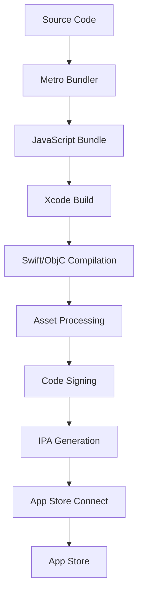

# 🍎 **iOS Build Process**

> **Master iOS build configuration, Xcode optimization, and App Store release processes for React Native applications**

<link rel="stylesheet" href="../../common-styles.css">

---

## 📚 **Table of Contents**

- [iOS Build Overview](#-ios-build-overview)
- [Xcode Configuration](#-xcode-configuration)
- [Build Schemes](#-build-schemes)
- [Code Signing](#-code-signing)
- [App Store Optimization](#-app-store-optimization)
- [Release Process](#-release-process)
- [Best Practices](#-best-practices)
- [Interview Questions](#-interview-questions)

---

## 🏗️ **iOS Build Overview**

### **Build Process Flow**





### **Key Components**
- **Xcode**: Apple's IDE and build system
- **CocoaPods**: Dependency management
- **Fastlane**: Automation tool
- **App Store Connect**: Distribution platform

---

## ⚙️ **Xcode Configuration**

### **Project Settings**

<button onclick="copyCode(this)" class="copy-btn">📋 Copy</button>

```javascript
// ios/YourApp.xcodeproj/project.pbxproj
// Key build settings for optimization

"RELEASE" = {
    // Optimization
    "GCC_OPTIMIZATION_LEVEL" = "s";
    "SWIFT_OPTIMIZATION_LEVEL" = "-O";
    "ENABLE_BITCODE" = "NO";
    
    // Code stripping
    "STRIP_INSTALLED_PRODUCT" = "YES";
    "SEPARATE_STRIP" = "YES";
    "COPY_PHASE_STRIP" = "YES";
    "DEAD_CODE_STRIPPING" = "YES";
    "STRIP_STYLE" = "all";
    
    // Validation
    "VALIDATE_PRODUCT" = "YES";
    "ONLY_ACTIVE_ARCH" = "YES";
    
    // Swift settings
    "SWIFT_COMPILATION_MODE" = "wholemodule";
    "SWIFT_OPTIMIZATION_LEVEL" = "-O";
};

"DEBUG" = {
    "GCC_OPTIMIZATION_LEVEL" = "0";
    "SWIFT_OPTIMIZATION_LEVEL" = "-Onone";
    "GCC_DYNAMIC_NO_PIC" = "NO";
    "GCC_NO_COMMON_BLOCKS" = "YES";
    "ENABLE_STRICT_OBJC_MSGSEND" = "YES";
    "ENABLE_TESTABILITY" = "YES";
    "GCC_C_LANGUAGE_STANDARD" = "gnu11";
    "CLANG_CXX_LANGUAGE_STANDARD" = "gnu++14";
    "CLANG_CXX_LIBRARY" = "libc++";
    "CLANG_ENABLE_MODULES" = "YES";
    "CLANG_ENABLE_OBJC_ARC" = "YES";
    "CLANG_ENABLE_OBJC_WEAK" = "YES";
    "CLANG_WARN_BLOCK_CAPTURE_AUTORELEASING" = "YES";
    "CLANG_WARN_BOOL_CONVERSION" = "YES";
    "CLANG_WARN_COMMA" = "YES";
    "CLANG_WARN_CONSTANT_CONVERSION" = "YES";
    "CLANG_WARN_DEPRECATED_OBJC_IMPLEMENTATIONS" = "YES";
    "CLANG_WARN_DIRECT_OBJC_ISA_USAGE" = "YES_ERROR";
    "CLANG_WARN_DOCUMENTATION_COMMENTS" = "YES";
    "CLANG_WARN_EMPTY_BODY" = "YES";
    "CLANG_WARN_ENUM_CONVERSION" = "YES";
    "CLANG_WARN_INFINITE_RECURSION" = "YES";
    "CLANG_WARN_INT_CONVERSION" = "YES";
    "CLANG_WARN_NON_LITERAL_NULL_CONVERSION" = "YES";
    "CLANG_WARN_OBJC_IMPLICIT_RETAIN_SELF" = "YES";
    "CLANG_WARN_OBJC_LITERAL_CONVERSION" = "YES";
    "CLANG_WARN_OBJC_ROOT_CLASS" = "YES_ERROR";
    "CLANG_WARN_QUOTED_INCLUDE_IN_FRAMEWORK_HEADER" = "YES";
    "CLANG_WARN_RANGE_LOOP_ANALYSIS" = "YES";
    "CLANG_WARN_STRICT_PROTOTYPES" = "YES";
    "CLANG_WARN_SUSPICIOUS_MOVE" = "YES";
    "CLANG_WARN_UNGUARDED_AVAILABILITY" = "YES_AGGRESSIVE";
    "CLANG_WARN_UNREACHABLE_CODE" = "YES";
    "CLANG_WARN__DUPLICATE_METHOD_MATCH" = "YES";
    "COPY_PHASE_STRIP" = "NO";
    "DEBUG_INFORMATION_FORMAT" = "dwarf";
    "ENABLE_STRICT_OBJC_MSGSEND" = "YES";
    "ENABLE_TESTABILITY" = "YES";
    "GCC_C_LANGUAGE_STANDARD" = "gnu11";
    "GCC_DYNAMIC_NO_PIC" = "NO";
    "GCC_NO_COMMON_BLOCKS" = "YES";
    "GCC_OPTIMIZATION_LEVEL" = "0";
    "GCC_PREPROCESSOR_DEFINITIONS" = (
        "DEBUG=1",
        "$(inherited)",
    );
    "GCC_WARN_64_TO_32_BIT_CONVERSION" = "YES";
    "GCC_WARN_ABOUT_RETURN_TYPE" = "YES_ERROR";
    "GCC_WARN_UNDECLARED_SELECTOR" = "YES";
    "GCC_WARN_UNINITIALIZED_AUTOS" = "YES_AGGRESSIVE";
    "GCC_WARN_UNUSED_FUNCTION" = "YES";
    "GCC_WARN_UNUSED_VARIABLE" = "YES";
    "IPHONEOS_DEPLOYMENT_TARGET" = "11.0";
    "MTL_ENABLE_DEBUG_INFO" = "INCLUDE_SOURCE";
    "MTL_FAST_MATH" = "YES";
    "ONLY_ACTIVE_ARCH" = "YES";
    "SDKROOT" = "iphoneos";
    "SWIFT_ACTIVE_COMPILATION_CONDITIONS" = "DEBUG";
    "SWIFT_OPTIMIZATION_LEVEL" = "-Onone";
};
```


### **CocoaPods Configuration**

<button onclick="copyCode(this)" class="copy-btn">📋 Copy</button>

```ruby
# ios/Podfile
require_relative '../node_modules/react-native/scripts/react_native_pods'
require_relative '../node_modules/@react-native-community/cli-platform-ios/native_modules'

platform :ios, '11.0'
install! 'cocoapods', :deterministic_uuids => false

target 'YourApp' do
  config = use_native_modules!

  # Flags change depending on the env values.
  flags = get_default_flags()

  use_react_native!(
    :path => config[:reactNativePath],
    # Hermes is now enabled by default. Disable by setting this flag to false.
    :hermes_enabled => flags[:hermes_enabled],
    :fabric_enabled => flags[:fabric_enabled],
    # Enables Flipper.
    :flipper_configuration => FlipperConfiguration.enabled,
    # An absolute path to your application root.
    :app_path => "#{Pod::Config.instance.installation_root}/.."
  )

  target 'YourAppTests' do
    inherit! :complete
    # Pods for testing
  end

  post_install do |installer|
    react_native_post_install(
      installer,
      # Set `mac_catalyst_enabled` to `true` in order to apply patches
      # necessary for Mac Catalyst builds
      :mac_catalyst_enabled => false
    )
    __apply_Xcode_12_5_M1_post_install_workaround(installer)
  end
end
```


---

## 🎯 **Build Schemes**

### **Scheme Configuration**

<button onclick="copyCode(this)" class="copy-btn">📋 Copy</button>

```javascript
// ios/YourApp.xcodeproj/xcshareddata/xcschemes/YourApp.xcscheme
// Build configuration for different environments

const buildSchemes = {
  development: {
    buildConfiguration: 'Debug',
    archiveConfiguration: 'Release',
    runConfiguration: 'Debug',
    testConfiguration: 'Debug',
    profileConfiguration: 'Release',
    analyzeConfiguration: 'Debug',
  },
  staging: {
    buildConfiguration: 'Release',
    archiveConfiguration: 'Release',
    runConfiguration: 'Release',
    testConfiguration: 'Debug',
    profileConfiguration: 'Release',
    analyzeConfiguration: 'Release',
  },
  production: {
    buildConfiguration: 'Release',
    archiveConfiguration: 'Release',
    runConfiguration: 'Release',
    testConfiguration: 'Release',
    profileConfiguration: 'Release',
    analyzeConfiguration: 'Release',
  },
};
```


### **Build Scripts**

<button onclick="copyCode(this)" class="copy-btn">📋 Copy</button>

```javascript
// scripts/build-ios.js
const { execSync } = require('child_process');
const fs = require('fs');
const path = require('path');

const buildiOS = async (scheme = 'YourApp', configuration = 'Release') => {
  const startTime = Date.now();
  
  try {
    console.log(`Building iOS ${scheme} ${configuration}...`);
    
    // Clean previous build
    execSync('cd ios && xcodebuild clean -workspace YourApp.xcworkspace -scheme YourApp', { 
      stdio: 'inherit' 
    });
    
    // Build the app
    const buildCommand = `cd ios && xcodebuild -workspace YourApp.xcworkspace -scheme ${scheme} -configuration ${configuration} -destination 'generic/platform=iOS' build`;
    execSync(buildCommand, { stdio: 'inherit' });
    
    const buildTime = Date.now() - startTime;
    console.log(`Build completed in ${buildTime}ms`);
    
  } catch (error) {
    console.error('Build failed:', error);
    process.exit(1);
  }
};

// Archive for App Store
const archiveiOS = async (scheme = 'YourApp') => {
  try {
    console.log(`Archiving iOS ${scheme}...`);
    
    const archiveCommand = `cd ios && xcodebuild -workspace YourApp.xcworkspace -scheme ${scheme} -configuration Release -destination 'generic/platform=iOS' archive -archivePath build/YourApp.xcarchive`;
    execSync(archiveCommand, { stdio: 'inherit' });
    
    console.log('Archive completed successfully!');
    
  } catch (error) {
    console.error('Archive failed:', error);
    process.exit(1);
  }
};

// Usage
const scheme = process.argv[2] || 'YourApp';
const configuration = process.argv[3] || 'Release';
buildiOS(scheme, configuration);
```


---

## 🔐 **Code Signing**

### **Signing Configuration**

<button onclick="copyCode(this)" class="copy-btn">📋 Copy</button>

```javascript
// ios/YourApp.xcodeproj/project.pbxproj
// Code signing settings

"CODE_SIGN_STYLE" = "Automatic";
"DEVELOPMENT_TEAM" = "YOUR_TEAM_ID";
"CODE_SIGN_IDENTITY" = "iPhone Developer";
"PROVISIONING_PROFILE_SPECIFIER" = "";

// For release builds
"RELEASE" = {
    "CODE_SIGN_STYLE" = "Manual";
    "CODE_SIGN_IDENTITY" = "iPhone Distribution";
    "PROVISIONING_PROFILE_SPECIFIER" = "YourApp Distribution Profile";
    "DEVELOPMENT_TEAM" = "YOUR_TEAM_ID";
};
```


### **Fastlane Configuration**

<button onclick="copyCode(this)" class="copy-btn">📋 Copy</button>

```ruby
# ios/fastlane/Fastfile
default_platform(:ios)

platform :ios do
  desc "Build and upload to App Store"
  lane :release do
    # Increment build number
    increment_build_number(xcodeproj: "YourApp.xcodeproj")
    
    # Build the app
    build_app(
      workspace: "YourApp.xcworkspace",
      scheme: "YourApp",
      configuration: "Release",
      export_method: "app-store",
      export_options: {
        method: "app-store",
        teamID: "YOUR_TEAM_ID",
        uploadBitcode: false,
        uploadSymbols: true,
        compileBitcode: false
      }
    )
    
    # Upload to App Store Connect
    upload_to_app_store(
      force: true,
      skip_metadata: false,
      skip_screenshots: false
    )
  end
  
  desc "Build for TestFlight"
  lane :beta do
    # Build and upload to TestFlight
    build_app(
      workspace: "YourApp.xcworkspace",
      scheme: "YourApp",
      configuration: "Release",
      export_method: "app-store"
    )
    
    upload_to_testflight(
      skip_waiting_for_build_processing: true
    )
  end
end
```


---

## 📱 **App Store Optimization**

### **App Store Metadata**

<button onclick="copyCode(this)" class="copy-btn">📋 Copy</button>

```javascript
// ios/fastlane/metadata/en-US/name.txt
Your App Name

// ios/fastlane/metadata/en-US/subtitle.txt
Your App Subtitle

// ios/fastlane/metadata/en-US/description.txt
Your app description goes here. This should be compelling and describe what your app does.

Key features:
- Feature 1
- Feature 2
- Feature 3

// ios/fastlane/metadata/en-US/keywords.txt
keyword1, keyword2, keyword3, keyword4, keyword5

// ios/fastlane/metadata/en-US/release_notes.txt
What's New in Version 1.0.0:

- New feature 1
- Bug fixes
- Performance improvements
- UI enhancements
```


### **Screenshot Automation**

<button onclick="copyCode(this)" class="copy-btn">📋 Copy</button>

```ruby
# ios/fastlane/Fastfile
desc "Generate screenshots"
lane :screenshots do
  # Run UI tests to generate screenshots
  run_tests(
    workspace: "YourApp.xcworkspace",
    scheme: "YourAppUITests",
    device: "iPhone 12 Pro"
  )
  
  # Collect screenshots
  collect_screenshots
end
```


---

## 🚀 **Release Process**

### **Automated Release Script**

<button onclick="copyCode(this)" class="copy-btn">📋 Copy</button>

```javascript
// scripts/release-ios.js
const { execSync } = require('child_process');
const fs = require('fs');
const path = require('path');

const releaseiOS = async () => {
  try {
    console.log('Starting iOS release process...');
    
    // 1. Clean and build
    console.log('Cleaning and building...');
    execSync('cd ios && xcodebuild clean -workspace YourApp.xcworkspace -scheme YourApp', { 
      stdio: 'inherit' 
    });
    
    // 2. Archive the app
    console.log('Archiving app...');
    execSync('cd ios && xcodebuild -workspace YourApp.xcworkspace -scheme YourApp -configuration Release -destination "generic/platform=iOS" archive -archivePath build/YourApp.xcarchive', { 
      stdio: 'inherit' 
    });
    
    // 3. Export IPA
    console.log('Exporting IPA...');
    execSync('cd ios && xcodebuild -exportArchive -archivePath build/YourApp.xcarchive -exportPath build -exportOptionsPlist ExportOptions.plist', { 
      stdio: 'inherit' 
    });
    
    // 4. Get version info
    const packageJson = JSON.parse(fs.readFileSync('package.json', 'utf8'));
    const version = packageJson.version;
    
    // 5. Copy files to release directory
    const releaseDir = `releases/ios/v${version}`;
    fs.mkdirSync(releaseDir, { recursive: true });
    
    // Copy IPA
    const ipaSource = 'ios/build/YourApp.ipa';
    const ipaDest = `${releaseDir}/YourApp.ipa`;
    fs.copyFileSync(ipaSource, ipaDest);
    
    // 6. Generate release notes
    const releaseNotes = {
      version: version,
      timestamp: new Date().toISOString(),
      files: {
        ipa: ipaDest,
      },
      buildInfo: {
        xcodeVersion: '14.0',
        iosDeploymentTarget: '11.0',
        swiftVersion: '5.0',
      },
    };
    
    fs.writeFileSync(`${releaseDir}/release-info.json`, JSON.stringify(releaseNotes, null, 2));
    
    console.log(`Release completed! Files available in ${releaseDir}`);
    
  } catch (error) {
    console.error('Release failed:', error);
    process.exit(1);
  }
};

// Run release
releaseiOS();
```


### **App Store Connect Upload**

<button onclick="copyCode(this)" class="copy-btn">📋 Copy</button>

```javascript
// scripts/upload-appstore.js
const { execSync } = require('child_process');

const uploadToAppStore = async () => {
  try {
    console.log('Uploading to App Store Connect...');
    
    // Check if fastlane is installed
    try {
      execSync('fastlane --version', { stdio: 'pipe' });
    } catch (error) {
      console.error('Fastlane not installed. Please install it first.');
      process.exit(1);
    }
    
    // Upload using fastlane
    execSync('cd ios && fastlane release', { 
      stdio: 'inherit' 
    });
    
    console.log('Upload completed successfully!');
    
  } catch (error) {
    console.error('Upload failed:', error);
    process.exit(1);
  }
};

// Run upload
uploadToAppStore();
```


---

## 🎯 **Best Practices**

### **1. Build Optimization**
- Use Release configuration for production
- Enable code stripping and dead code elimination
- Optimize Swift compilation
- Use bitcode when possible

### **2. Code Signing**
- Use automatic signing for development
- Use manual signing for production
- Store certificates securely
- Use different provisioning profiles

### **3. App Store**
- Optimize app metadata
- Use compelling screenshots
- Write clear release notes
- Test on multiple devices

---

## ❓ **Interview Questions**

### **Basic Questions**
1. **What is the difference between Debug and Release builds in iOS?**
2. **How do you configure code signing in Xcode?**
3. **What is CocoaPods and how does it work?**

### **Advanced Questions**
1. **How would you optimize iOS build performance?**
2. **Explain the iOS build process for React Native apps.**
3. **How do you handle different environments in iOS builds?**

### **Practical Questions**
1. **Configure build schemes for development, staging, and production.**
2. **Set up automated release process for iOS.**
3. **Optimize app size and performance for App Store.**

---

## 🧭 Navigation

<div class="navigation">
    <a href="./02-Android-Build-Process.md" class="nav-link prev">⬅️ Previous: Android Build Process</a>
    <a href="./04-CICD-Pipelines.md" class="nav-link next">Next: CI/CD Pipelines ➡️</a>
</div>

---

<script src="../../common-scripts.js"></script>

*Last updated: December 2024*
