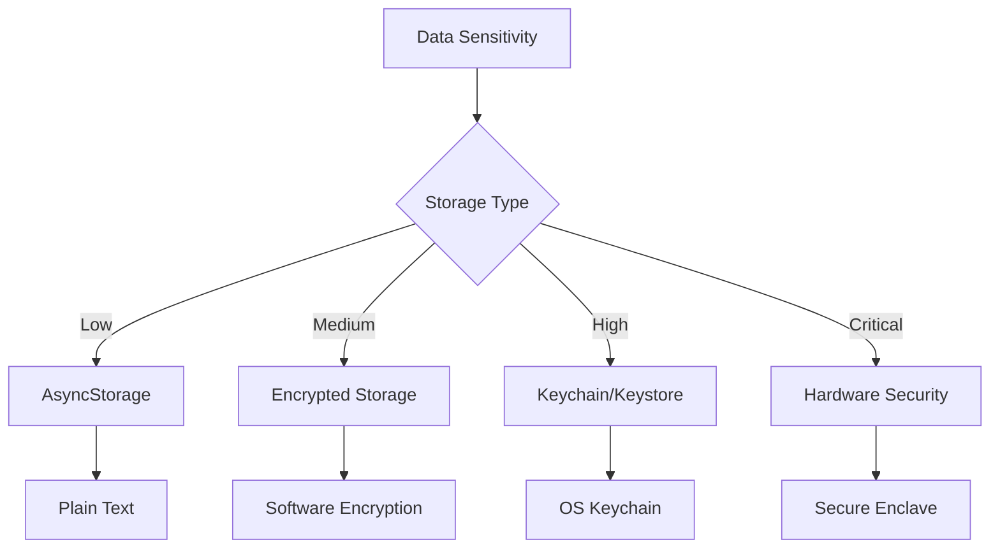

# 🔐 **Secure Storage**

> **Master secure storage solutions, encryption, and data protection for React Native applications**

<link rel="stylesheet" href="../../common-styles.css">

---

## 📚 **Table of Contents**

- [Secure Storage Overview](#-secure-storage-overview)
- [Keychain & Keystore](#-keychain--keystore)
- [Encryption Strategies](#-encryption-strategies)
- [Biometric Authentication](#-biometric-authentication)
- [Data Protection](#-data-protection)
- [Best Practices](#-best-practices)
- [Interview Questions](#-interview-questions)

---

## 🏗️ **Secure Storage Overview**

### **Storage Security Levels**





### **Security Considerations**
- **Data Classification**: Categorize data by sensitivity
- **Encryption**: Use appropriate encryption methods
- **Access Control**: Implement proper authentication
- **Key Management**: Secure key storage and rotation

---

## 🔑 **Keychain & Keystore**

### **React Native Keychain**

<button onclick="copyCode(this)" class="copy-btn">📋 Copy</button>

```javascript
import React, { useState, useEffect } from 'react';
import { View, Text, TextInput, TouchableOpacity, Alert } from 'react-native';
import * as Keychain from 'react-native-keychain';

const SecureStorageExample = () => {
  const [username, setUsername] = useState('');
  const [password, setPassword] = useState('');
  const [storedCredentials, setStoredCredentials] = useState(null);

  // Store credentials securely
  const storeCredentials = async () => {
    try {
      await Keychain.setInternetCredentials(
        'myapp.com',
        username,
        password,
        {
          accessControl: Keychain.ACCESS_CONTROL.BIOMETRY_ANY,
          accessGroup: 'com.yourapp.shared',
          authenticationType: Keychain.AUTHENTICATION_TYPE.DEVICE_PASSCODE_OR_BIOMETRICS,
          showPrompt: 'Authenticate to save credentials',
        }
      );
      
      Alert.alert('Success', 'Credentials stored securely');
    } catch (error) {
      console.error('Error storing credentials:', error);
      Alert.alert('Error', 'Failed to store credentials');
    }
  };

  // Retrieve credentials
  const getCredentials = async () => {
    try {
      const credentials = await Keychain.getInternetCredentials('myapp.com');
      
      if (credentials) {
        setStoredCredentials(credentials);
        Alert.alert('Success', 'Credentials retrieved');
      } else {
        Alert.alert('Info', 'No credentials found');
      }
    } catch (error) {
      console.error('Error retrieving credentials:', error);
      Alert.alert('Error', 'Failed to retrieve credentials');
    }
  };

  // Delete credentials
  const deleteCredentials = async () => {
    try {
      await Keychain.resetInternetCredentials('myapp.com');
      setStoredCredentials(null);
      Alert.alert('Success', 'Credentials deleted');
    } catch (error) {
      console.error('Error deleting credentials:', error);
      Alert.alert('Error', 'Failed to delete credentials');
    }
  };

  return (
    <View style={styles.container}>
      <Text style={styles.title}>Secure Storage Example</Text>
      
      <TextInput
        style={styles.input}
        placeholder="Username"
        value={username}
        onChangeText={setUsername}
      />
      
      <TextInput
        style={styles.input}
        placeholder="Password"
        value={password}
        onChangeText={setPassword}
        secureTextEntry
      />
      
      <TouchableOpacity style={styles.button} onPress={storeCredentials}>
        <Text style={styles.buttonText}>Store Credentials</Text>
      </TouchableOpacity>
      
      <TouchableOpacity style={styles.button} onPress={getCredentials}>
        <Text style={styles.buttonText}>Get Credentials</Text>
      </TouchableOpacity>
      
      <TouchableOpacity style={styles.button} onPress={deleteCredentials}>
        <Text style={styles.buttonText}>Delete Credentials</Text>
      </TouchableOpacity>
      
      {storedCredentials && (
        <View style={styles.credentialsContainer}>
          <Text style={styles.credentialsTitle}>Stored Credentials:</Text>
          <Text>Username: {storedCredentials.username}</Text>
          <Text>Password: {storedCredentials.password}</Text>
        </View>
      )}
    </View>
  );
};

const styles = {
  container: {
    flex: 1,
    padding: 20,
    justifyContent: 'center',
  },
  title: {
    fontSize: 24,
    fontWeight: 'bold',
    marginBottom: 20,
    textAlign: 'center',
  },
  input: {
    borderWidth: 1,
    borderColor: '#ccc',
    padding: 10,
    marginBottom: 10,
    borderRadius: 5,
  },
  button: {
    backgroundColor: '#007bff',
    padding: 15,
    borderRadius: 5,
    marginBottom: 10,
  },
  buttonText: {
    color: 'white',
    textAlign: 'center',
    fontWeight: 'bold',
  },
  credentialsContainer: {
    marginTop: 20,
    padding: 15,
    backgroundColor: '#f8f9fa',
    borderRadius: 5,
  },
  credentialsTitle: {
    fontWeight: 'bold',
    marginBottom: 10,
  },
};

export default SecureStorageExample;
```


### **Android Keystore Integration**

<button onclick="copyCode(this)" class="copy-btn">📋 Copy</button>

```javascript
// android/app/src/main/java/com/yourapp/KeystoreModule.java
package com.yourapp;

import android.security.keystore.KeyGenParameterSpec;
import android.security.keystore.KeyProperties;
import android.util.Base64;

import com.facebook.react.bridge.ReactApplicationContext;
import com.facebook.react.bridge.ReactContextBaseJavaModule;
import com.facebook.react.bridge.ReactMethod;
import com.facebook.react.bridge.Promise;

import java.security.KeyStore;
import javax.crypto.Cipher;
import javax.crypto.KeyGenerator;
import javax.crypto.SecretKey;
import javax.crypto.spec.GCMParameterSpec;

public class KeystoreModule extends ReactContextBaseJavaModule {
    private static final String KEY_ALIAS = "MyAppKey";
    private static final String ANDROID_KEYSTORE = "AndroidKeyStore";
    private static final String TRANSFORMATION = "AES/GCM/NoPadding";
    private static final int GCM_IV_LENGTH = 12;

    public KeystoreModule(ReactApplicationContext reactContext) {
        super(reactContext);
    }

    @Override
    public String getName() {
        return "KeystoreModule";
    }

    @ReactMethod
    public void generateKey(Promise promise) {
        try {
            KeyGenerator keyGenerator = KeyGenerator.getInstance(KeyProperties.KEY_ALGORITHM_AES, ANDROID_KEYSTORE);
            KeyGenParameterSpec keyGenParameterSpec = new KeyGenParameterSpec.Builder(KEY_ALIAS,
                    KeyProperties.PURPOSE_ENCRYPT | KeyProperties.PURPOSE_DECRYPT)
                    .setBlockModes(KeyProperties.BLOCK_MODE_GCM)
                    .setEncryptionPaddings(KeyProperties.ENCRYPTION_PADDING_NONE)
                    .setUserAuthenticationRequired(true)
                    .setUserAuthenticationValidityDurationSeconds(300) // 5 minutes
                    .build();
            
            keyGenerator.init(keyGenParameterSpec);
            keyGenerator.generateKey();
            
            promise.resolve("Key generated successfully");
        } catch (Exception e) {
            promise.reject("KEY_GENERATION_ERROR", e.getMessage());
        }
    }

    @ReactMethod
    public void encrypt(String plaintext, Promise promise) {
        try {
            KeyStore keyStore = KeyStore.getInstance(ANDROID_KEYSTORE);
            keyStore.load(null);
            SecretKey secretKey = (SecretKey) keyStore.getKey(KEY_ALIAS, null);
            
            Cipher cipher = Cipher.getInstance(TRANSFORMATION);
            cipher.init(Cipher.ENCRYPT_MODE, secretKey);
            
            byte[] iv = cipher.getIV();
            byte[] ciphertext = cipher.doFinal(plaintext.getBytes("UTF-8"));
            
            // Combine IV and ciphertext
            byte[] encryptedData = new byte[GCM_IV_LENGTH + ciphertext.length];
            System.arraycopy(iv, 0, encryptedData, 0, GCM_IV_LENGTH);
            System.arraycopy(ciphertext, 0, encryptedData, GCM_IV_LENGTH, ciphertext.length);
            
            String encryptedString = Base64.encodeToString(encryptedData, Base64.DEFAULT);
            promise.resolve(encryptedString);
        } catch (Exception e) {
            promise.reject("ENCRYPTION_ERROR", e.getMessage());
        }
    }

    @ReactMethod
    public void decrypt(String encryptedData, Promise promise) {
        try {
            KeyStore keyStore = KeyStore.getInstance(ANDROID_KEYSTORE);
            keyStore.load(null);
            SecretKey secretKey = (SecretKey) keyStore.getKey(KEY_ALIAS, null);
            
            byte[] encryptedBytes = Base64.decode(encryptedData, Base64.DEFAULT);
            
            // Extract IV and ciphertext
            byte[] iv = new byte[GCM_IV_LENGTH];
            byte[] ciphertext = new byte[encryptedBytes.length - GCM_IV_LENGTH];
            System.arraycopy(encryptedBytes, 0, iv, 0, GCM_IV_LENGTH);
            System.arraycopy(encryptedBytes, GCM_IV_LENGTH, ciphertext, 0, ciphertext.length);
            
            Cipher cipher = Cipher.getInstance(TRANSFORMATION);
            GCMParameterSpec spec = new GCMParameterSpec(128, iv);
            cipher.init(Cipher.DECRYPT_MODE, secretKey, spec);
            
            byte[] plaintext = cipher.doFinal(ciphertext);
            promise.resolve(new String(plaintext, "UTF-8"));
        } catch (Exception e) {
            promise.reject("DECRYPTION_ERROR", e.getMessage());
        }
    }
}
```


---

## 🔐 **Encryption Strategies**

### **AES Encryption Implementation**

<button onclick="copyCode(this)" class="copy-btn">📋 Copy</button>

```javascript
import CryptoJS from 'crypto-js';

// Encryption utility class
class EncryptionService {
  constructor() {
    this.secretKey = this.generateSecretKey();
  }

  // Generate a secure secret key
  generateSecretKey() {
    const timestamp = Date.now().toString();
    const random = Math.random().toString(36).substring(2);
    return CryptoJS.SHA256(timestamp + random).toString();
  }

  // Encrypt data
  encrypt(data) {
    try {
      const jsonString = JSON.stringify(data);
      const encrypted = CryptoJS.AES.encrypt(jsonString, this.secretKey).toString();
      return encrypted;
    } catch (error) {
      console.error('Encryption error:', error);
      throw new Error('Failed to encrypt data');
    }
  }

  // Decrypt data
  decrypt(encryptedData) {
    try {
      const decrypted = CryptoJS.AES.decrypt(encryptedData, this.secretKey);
      const jsonString = decrypted.toString(CryptoJS.enc.Utf8);
      return JSON.parse(jsonString);
    } catch (error) {
      console.error('Decryption error:', error);
      throw new Error('Failed to decrypt data');
    }
  }

  // Hash password with salt
  hashPassword(password, salt) {
    try {
      const hash = CryptoJS.PBKDF2(password, salt, {
        keySize: 512/32,
        iterations: 10000
      });
      return hash.toString();
    } catch (error) {
      console.error('Hashing error:', error);
      throw new Error('Failed to hash password');
    }
  }

  // Generate salt
  generateSalt() {
    return CryptoJS.lib.WordArray.random(128/8).toString();
  }

  // Verify password
  verifyPassword(password, hash, salt) {
    try {
      const hashToVerify = this.hashPassword(password, salt);
      return hashToVerify === hash;
    } catch (error) {
      console.error('Verification error:', error);
      return false;
    }
  }
}

// Usage example
const encryptionService = new EncryptionService();

// Encrypt sensitive data
const sensitiveData = {
  creditCard: '1234-5678-9012-3456',
  ssn: '123-45-6789',
  personalInfo: {
    name: 'John Doe',
    email: 'john@example.com'
  }
};

const encryptedData = encryptionService.encrypt(sensitiveData);
console.log('Encrypted data:', encryptedData);

// Decrypt data
const decryptedData = encryptionService.decrypt(encryptedData);
console.log('Decrypted data:', decryptedData);

export default EncryptionService;
```


### **Secure Data Storage Hook**

<button onclick="copyCode(this)" class="copy-btn">📋 Copy</button>

```javascript
import { useState, useEffect } from 'react';
import AsyncStorage from '@react-native-async-storage/async-storage';
import * as Keychain from 'react-native-keychain';
import EncryptionService from './EncryptionService';

const useSecureStorage = () => {
  const [encryptionService] = useState(() => new EncryptionService());
  const [isLoading, setIsLoading] = useState(false);

  // Store data securely
  const storeSecureData = async (key, data, useKeychain = false) => {
    setIsLoading(true);
    try {
      if (useKeychain) {
        // Use keychain for highly sensitive data
        await Keychain.setInternetCredentials(key, 'data', JSON.stringify(data), {
          accessControl: Keychain.ACCESS_CONTROL.BIOMETRY_ANY,
          authenticationType: Keychain.AUTHENTICATION_TYPE.DEVICE_PASSCODE_OR_BIOMETRICS,
        });
      } else {
        // Use encrypted AsyncStorage for moderately sensitive data
        const encryptedData = encryptionService.encrypt(data);
        await AsyncStorage.setItem(`secure_${key}`, encryptedData);
      }
      return true;
    } catch (error) {
      console.error('Error storing secure data:', error);
      return false;
    } finally {
      setIsLoading(false);
    }
  };

  // Retrieve data securely
  const getSecureData = async (key, useKeychain = false) => {
    setIsLoading(true);
    try {
      if (useKeychain) {
        const credentials = await Keychain.getInternetCredentials(key);
        if (credentials) {
          return JSON.parse(credentials.password);
        }
        return null;
      } else {
        const encryptedData = await AsyncStorage.getItem(`secure_${key}`);
        if (encryptedData) {
          return encryptionService.decrypt(encryptedData);
        }
        return null;
      }
    } catch (error) {
      console.error('Error retrieving secure data:', error);
      return null;
    } finally {
      setIsLoading(false);
    }
  };

  // Delete secure data
  const deleteSecureData = async (key, useKeychain = false) => {
    setIsLoading(true);
    try {
      if (useKeychain) {
        await Keychain.resetInternetCredentials(key);
      } else {
        await AsyncStorage.removeItem(`secure_${key}`);
      }
      return true;
    } catch (error) {
      console.error('Error deleting secure data:', error);
      return false;
    } finally {
      setIsLoading(false);
    }
  };

  // Clear all secure data
  const clearAllSecureData = async () => {
    setIsLoading(true);
    try {
      // Clear AsyncStorage secure data
      const keys = await AsyncStorage.getAllKeys();
      const secureKeys = keys.filter(key => key.startsWith('secure_'));
      await AsyncStorage.multiRemove(secureKeys);

      // Clear keychain data (you'd need to track keychain keys)
      // This is a simplified example
      return true;
    } catch (error) {
      console.error('Error clearing secure data:', error);
      return false;
    } finally {
      setIsLoading(false);
    }
  };

  return {
    storeSecureData,
    getSecureData,
    deleteSecureData,
    clearAllSecureData,
    isLoading,
  };
};

export default useSecureStorage;
```


---

## 👆 **Biometric Authentication**

### **Biometric Setup**

<button onclick="copyCode(this)" class="copy-btn">📋 Copy</button>

```javascript
import React, { useState, useEffect } from 'react';
import { View, Text, TouchableOpacity, Alert } from 'react-native';
import TouchID from 'react-native-touch-id';
import * as Keychain from 'react-native-keychain';

const BiometricAuth = () => {
  const [isBiometricAvailable, setIsBiometricAvailable] = useState(false);
  const [biometricType, setBiometricType] = useState('');

  useEffect(() => {
    checkBiometricAvailability();
  }, []);

  // Check if biometric authentication is available
  const checkBiometricAvailability = async () => {
    try {
      const biometryType = await TouchID.isSupported();
      setIsBiometricAvailable(true);
      setBiometricType(biometryType);
    } catch (error) {
      setIsBiometricAvailable(false);
      console.error('Biometric not available:', error);
    }
  };

  // Authenticate with biometrics
  const authenticateWithBiometrics = async () => {
    try {
      const result = await TouchID.authenticate('Authenticate to access secure data', {
        title: 'Biometric Authentication',
        subTitle: 'Use your biometric to authenticate',
        description: 'Place your finger on the sensor',
        fallbackLabel: 'Use Passcode',
        cancelLabel: 'Cancel',
      });

      if (result) {
        Alert.alert('Success', 'Biometric authentication successful');
        return true;
      }
    } catch (error) {
      console.error('Biometric authentication failed:', error);
      Alert.alert('Error', 'Biometric authentication failed');
      return false;
    }
  };

  // Store data with biometric protection
  const storeDataWithBiometrics = async () => {
    try {
      const authenticated = await authenticateWithBiometrics();
      
      if (authenticated) {
        const sensitiveData = {
          creditCard: '1234-5678-9012-3456',
          pin: '1234',
        };

        await Keychain.setInternetCredentials(
          'biometric_protected_data',
          'data',
          JSON.stringify(sensitiveData),
          {
            accessControl: Keychain.ACCESS_CONTROL.BIOMETRY_ANY,
            authenticationType: Keychain.AUTHENTICATION_TYPE.DEVICE_PASSCODE_OR_BIOMETRICS,
            showPrompt: 'Authenticate to store sensitive data',
          }
        );

        Alert.alert('Success', 'Data stored with biometric protection');
      }
    } catch (error) {
      console.error('Error storing data:', error);
      Alert.alert('Error', 'Failed to store data');
    }
  };

  // Retrieve data with biometric protection
  const retrieveDataWithBiometrics = async () => {
    try {
      const credentials = await Keychain.getInternetCredentials('biometric_protected_data');
      
      if (credentials) {
        const data = JSON.parse(credentials.password);
        Alert.alert('Retrieved Data', `Credit Card: ${data.creditCard}`);
      } else {
        Alert.alert('Info', 'No data found');
      }
    } catch (error) {
      console.error('Error retrieving data:', error);
      Alert.alert('Error', 'Failed to retrieve data');
    }
  };

  return (
    <View style={styles.container}>
      <Text style={styles.title}>Biometric Authentication</Text>
      
      <Text style={styles.status}>
        Biometric Available: {isBiometricAvailable ? 'Yes' : 'No'}
      </Text>
      
      {isBiometricAvailable && (
        <Text style={styles.status}>
          Type: {biometricType}
        </Text>
      )}
      
      <TouchableOpacity 
        style={styles.button} 
        onPress={authenticateWithBiometrics}
        disabled={!isBiometricAvailable}
      >
        <Text style={styles.buttonText}>Authenticate</Text>
      </TouchableOpacity>
      
      <TouchableOpacity 
        style={styles.button} 
        onPress={storeDataWithBiometrics}
        disabled={!isBiometricAvailable}
      >
        <Text style={styles.buttonText}>Store Data with Biometrics</Text>
      </TouchableOpacity>
      
      <TouchableOpacity 
        style={styles.button} 
        onPress={retrieveDataWithBiometrics}
        disabled={!isBiometricAvailable}
      >
        <Text style={styles.buttonText}>Retrieve Data</Text>
      </TouchableOpacity>
    </View>
  );
};

const styles = {
  container: {
    flex: 1,
    padding: 20,
    justifyContent: 'center',
  },
  title: {
    fontSize: 24,
    fontWeight: 'bold',
    marginBottom: 20,
    textAlign: 'center',
  },
  status: {
    fontSize: 16,
    marginBottom: 10,
    textAlign: 'center',
  },
  button: {
    backgroundColor: '#007bff',
    padding: 15,
    borderRadius: 5,
    marginBottom: 10,
  },
  buttonText: {
    color: 'white',
    textAlign: 'center',
    fontWeight: 'bold',
  },
};

export default BiometricAuth;
```


---

## 🛡️ **Data Protection**

### **Data Classification System**

<button onclick="copyCode(this)" class="copy-btn">📋 Copy</button>

```javascript
// Data classification levels
const DATA_CLASSIFICATION = {
  PUBLIC: 'public',
  INTERNAL: 'internal',
  CONFIDENTIAL: 'confidential',
  RESTRICTED: 'restricted',
};

// Data protection policies
const DATA_PROTECTION_POLICIES = {
  [DATA_CLASSIFICATION.PUBLIC]: {
    storage: 'AsyncStorage',
    encryption: false,
    accessControl: 'none',
    retention: 'indefinite',
  },
  [DATA_CLASSIFICATION.INTERNAL]: {
    storage: 'EncryptedAsyncStorage',
    encryption: 'AES-256',
    accessControl: 'app-level',
    retention: '1 year',
  },
  [DATA_CLASSIFICATION.CONFIDENTIAL]: {
    storage: 'Keychain',
    encryption: 'AES-256',
    accessControl: 'biometric',
    retention: '6 months',
  },
  [DATA_CLASSIFICATION.RESTRICTED]: {
    storage: 'HardwareSecurity',
    encryption: 'AES-256',
    accessControl: 'biometric + pin',
    retention: '3 months',
  },
};

// Data protection service
class DataProtectionService {
  constructor() {
    this.encryptionService = new EncryptionService();
  }

  // Store data with appropriate protection
  async storeData(key, data, classification) {
    const policy = DATA_PROTECTION_POLICIES[classification];
    
    if (!policy) {
      throw new Error(`Unknown data classification: ${classification}`);
    }

    switch (policy.storage) {
      case 'AsyncStorage':
        return await this.storeInAsyncStorage(key, data);
      
      case 'EncryptedAsyncStorage':
        return await this.storeInEncryptedAsyncStorage(key, data);
      
      case 'Keychain':
        return await this.storeInKeychain(key, data, policy.accessControl);
      
      case 'HardwareSecurity':
        return await this.storeInHardwareSecurity(key, data, policy.accessControl);
      
      default:
        throw new Error(`Unsupported storage type: ${policy.storage}`);
    }
  }

  // Store in AsyncStorage (no encryption)
  async storeInAsyncStorage(key, data) {
    await AsyncStorage.setItem(key, JSON.stringify(data));
  }

  // Store in encrypted AsyncStorage
  async storeInEncryptedAsyncStorage(key, data) {
    const encryptedData = this.encryptionService.encrypt(data);
    await AsyncStorage.setItem(`encrypted_${key}`, encryptedData);
  }

  // Store in Keychain with access control
  async storeInKeychain(key, data, accessControl) {
    const accessControlOptions = this.getAccessControlOptions(accessControl);
    
    await Keychain.setInternetCredentials(
      key,
      'data',
      JSON.stringify(data),
      accessControlOptions
    );
  }

  // Store in hardware security module
  async storeInHardwareSecurity(key, data, accessControl) {
    // This would integrate with hardware security modules
    // For now, we'll use enhanced keychain with additional security
    const accessControlOptions = {
      ...this.getAccessControlOptions(accessControl),
      accessGroup: 'com.yourapp.hardware',
      synchronizable: false,
    };
    
    await Keychain.setInternetCredentials(
      key,
      'data',
      JSON.stringify(data),
      accessControlOptions
    );
  }

  // Get access control options
  getAccessControlOptions(accessControl) {
    switch (accessControl) {
      case 'biometric':
        return {
          accessControl: Keychain.ACCESS_CONTROL.BIOMETRY_ANY,
          authenticationType: Keychain.AUTHENTICATION_TYPE.DEVICE_PASSCODE_OR_BIOMETRICS,
        };
      
      case 'biometric + pin':
        return {
          accessControl: Keychain.ACCESS_CONTROL.BIOMETRY_CURRENT_SET,
          authenticationType: Keychain.AUTHENTICATION_TYPE.DEVICE_PASSCODE_OR_BIOMETRICS,
        };
      
      default:
        return {};
    }
  }

  // Retrieve data with appropriate protection
  async getData(key, classification) {
    const policy = DATA_PROTECTION_POLICIES[classification];
    
    switch (policy.storage) {
      case 'AsyncStorage':
        const data = await AsyncStorage.getItem(key);
        return data ? JSON.parse(data) : null;
      
      case 'EncryptedAsyncStorage':
        const encryptedData = await AsyncStorage.getItem(`encrypted_${key}`);
        return encryptedData ? this.encryptionService.decrypt(encryptedData) : null;
      
      case 'Keychain':
      case 'HardwareSecurity':
        const credentials = await Keychain.getInternetCredentials(key);
        return credentials ? JSON.parse(credentials.password) : null;
      
      default:
        throw new Error(`Unsupported storage type: ${policy.storage}`);
    }
  }
}

export default DataProtectionService;
```


---

## 🎯 **Best Practices**

### **1. Data Classification**
- Classify data by sensitivity level
- Apply appropriate protection measures
- Implement data retention policies
- Regular security audits

### **2. Encryption**
- Use strong encryption algorithms
- Implement proper key management
- Use hardware security when available
- Regular key rotation

### **3. Access Control**
- Implement biometric authentication
- Use multi-factor authentication
- Apply principle of least privilege
- Monitor access patterns

---

## ❓ **Interview Questions**

### **Basic Questions**
1. **What is the difference between AsyncStorage and Keychain?**
2. **How do you implement secure storage in React Native?**
3. **What are the benefits of biometric authentication?**

### **Advanced Questions**
1. **How would you implement a data classification system?**
2. **Explain the encryption strategies for mobile apps.**
3. **How do you handle key management in secure storage?**

### **Practical Questions**
1. **Implement secure storage with biometric protection.**
2. **Create a data protection service with classification levels.**
3. **Set up encryption for sensitive user data.**

---

## 🧭 Navigation

<div class="navigation">
    <a href="../10-Build-Release-CICD/04-CICD-Pipelines.md" class="nav-link prev">⬅️ Previous: CI/CD Pipelines</a>
    <a href="./02-Network-Security.md" class="nav-link next">Next: Network Security ➡️</a>
</div>

---

<script src="../../common-scripts.js"></script>

*Last updated: December 2024*
