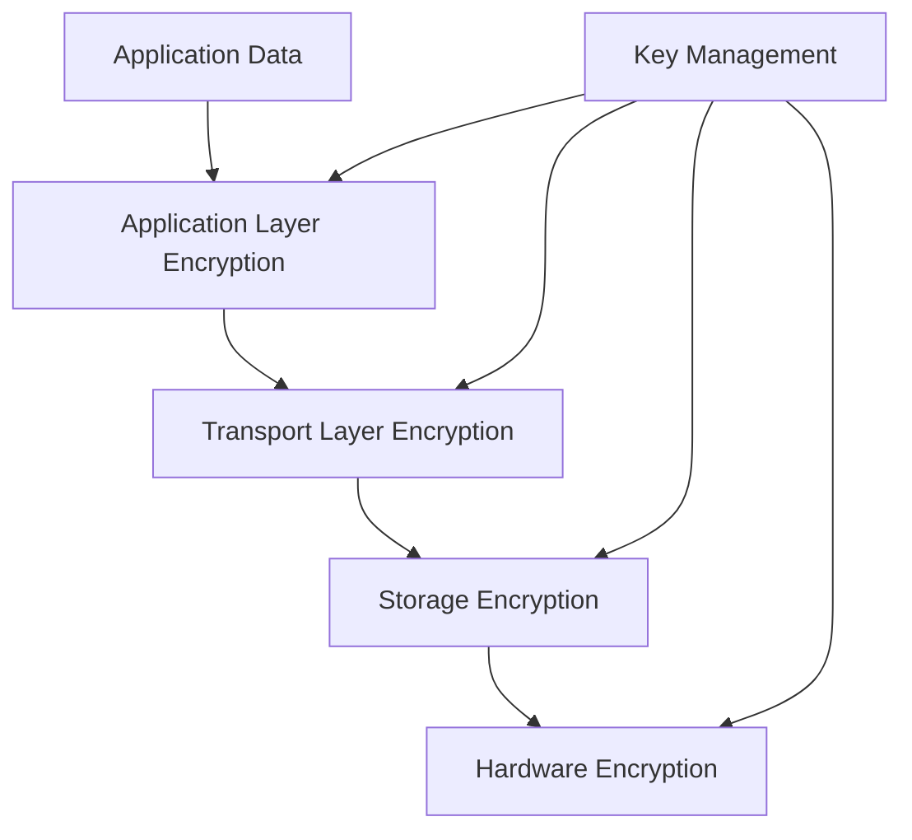

# 🔐 **Data Encryption**

> **Master data encryption strategies, key management, and secure data handling for React Native applications**

<link rel="stylesheet" href="../../common-styles.css">

---

## 📚 **Table of Contents**

- [Data Encryption Overview](#-data-encryption-overview)
- [Encryption Algorithms](#-encryption-algorithms)
- [Key Management](#-key-management)
- [Data Protection Strategies](#-data-protection-strategies)
- [Secure Communication](#-secure-communication)
- [Best Practices](#-best-practices)
- [Interview Questions](#-interview-questions)

---

## 🏗️ **Data Encryption Overview**

### **Encryption Layers**



### **Encryption Types**
- **Symmetric**: Same key for encryption/decryption
- **Asymmetric**: Public/private key pairs
- **Hybrid**: Combination of both approaches
- **End-to-End**: Client-to-client encryption

---

## 🔑 **Encryption Algorithms**

### **AES Encryption Implementation**

<button onclick="copyCode(this)" class="copy-btn">📋 Copy</button>
```javascript
import CryptoJS from 'crypto-js';

// AES encryption configuration
const AES_CONFIG = {
  keySize: 256,
  ivSize: 128,
  mode: CryptoJS.mode.CBC,
  padding: CryptoJS.pad.Pkcs7,
};

// Generate encryption key
const generateEncryptionKey = () => {
  return CryptoJS.lib.WordArray.random(AES_CONFIG.keySize / 8).toString();
};

// Generate initialization vector
const generateIV = () => {
  return CryptoJS.lib.WordArray.random(AES_CONFIG.ivSize / 8).toString();
};

// Encrypt data with AES
const encryptData = (data, key) => {
  try {
    const jsonString = JSON.stringify(data);
    const iv = generateIV();
    
    const encrypted = CryptoJS.AES.encrypt(jsonString, key, {
      iv: CryptoJS.enc.Hex.parse(iv),
      mode: AES_CONFIG.mode,
      padding: AES_CONFIG.padding,
    });
    
    return {
      encryptedData: encrypted.toString(),
      iv: iv,
    };
  } catch (error) {
    console.error('Encryption error:', error);
    throw new Error('Failed to encrypt data');
  }
};

// Decrypt data with AES
const decryptData = (encryptedData, key, iv) => {
  try {
    const decrypted = CryptoJS.AES.decrypt(encryptedData, key, {
      iv: CryptoJS.enc.Hex.parse(iv),
      mode: AES_CONFIG.mode,
      padding: AES_CONFIG.padding,
    });
    
    const jsonString = decrypted.toString(CryptoJS.enc.Utf8);
    return JSON.parse(jsonString);
  } catch (error) {
    console.error('Decryption error:', error);
    throw new Error('Failed to decrypt data');
  }
};

// Hash data with SHA-256
const hashData = (data) => {
  try {
    const jsonString = JSON.stringify(data);
    return CryptoJS.SHA256(jsonString).toString();
  } catch (error) {
    console.error('Hashing error:', error);
    throw new Error('Failed to hash data');
  }
};

// Export encryption functions
export {
  generateEncryptionKey,
  generateIV,
  encryptData,
  decryptData,
  hashData,
  AES_CONFIG,
};
```

### **RSA Encryption Implementation**

<button onclick="copyCode(this)" class="copy-btn">📋 Copy</button>
```javascript
import CryptoJS from 'crypto-js';

// RSA encryption configuration
const RSA_CONFIG = {
  keySize: 2048,
  padding: CryptoJS.pad.Pkcs1,
};

// Generate RSA key pair
const generateRSAKeyPair = () => {
  try {
    const keyPair = CryptoJS.lib.WordArray.random(RSA_CONFIG.keySize / 8);
    
    // In a real implementation, you would use a proper RSA library
    // This is a simplified example
    return {
      publicKey: keyPair.toString(),
      privateKey: keyPair.toString(),
    };
  } catch (error) {
    console.error('RSA key generation error:', error);
    throw new Error('Failed to generate RSA key pair');
  }
};

// Encrypt data with RSA public key
const encryptWithRSA = (data, publicKey) => {
  try {
    const jsonString = JSON.stringify(data);
    
    // In a real implementation, you would use proper RSA encryption
    // This is a simplified example
    const encrypted = CryptoJS.AES.encrypt(jsonString, publicKey).toString();
    
    return encrypted;
  } catch (error) {
    console.error('RSA encryption error:', error);
    throw new Error('Failed to encrypt with RSA');
  }
};

// Decrypt data with RSA private key
const decryptWithRSA = (encryptedData, privateKey) => {
  try {
    // In a real implementation, you would use proper RSA decryption
    // This is a simplified example
    const decrypted = CryptoJS.AES.decrypt(encryptedData, privateKey);
    const jsonString = decrypted.toString(CryptoJS.enc.Utf8);
    
    return JSON.parse(jsonString);
  } catch (error) {
    console.error('RSA decryption error:', error);
    throw new Error('Failed to decrypt with RSA');
  }
};

// Export RSA functions
export {
  generateRSAKeyPair,
  encryptWithRSA,
  decryptWithRSA,
  RSA_CONFIG,
};
```

---

## 🔐 **Key Management**

### **Secure Key Storage**

<button onclick="copyCode(this)" class="copy-btn">📋 Copy</button>
```javascript
import * as Keychain from 'react-native-keychain';
import AsyncStorage from '@react-native-async-storage/async-storage';
import CryptoJS from 'crypto-js';

// Key management configuration
const KEY_MANAGEMENT_CONFIG = {
  masterKeyAlias: 'master_encryption_key',
  keyDerivationIterations: 10000,
  keySize: 256,
};

// Generate master key
const generateMasterKey = () => {
  return CryptoJS.lib.WordArray.random(KEY_MANAGEMENT_CONFIG.keySize / 8).toString();
};

// Derive key from password
const deriveKeyFromPassword = (password, salt) => {
  try {
    const key = CryptoJS.PBKDF2(password, salt, {
      keySize: KEY_MANAGEMENT_CONFIG.keySize / 32,
      iterations: KEY_MANAGEMENT_CONFIG.keyDerivationIterations,
    });
    
    return key.toString();
  } catch (error) {
    console.error('Key derivation error:', error);
    throw new Error('Failed to derive key from password');
  }
};

// Store master key securely
const storeMasterKey = async (masterKey) => {
  try {
    await Keychain.setInternetCredentials(
      KEY_MANAGEMENT_CONFIG.masterKeyAlias,
      'master_key',
      masterKey,
      {
        accessControl: Keychain.ACCESS_CONTROL.BIOMETRY_ANY,
        authenticationType: Keychain.AUTHENTICATION_TYPE.DEVICE_PASSCODE_OR_BIOMETRICS,
      }
    );
    
    return true;
  } catch (error) {
    console.error('Error storing master key:', error);
    return false;
  }
};

// Retrieve master key
const getMasterKey = async () => {
  try {
    const credentials = await Keychain.getInternetCredentials(
      KEY_MANAGEMENT_CONFIG.masterKeyAlias
    );
    
    return credentials ? credentials.password : null;
  } catch (error) {
    console.error('Error retrieving master key:', error);
    return null;
  }
};

// Generate data encryption key
const generateDataEncryptionKey = () => {
  return CryptoJS.lib.WordArray.random(KEY_MANAGEMENT_CONFIG.keySize / 8).toString();
};

// Encrypt data encryption key with master key
const encryptDataEncryptionKey = (dataKey, masterKey) => {
  try {
    const encrypted = CryptoJS.AES.encrypt(dataKey, masterKey).toString();
    return encrypted;
  } catch (error) {
    console.error('Error encrypting data key:', error);
    throw new Error('Failed to encrypt data key');
  }
};

// Decrypt data encryption key with master key
const decryptDataEncryptionKey = (encryptedDataKey, masterKey) => {
  try {
    const decrypted = CryptoJS.AES.decrypt(encryptedDataKey, masterKey);
    return decrypted.toString(CryptoJS.enc.Utf8);
  } catch (error) {
    console.error('Error decrypting data key:', error);
    throw new Error('Failed to decrypt data key');
  }
};

// Store encrypted data key
const storeEncryptedDataKey = async (keyId, encryptedDataKey) => {
  try {
    await AsyncStorage.setItem(`encrypted_key_${keyId}`, encryptedDataKey);
    return true;
  } catch (error) {
    console.error('Error storing encrypted data key:', error);
    return false;
  }
};

// Retrieve encrypted data key
const getEncryptedDataKey = async (keyId) => {
  try {
    return await AsyncStorage.getItem(`encrypted_key_${keyId}`);
  } catch (error) {
    console.error('Error retrieving encrypted data key:', error);
    return null;
  }
};

// Export key management functions
export {
  generateMasterKey,
  deriveKeyFromPassword,
  storeMasterKey,
  getMasterKey,
  generateDataEncryptionKey,
  encryptDataEncryptionKey,
  decryptDataEncryptionKey,
  storeEncryptedDataKey,
  getEncryptedDataKey,
  KEY_MANAGEMENT_CONFIG,
};
```

### **Key Rotation Strategy**

<button onclick="copyCode(this)" class="copy-btn">📋 Copy</button>
```javascript
import { generateMasterKey, storeMasterKey, getMasterKey } from './KeyManagement';

// Key rotation configuration
const KEY_ROTATION_CONFIG = {
  rotationInterval: 30 * 24 * 60 * 60 * 1000, // 30 days in milliseconds
  keyVersionPrefix: 'key_version_',
  currentVersionKey: 'current_key_version',
};

// Check if key rotation is needed
const isKeyRotationNeeded = async () => {
  try {
    const lastRotation = await AsyncStorage.getItem('last_key_rotation');
    if (!lastRotation) {
      return true; // First time, need to generate key
    }
    
    const lastRotationTime = parseInt(lastRotation);
    const currentTime = Date.now();
    
    return (currentTime - lastRotationTime) > KEY_ROTATION_CONFIG.rotationInterval;
  } catch (error) {
    console.error('Error checking key rotation:', error);
    return true; // Default to rotation needed on error
  }
};

// Rotate encryption key
const rotateEncryptionKey = async () => {
  try {
    // Generate new master key
    const newMasterKey = generateMasterKey();
    
    // Store new master key
    const stored = await storeMasterKey(newMasterKey);
    if (!stored) {
      throw new Error('Failed to store new master key');
    }
    
    // Update rotation timestamp
    await AsyncStorage.setItem('last_key_rotation', Date.now().toString());
    
    // Increment key version
    const currentVersion = await getCurrentKeyVersion();
    const newVersion = currentVersion + 1;
    await AsyncStorage.setItem(KEY_ROTATION_CONFIG.currentVersionKey, newVersion.toString());
    
    console.log(`Key rotated to version ${newVersion}`);
    return true;
  } catch (error) {
    console.error('Error rotating encryption key:', error);
    return false;
  }
};

// Get current key version
const getCurrentKeyVersion = async () => {
  try {
    const version = await AsyncStorage.getItem(KEY_ROTATION_CONFIG.currentVersionKey);
    return version ? parseInt(version) : 1;
  } catch (error) {
    console.error('Error getting current key version:', error);
    return 1;
  }
};

// Initialize key rotation
const initializeKeyRotation = async () => {
  try {
    const rotationNeeded = await isKeyRotationNeeded();
    
    if (rotationNeeded) {
      console.log('Key rotation needed, rotating...');
      await rotateEncryptionKey();
    } else {
      console.log('Key rotation not needed');
    }
    
    return true;
  } catch (error) {
    console.error('Error initializing key rotation:', error);
    return false;
  }
};

// Export key rotation functions
export {
  isKeyRotationNeeded,
  rotateEncryptionKey,
  getCurrentKeyVersion,
  initializeKeyRotation,
  KEY_ROTATION_CONFIG,
};
```

---

## 🛡️ **Data Protection Strategies**

### **Data Classification Service**

<button onclick="copyCode(this)" class="copy-btn">📋 Copy</button>
```javascript
// Data classification levels
const DATA_CLASSIFICATION = {
  PUBLIC: 'public',
  INTERNAL: 'internal',
  CONFIDENTIAL: 'confidential',
  RESTRICTED: 'restricted',
};

// Data protection policies
const DATA_PROTECTION_POLICIES = {
  [DATA_CLASSIFICATION.PUBLIC]: {
    encryption: false,
    keyRotation: false,
    accessControl: 'none',
    retention: 'indefinite',
  },
  [DATA_CLASSIFICATION.INTERNAL]: {
    encryption: 'AES-256',
    keyRotation: false,
    accessControl: 'app-level',
    retention: '1 year',
  },
  [DATA_CLASSIFICATION.CONFIDENTIAL]: {
    encryption: 'AES-256',
    keyRotation: true,
    accessControl: 'biometric',
    retention: '6 months',
  },
  [DATA_CLASSIFICATION.RESTRICTED]: {
    encryption: 'AES-256 + RSA',
    keyRotation: true,
    accessControl: 'biometric + pin',
    retention: '3 months',
  },
};

// Classify data
const classifyData = (data) => {
  // Simple classification logic - in real app, this would be more sophisticated
  if (data.creditCard || data.ssn || data.passport) {
    return DATA_CLASSIFICATION.RESTRICTED;
  } else if (data.email || data.phone || data.address) {
    return DATA_CLASSIFICATION.CONFIDENTIAL;
  } else if (data.preferences || data.settings) {
    return DATA_CLASSIFICATION.INTERNAL;
  } else {
    return DATA_CLASSIFICATION.PUBLIC;
  }
};

// Get protection policy for data
const getProtectionPolicy = (data) => {
  const classification = classifyData(data);
  return DATA_PROTECTION_POLICIES[classification];
};

// Apply data protection
const applyDataProtection = async (data, classification) => {
  const policy = DATA_PROTECTION_POLICIES[classification];
  
  if (!policy) {
    throw new Error(`Unknown data classification: ${classification}`);
  }
  
  let protectedData = { ...data };
  
  // Apply encryption if required
  if (policy.encryption) {
    const masterKey = await getMasterKey();
    if (!masterKey) {
      throw new Error('Master key not available');
    }
    
    const encrypted = encryptData(protectedData, masterKey);
    protectedData = {
      encryptedData: encrypted.encryptedData,
      iv: encrypted.iv,
      encrypted: true,
    };
  }
  
  // Add metadata
  protectedData.metadata = {
    classification,
    encrypted: policy.encryption ? true : false,
    timestamp: Date.now(),
    version: await getCurrentKeyVersion(),
  };
  
  return protectedData;
};

// Remove data protection
const removeDataProtection = async (protectedData) => {
  if (!protectedData.encrypted) {
    return protectedData;
  }
  
  const masterKey = await getMasterKey();
  if (!masterKey) {
    throw new Error('Master key not available');
  }
  
  const decrypted = decryptData(
    protectedData.encryptedData,
    masterKey,
    protectedData.iv
  );
  
  return decrypted;
};

// Export data protection functions
export {
  DATA_CLASSIFICATION,
  DATA_PROTECTION_POLICIES,
  classifyData,
  getProtectionPolicy,
  applyDataProtection,
  removeDataProtection,
};
```

---

## 🔒 **Secure Communication**

### **End-to-End Encryption**

<button onclick="copyCode(this)" class="copy-btn">📋 Copy</button>
```javascript
import { generateRSAKeyPair, encryptWithRSA, decryptWithRSA } from './RSAEncryption';
import { encryptData, decryptData } from './AESEncryption';

// End-to-end encryption service
const createE2EEncryptionService = () => {
  let publicKey = null;
  let privateKey = null;
  let sessionKey = null;
  
  return {
    // Initialize E2E encryption
    initialize: async () => {
      try {
        const keyPair = generateRSAKeyPair();
        publicKey = keyPair.publicKey;
        privateKey = keyPair.privateKey;
        
        // Generate session key for symmetric encryption
        sessionKey = generateEncryptionKey();
        
        return {
          publicKey,
          sessionKey: encryptWithRSA(sessionKey, publicKey),
        };
      } catch (error) {
        console.error('E2E initialization error:', error);
        throw error;
      }
    },
    
    // Encrypt message for recipient
    encryptMessage: (message, recipientPublicKey) => {
      try {
        // Encrypt message with session key
        const encryptedMessage = encryptData(message, sessionKey);
        
        // Encrypt session key with recipient's public key
        const encryptedSessionKey = encryptWithRSA(sessionKey, recipientPublicKey);
        
        return {
          encryptedMessage: encryptedMessage.encryptedData,
          iv: encryptedMessage.iv,
          encryptedSessionKey,
        };
      } catch (error) {
        console.error('Message encryption error:', error);
        throw error;
      }
    },
    
    // Decrypt received message
    decryptMessage: (encryptedMessage, encryptedSessionKey) => {
      try {
        // Decrypt session key with private key
        const decryptedSessionKey = decryptWithRSA(encryptedSessionKey, privateKey);
        
        // Decrypt message with session key
        const decryptedMessage = decryptData(
          encryptedMessage.encryptedMessage,
          decryptedSessionKey,
          encryptedMessage.iv
        );
        
        return decryptedMessage;
      } catch (error) {
        console.error('Message decryption error:', error);
        throw error;
      }
    },
    
    // Get public key
    getPublicKey: () => publicKey,
    
    // Update session key
    updateSessionKey: () => {
      sessionKey = generateEncryptionKey();
      return encryptWithRSA(sessionKey, publicKey);
    },
  };
};

// Export E2E encryption service
export { createE2EEncryptionService };
```

---

## 🎯 **Best Practices**

### **1. Encryption Strategy**
- Use AES-256 for symmetric encryption
- Use RSA-2048+ for asymmetric encryption
- Implement proper key management
- Use hardware security when available

### **2. Key Management**
- Store keys securely (Keychain/Keystore)
- Implement key rotation
- Use different keys for different data types
- Monitor key usage

### **3. Data Protection**
- Classify data by sensitivity
- Apply appropriate protection levels
- Implement data retention policies
- Regular security audits

---

## ❓ **Interview Questions**

### **Basic Questions**
1. **What is the difference between symmetric and asymmetric encryption?**
2. **How do you implement data encryption in React Native?**
3. **What are the benefits of key rotation?**

### **Advanced Questions**
1. **How would you implement end-to-end encryption?**
2. **Explain the key management strategy for mobile apps.**
3. **How do you handle encryption performance in mobile apps?**

### **Practical Questions**
1. **Implement AES encryption with key management.**
2. **Create a data classification system with encryption.**
3. **Set up end-to-end encryption for messaging.**

---

## 🧭 Navigation

<div class="navigation">
    <a href="./02-Network-Security.md" class="nav-link prev">⬅️ Previous: Network Security</a>
    <a href="./04-Security-Best-Practices.md" class="nav-link next">Next: Security Best Practices ➡️</a>
</div>

---

<script src="../../common-scripts.js"></script>

*Last updated: December 2024*
