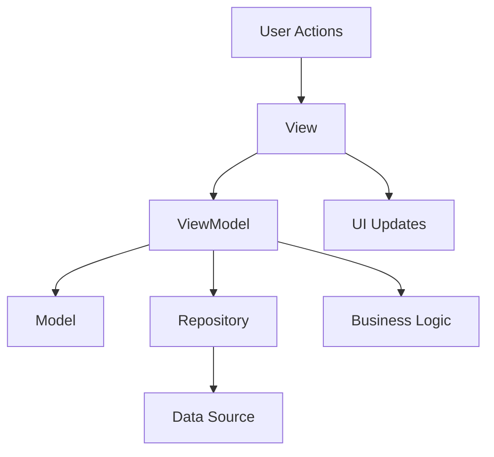

# 🎯 **MVVM Pattern**

> **Master MVVM (Model-View-ViewModel) pattern implementation for React Native applications**

<link rel="stylesheet" href="../../common-styles.css">

---

## 📚 **Table of Contents**

- [MVVM Overview](#-mvvm-overview)
- [View Layer](#-view-layer)
- [ViewModel Layer](#-viewmodel-layer)
- [Model Layer](#-model-layer)
- [Data Binding](#-data-binding)
- [Best Practices](#-best-practices)
- [Interview Questions](#-interview-questions)

---

## 🎯 **MVVM Overview**

### **MVVM Architecture**





### **Key Components**
- **View**: UI components and user interactions
- **ViewModel**: Business logic and state management
- **Model**: Data structures and entities
- **Repository**: Data access abstraction

---

## 🖼️ **View Layer**

### **View Implementation**

<button onclick="copyCode(this)" class="copy-btn">📋 Copy</button>

```javascript
import React, { useState, useEffect } from 'react';
import { View, Text, TextInput, TouchableOpacity, StyleSheet, Alert } from 'react-native';

const UserProfileView = ({ viewModel }) => {
  const [user, setUser] = useState(null);
  const [loading, setLoading] = useState(false);
  const [error, setError] = useState(null);

  useEffect(() => {
    // Subscribe to ViewModel state changes
    const unsubscribe = viewModel.subscribe((state) => {
      setUser(state.user);
      setLoading(state.loading);
      setError(state.error);
    });

    // Load user data
    viewModel.loadUser();

    return unsubscribe;
  }, [viewModel]);

  const handleSave = async () => {
    try {
      await viewModel.saveUser(user);
      Alert.alert('Success', 'User saved successfully');
    } catch (error) {
      Alert.alert('Error', error.message);
    }
  };

  const handleNameChange = (name) => {
    setUser(prev => ({ ...prev, name }));
  };

  const handleEmailChange = (email) => {
    setUser(prev => ({ ...prev, email }));
  };

  if (loading) {
    return (
      <View style={styles.container}>
        <Text style={styles.loadingText}>Loading...</Text>
      </View>
    );
  }

  if (error) {
    return (
      <View style={styles.container}>
        <Text style={styles.errorText}>{error}</Text>
        <TouchableOpacity 
          style={styles.retryButton}
          onPress={() => viewModel.loadUser()}
        >
          <Text style={styles.retryButtonText}>Retry</Text>
        </TouchableOpacity>
      </View>
    );
  }

  return (
    <View style={styles.container}>
      <Text style={styles.title}>User Profile</Text>
      
      <View style={styles.form}>
        <Text style={styles.label}>Name</Text>
        <TextInput
          style={styles.input}
          value={user?.name || ''}
          onChangeText={handleNameChange}
          placeholder="Enter name"
        />
        
        <Text style={styles.label}>Email</Text>
        <TextInput
          style={styles.input}
          value={user?.email || ''}
          onChangeText={handleEmailChange}
          placeholder="Enter email"
          keyboardType="email-address"
          autoCapitalize="none"
        />
        
        <TouchableOpacity 
          style={styles.saveButton}
          onPress={handleSave}
          disabled={loading}
        >
          <Text style={styles.saveButtonText}>Save</Text>
        </TouchableOpacity>
      </View>
    </View>
  );
};

const styles = StyleSheet.create({
  container: {
    flex: 1,
    padding: 20,
    backgroundColor: '#fff',
  },
  title: {
    fontSize: 24,
    fontWeight: 'bold',
    marginBottom: 20,
    color: '#333',
  },
  form: {
    flex: 1,
  },
  label: {
    fontSize: 16,
    fontWeight: '600',
    marginBottom: 5,
    color: '#333',
  },
  input: {
    borderWidth: 1,
    borderColor: '#ccc',
    borderRadius: 5,
    padding: 10,
    fontSize: 16,
    marginBottom: 15,
    backgroundColor: '#fff',
  },
  saveButton: {
    backgroundColor: '#007bff',
    padding: 15,
    borderRadius: 5,
    alignItems: 'center',
    marginTop: 20,
  },
  saveButtonText: {
    color: '#fff',
    fontSize: 16,
    fontWeight: 'bold',
  },
  loadingText: {
    fontSize: 18,
    textAlign: 'center',
    color: '#666',
  },
  errorText: {
    fontSize: 16,
    color: '#dc3545',
    textAlign: 'center',
    marginBottom: 20,
  },
  retryButton: {
    backgroundColor: '#6c757d',
    padding: 15,
    borderRadius: 5,
    alignItems: 'center',
  },
  retryButtonText: {
    color: '#fff',
    fontSize: 16,
    fontWeight: 'bold',
  },
});

export default UserProfileView;
```


---

## 🧠 **ViewModel Layer**

### **ViewModel Implementation**

<button onclick="copyCode(this)" class="copy-btn">📋 Copy</button>

```javascript
import { useState, useCallback } from 'react';

const createUserProfileViewModel = (userService) => {
  const [state, setState] = useState({
    user: null,
    loading: false,
    error: null,
  });

  const [subscribers, setSubscribers] = useState([]);

  // Subscribe to state changes
  const subscribe = useCallback((callback) => {
    setSubscribers(prev => [...prev, callback]);
    
    // Return unsubscribe function
    return () => {
      setSubscribers(prev => prev.filter(sub => sub !== callback));
    };
  }, []);

  // Notify subscribers of state changes
  const notifySubscribers = useCallback((newState) => {
    subscribers.forEach(callback => callback(newState));
  }, [subscribers]);

  // Update state and notify subscribers
  const updateState = useCallback((updates) => {
    setState(prevState => {
      const newState = { ...prevState, ...updates };
      notifySubscribers(newState);
      return newState;
    });
  }, [notifySubscribers]);

  // Load user data
  const loadUser = useCallback(async (userId = 'current') => {
    try {
      updateState({ loading: true, error: null });
      
      const user = await userService.getUser(userId);
      updateState({ user, loading: false });
    } catch (error) {
      updateState({ 
        error: error.message, 
        loading: false 
      });
    }
  }, [userService, updateState]);

  // Save user data
  const saveUser = useCallback(async (userData) => {
    try {
      updateState({ loading: true, error: null });
      
      let savedUser;
      if (userData.id) {
        savedUser = await userService.updateUser(userData.id, userData);
      } else {
        savedUser = await userService.createUser(userData);
      }
      
      updateState({ user: savedUser, loading: false });
      return savedUser;
    } catch (error) {
      updateState({ 
        error: error.message, 
        loading: false 
      });
      throw error;
    }
  }, [userService, updateState]);

  // Delete user
  const deleteUser = useCallback(async (userId) => {
    try {
      updateState({ loading: true, error: null });
      
      await userService.deleteUser(userId);
      updateState({ user: null, loading: false });
    } catch (error) {
      updateState({ 
        error: error.message, 
        loading: false 
      });
      throw error;
    }
  }, [userService, updateState]);

  // Validate user data
  const validateUser = useCallback((userData) => {
    const errors = [];
    
    if (!userData.name || userData.name.trim().length === 0) {
      errors.push('Name is required');
    }
    
    if (!userData.email || !isValidEmail(userData.email)) {
      errors.push('Valid email is required');
    }
    
    return errors;
  }, []);

  // Get current state
  const getState = useCallback(() => state, [state]);

  return {
    // State
    getState,
    subscribe,
    
    // Actions
    loadUser,
    saveUser,
    deleteUser,
    validateUser,
    
    // Utilities
    updateState,
  };
};

// Email validation utility
const isValidEmail = (email) => {
  const emailRegex = /^[^\s@]+@[^\s@]+\.[^\s@]+$/;
  return emailRegex.test(email);
};

export { createUserProfileViewModel };
```


---

## 📊 **Model Layer**

### **Model Implementation**

<button onclick="copyCode(this)" class="copy-btn">📋 Copy</button>

```javascript
// User model
const UserModel = {
  id: null,
  name: '',
  email: '',
  avatar: null,
  createdAt: null,
  updatedAt: null,
  
  // Create new user
  create: (userData) => ({
    id: userData.id || generateId(),
    name: userData.name || '',
    email: userData.email || '',
    avatar: userData.avatar || null,
    createdAt: userData.createdAt || new Date(),
    updatedAt: new Date(),
  }),
  
  // Update user
  update: (user, updates) => ({
    ...user,
    ...updates,
    updatedAt: new Date(),
  }),
  
  // Validate user
  validate: (user) => {
    const errors = [];
    
    if (!user.name || user.name.trim().length === 0) {
      errors.push('Name is required');
    }
    
    if (!user.email || !isValidEmail(user.email)) {
      errors.push('Valid email is required');
    }
    
    return errors;
  },
  
  // Check if user is valid
  isValid: (user) => {
    return UserModel.validate(user).length === 0;
  },
  
  // Get user display name
  getDisplayName: (user) => {
    return user.name || user.email || 'Unknown User';
  },
  
  // Get user initials
  getInitials: (user) => {
    const name = user.name || '';
    const words = name.trim().split(' ');
    
    if (words.length >= 2) {
      return (words[0][0] + words[1][0]).toUpperCase();
    } else if (words.length === 1) {
      return words[0][0].toUpperCase();
    } else {
      return 'U';
    }
  }
};

// User list model
const UserListModel = {
  users: [],
  loading: false,
  error: null,
  totalCount: 0,
  currentPage: 1,
  hasMore: false,
  
  // Create initial state
  create: () => ({
    users: [],
    loading: false,
    error: null,
    totalCount: 0,
    currentPage: 1,
    hasMore: false,
  }),
  
  // Add users
  addUsers: (state, newUsers) => ({
    ...state,
    users: [...state.users, ...newUsers],
    totalCount: state.totalCount + newUsers.length,
  }),
  
  // Set users
  setUsers: (state, users) => ({
    ...state,
    users,
    totalCount: users.length,
  }),
  
  // Update user
  updateUser: (state, userId, updates) => ({
    ...state,
    users: state.users.map(user => 
      user.id === userId ? { ...user, ...updates } : user
    ),
  }),
  
  // Remove user
  removeUser: (state, userId) => ({
    ...state,
    users: state.users.filter(user => user.id !== userId),
    totalCount: state.totalCount - 1,
  }),
  
  // Set loading state
  setLoading: (state, loading) => ({
    ...state,
    loading,
  }),
  
  // Set error
  setError: (state, error) => ({
    ...state,
    error,
    loading: false,
  }),
  
  // Clear error
  clearError: (state) => ({
    ...state,
    error: null,
  }),
  
  // Set pagination
  setPagination: (state, { currentPage, hasMore }) => ({
    ...state,
    currentPage,
    hasMore,
  })
};

// Generate unique ID
const generateId = () => {
  return Date.now().toString(36) + Math.random().toString(36).substr(2);
};

// Email validation
const isValidEmail = (email) => {
  const emailRegex = /^[^\s@]+@[^\s@]+\.[^\s@]+$/;
  return emailRegex.test(email);
};

export { UserModel, UserListModel };
```


---

## 🔗 **Data Binding**

### **Data Binding Implementation**

<button onclick="copyCode(this)" class="copy-btn">📋 Copy</button>

```javascript
import { useState, useEffect, useCallback } from 'react';

// Data binding hook
const useDataBinding = (viewModel) => {
  const [state, setState] = useState(viewModel.getState());

  useEffect(() => {
    const unsubscribe = viewModel.subscribe((newState) => {
      setState(newState);
    });

    return unsubscribe;
  }, [viewModel]);

  return state;
};

// Two-way data binding hook
const useTwoWayBinding = (initialValue, onChange) => {
  const [value, setValue] = useState(initialValue);

  const handleChange = useCallback((newValue) => {
    setValue(newValue);
    if (onChange) {
      onChange(newValue);
    }
  }, [onChange]);

  return [value, handleChange];
};

// Form data binding
const useFormBinding = (initialFormData, validationRules) => {
  const [formData, setFormData] = useState(initialFormData);
  const [errors, setErrors] = useState({});
  const [touched, setTouched] = useState({});

  const updateField = useCallback((fieldName, value) => {
    setFormData(prev => ({ ...prev, [fieldName]: value }));
    
    // Validate field if it's been touched
    if (touched[fieldName] && validationRules[fieldName]) {
      const fieldErrors = validationRules[fieldName](value);
      setErrors(prev => ({ ...prev, [fieldName]: fieldErrors }));
    }
  }, [touched, validationRules]);

  const touchField = useCallback((fieldName) => {
    setTouched(prev => ({ ...prev, [fieldName]: true }));
    
    // Validate field when touched
    if (validationRules[fieldName]) {
      const fieldErrors = validationRules[fieldName](formData[fieldName]);
      setErrors(prev => ({ ...prev, [fieldName]: fieldErrors }));
    }
  }, [formData, validationRules]);

  const validateForm = useCallback(() => {
    const newErrors = {};
    let isValid = true;

    Object.keys(validationRules).forEach(fieldName => {
      const fieldErrors = validationRules[fieldName](formData[fieldName]);
      if (fieldErrors.length > 0) {
        newErrors[fieldName] = fieldErrors;
        isValid = false;
      }
    });

    setErrors(newErrors);
    return isValid;
  }, [formData, validationRules]);

  const resetForm = useCallback(() => {
    setFormData(initialFormData);
    setErrors({});
    setTouched({});
  }, [initialFormData]);

  return {
    formData,
    errors,
    touched,
    updateField,
    touchField,
    validateForm,
    resetForm,
    isValid: Object.keys(errors).length === 0,
  };
};

// List data binding
const useListBinding = (initialItems, itemKey = 'id') => {
  const [items, setItems] = useState(initialItems);
  const [selectedItems, setSelectedItems] = useState([]);

  const addItem = useCallback((item) => {
    setItems(prev => [...prev, item]);
  }, []);

  const updateItem = useCallback((itemId, updates) => {
    setItems(prev => prev.map(item => 
      item[itemKey] === itemId ? { ...item, ...updates } : item
    ));
  }, [itemKey]);

  const removeItem = useCallback((itemId) => {
    setItems(prev => prev.filter(item => item[itemKey] !== itemId));
    setSelectedItems(prev => prev.filter(id => id !== itemId));
  }, [itemKey]);

  const selectItem = useCallback((itemId) => {
    setSelectedItems(prev => [...prev, itemId]);
  }, []);

  const deselectItem = useCallback((itemId) => {
    setSelectedItems(prev => prev.filter(id => id !== itemId));
  }, []);

  const toggleSelection = useCallback((itemId) => {
    setSelectedItems(prev => 
      prev.includes(itemId) 
        ? prev.filter(id => id !== itemId)
        : [...prev, itemId]
    );
  }, []);

  const clearSelection = useCallback(() => {
    setSelectedItems([]);
  }, []);

  return {
    items,
    selectedItems,
    addItem,
    updateItem,
    removeItem,
    selectItem,
    deselectItem,
    toggleSelection,
    clearSelection,
    selectedCount: selectedItems.length,
  };
};

export { useDataBinding, useTwoWayBinding, useFormBinding, useListBinding };
```


---

## 🎯 **Best Practices**

### **1. MVVM Implementation**
- Keep ViewModels stateless
- Use proper data binding
- Separate business logic from UI
- Implement proper error handling

### **2. State Management**
- Use reactive state updates
- Implement proper subscriptions
- Handle loading and error states
- Optimize re-renders

### **3. Testing**
- Test ViewModels in isolation
- Mock dependencies properly
- Test data binding
- Validate business logic

---

## ❓ **Interview Questions**

### **Basic Questions**
1. **What is the MVVM pattern?**
2. **How do you implement data binding?**
3. **What are the benefits of MVVM?**

### **Advanced Questions**
1. **How would you implement MVVM in React Native?**
2. **Explain the relationship between View, ViewModel, and Model.**
3. **How do you handle state management in MVVM?**

### **Practical Questions**
1. **Implement a user profile screen using MVVM.**
2. **Create a data binding system.**
3. **Design a form with validation using MVVM.**

---

## 🧭 Navigation

<div class="navigation">
    <a href="./01-Clean-Architecture.md" class="nav-link prev">⬅️ Previous: Clean Architecture</a>
    <a href="./03-Feature-Based-Modules.md" class="nav-link next">Next: Feature-Based Modules ➡️</a>
</div>

---

<script src="../../common-scripts.js"></script>

*Last updated: December 2024*
