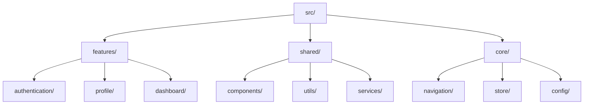

# 🏗️ **Feature-Based Modules**

> **Master feature-based architecture, module organization, and scalable project structure for React Native applications**

<link rel="stylesheet" href="../../common-styles.css">

---

## 📚 **Table of Contents**

- [Feature-Based Architecture](#-feature-based-architecture)
- [Module Organization](#-module-organization)
- [Shared Components](#-shared-components)
- [Navigation Structure](#-navigation-structure)
- [State Management](#-state-management)
- [Best Practices](#-best-practices)
- [Interview Questions](#-interview-questions)

---

## 🏗️ **Feature-Based Architecture**

### **Project Structure**







### **Key Principles**
- **Feature Isolation**: Each feature is self-contained
- **Shared Resources**: Common components and utilities
- **Core Infrastructure**: Navigation, state, configuration
- **Scalability**: Easy to add new features

---

## 📁 **Module Organization**

### **Feature Module Structure**

<button onclick="copyCode(this)" class="copy-btn">📋 Copy</button>


```javascript
// Feature module structure
const FeatureModule = {
  // Components
  components: {
    // Feature-specific components
    UserProfile: () => import('./components/UserProfile'),
    UserSettings: () => import('./components/UserSettings'),
    UserAvatar: () => import('./components/UserAvatar'),
  },
  
  // Screens
  screens: {
    ProfileScreen: () => import('./screens/ProfileScreen'),
    SettingsScreen: () => import('./screens/SettingsScreen'),
    EditProfileScreen: () => import('./screens/EditProfileScreen'),
  },
  
  // Services
  services: {
    ProfileService: () => import('./services/ProfileService'),
    UserService: () => import('./services/UserService'),
  },
  
  // Hooks
  hooks: {
    useProfile: () => import('./hooks/useProfile'),
    useUserSettings: () => import('./hooks/useUserSettings'),
  },
  
  // Utils
  utils: {
    profileUtils: () => import('./utils/profileUtils'),
    validationUtils: () => import('./utils/validationUtils'),
  },
  
  // Types
  types: {
    ProfileTypes: () => import('./types/ProfileTypes'),
    UserTypes: () => import('./types/UserTypes'),
  },
  
  // Constants
  constants: {
    ProfileConstants: () => import('./constants/ProfileConstants'),
  },
  
  // Navigation
  navigation: {
    ProfileNavigator: () => import('./navigation/ProfileNavigator'),
  },
  
  // Store
  store: {
    ProfileStore: () => import('./store/ProfileStore'),
  }
};

export default FeatureModule;
```



### **Feature Module Implementation**

<button onclick="copyCode(this)" class="copy-btn">📋 Copy</button>


```javascript
// Profile feature module
const ProfileFeature = {
  // Feature metadata
  name: 'profile',
  version: '1.0.0',
  dependencies: ['authentication', 'shared'],
  
  // Feature configuration
  config: {
    enableAvatarUpload: true,
    enableSocialLinks: true,
    maxAvatarSize: 5 * 1024 * 1024, // 5MB
  },
  
  // Feature initialization
  initialize: async (dependencies) => {
    const { authService, navigationService } = dependencies;
    
    // Initialize feature services
    const profileService = new ProfileService(authService);
    const userService = new UserService(authService);
    
    // Register feature routes
    navigationService.registerRoutes({
      'Profile': ProfileScreen,
      'EditProfile': EditProfileScreen,
      'UserSettings': SettingsScreen,
    });
    
    // Initialize feature store
    const profileStore = new ProfileStore(profileService);
    
    return {
      profileService,
      userService,
      profileStore,
    };
  },
  
  // Feature cleanup
  cleanup: () => {
    // Cleanup resources
    console.log('Profile feature cleanup');
  },
  
  // Feature exports
  exports: {
    ProfileScreen,
    EditProfileScreen,
    SettingsScreen,
    ProfileService,
    UserService,
    useProfile,
    useUserSettings,
  }
};

// Feature registry
const FeatureRegistry = {
  features: new Map(),
  
  register: (feature) => {
    FeatureRegistry.features.set(feature.name, feature);
  },
  
  get: (featureName) => {
    return FeatureRegistry.features.get(featureName);
  },
  
  getAll: () => {
    return Array.from(FeatureRegistry.features.values());
  },
  
  initialize: async (dependencies) => {
    const initializedFeatures = new Map();
    
    for (const [name, feature] of FeatureRegistry.features) {
      try {
        const initializedFeature = await feature.initialize(dependencies);
        initializedFeatures.set(name, initializedFeature);
      } catch (error) {
        console.error(`Failed to initialize feature ${name}:`, error);
      }
    }
    
    return initializedFeatures;
  }
};

export { ProfileFeature, FeatureRegistry };
```



---

## 🔄 **Shared Components**

### **Shared Component Library**

<button onclick="copyCode(this)" class="copy-btn">📋 Copy</button>


```javascript
// Shared components index
const SharedComponents = {
  // UI Components
  Button: () => import('./ui/Button'),
  Input: () => import('./ui/Input'),
  Modal: () => import('./ui/Modal'),
  LoadingSpinner: () => import('./ui/LoadingSpinner'),
  
  // Layout Components
  Container: () => import('./layout/Container'),
  Row: () => import('./layout/Row'),
  Column: () => import('./layout/Column'),
  Grid: () => import('./layout/Grid'),
  
  // Form Components
  Form: () => import('./forms/Form'),
  FormField: () => import('./forms/FormField'),
  FormValidation: () => import('./forms/FormValidation'),
  
  // Navigation Components
  TabBar: () => import('./navigation/TabBar'),
  Header: () => import('./navigation/Header'),
  Drawer: () => import('./navigation/Drawer'),
  
  // Data Components
  List: () => import('./data/List'),
  Card: () => import('./data/Card'),
  Table: () => import('./data/Table'),
  
  // Media Components
  Image: () => import('./media/Image'),
  Video: () => import('./media/Video'),
  Audio: () => import('./media/Audio'),
};

// Shared component factory
const createSharedComponent = (componentName, props) => {
  const Component = SharedComponents[componentName];
  if (!Component) {
    throw new Error(`Shared component ${componentName} not found`);
  }
  return <Component {...props} />;
};

// Shared component registry
const SharedComponentRegistry = {
  components: new Map(),
  
  register: (name, component) => {
    SharedComponentRegistry.components.set(name, component);
  },
  
  get: (name) => {
    return SharedComponentRegistry.components.get(name);
  },
  
  create: (name, props) => {
    const Component = SharedComponentRegistry.get(name);
    if (!Component) {
      throw new Error(`Component ${name} not found`);
    }
    return <Component {...props} />;
  }
};

export { SharedComponents, createSharedComponent, SharedComponentRegistry };
```



---

## 🧭 **Navigation Structure**

### **Feature-Based Navigation**

<button onclick="copyCode(this)" class="copy-btn">📋 Copy</button>


```javascript
import { createStackNavigator } from '@react-navigation/stack';
import { createBottomTabNavigator } from '@react-navigation/bottom-tabs';

// Feature navigation structure
const FeatureNavigation = {
  // Authentication feature navigation
  AuthNavigator: () => {
    const Stack = createStackNavigator();
    
    return (
      <Stack.Navigator>
        <Stack.Screen name="Login" component={LoginScreen} />
        <Stack.Screen name="Register" component={RegisterScreen} />
        <Stack.Screen name="ForgotPassword" component={ForgotPasswordScreen} />
      </Stack.Navigator>
    );
  },
  
  // Profile feature navigation
  ProfileNavigator: () => {
    const Stack = createStackNavigator();
    
    return (
      <Stack.Navigator>
        <Stack.Screen name="Profile" component={ProfileScreen} />
        <Stack.Screen name="EditProfile" component={EditProfileScreen} />
        <Stack.Screen name="UserSettings" component={SettingsScreen} />
      </Stack.Navigator>
    );
  },
  
  // Dashboard feature navigation
  DashboardNavigator: () => {
    const Stack = createStackNavigator();
    
    return (
      <Stack.Navigator>
        <Stack.Screen name="Dashboard" component={DashboardScreen} />
        <Stack.Screen name="Analytics" component={AnalyticsScreen} />
        <Stack.Screen name="Reports" component={ReportsScreen} />
      </Stack.Navigator>
    );
  },
  
  // Main app navigation
  MainNavigator: () => {
    const Tab = createBottomTabNavigator();
    
    return (
      <Tab.Navigator>
        <Tab.Screen 
          name="Dashboard" 
          component={DashboardNavigator}
          options={{}) => <DashboardIcon color={}}
        />
        <Tab.Screen 
          name="Profile" 
          component={ProfileNavigator}
          options={{}) => <ProfileIcon color={}}
        />
        <Tab.Screen 
          name="Settings" 
          component={SettingsNavigator}
          options={{}) => <SettingsIcon color={}}
        />
      </Tab.Navigator>
    );
  }
};

// Navigation service
const NavigationService = {
  navigator: null,
  
  setNavigator: (navigator) => {
    NavigationService.navigator = navigator;
  },
  
  navigate: (routeName, params) => {
    if (NavigationService.navigator) {
      NavigationService.navigator.navigate(routeName, params);
    }
  },
  
  goBack: () => {
    if (NavigationService.navigator) {
      NavigationService.navigator.goBack();
    }
  },
  
  reset: (routeName, params) => {
    if (NavigationService.navigator) {
      NavigationService.navigator.reset({
        index: 0,
        routes: [{ name: routeName, params }],
      });
    }
  }
};

export { FeatureNavigation, NavigationService };
```



---

## 🎯 **Best Practices**

### **1. Feature Organization**
- Keep features self-contained
- Use clear naming conventions
- Implement proper dependency management
- Follow consistent structure

### **2. Shared Resources**
- Create reusable components
- Implement proper abstractions
- Use composition over inheritance
- Maintain backward compatibility

### **3. Scalability**
- Plan for future growth
- Use lazy loading
- Implement proper caching
- Monitor performance

---

## ❓ **Interview Questions**

### **Basic Questions**
1. **What is feature-based architecture?**
2. **How do you organize modules in a large app?**
3. **What are the benefits of feature-based structure?**

### **Advanced Questions**
1. **How would you implement feature-based architecture?**
2. **Explain the relationship between features and shared components.**
3. **How do you handle feature dependencies?**

### **Practical Questions**
1. **Design a feature-based project structure.**
2. **Implement a feature module system.**
3. **Create a shared component library.**

---

## 🧭 Navigation

<div class="navigation">
    <a href="./02-MVVM-Pattern.md" class="nav-link prev">⬅️ Previous: MVVM Pattern</a>
    <a href="./04-Monorepo-Management.md" class="nav-link next">Next: Monorepo Management ➡️</a>
</div>

---

<script src="../../common-scripts.js"></script>

*Last updated: December 2024*
