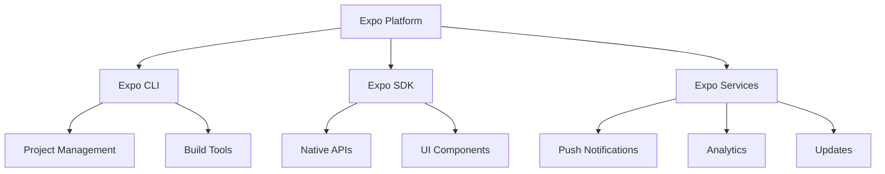

# 🚀 **Expo Overview**

> **Master Expo development platform, features, and capabilities for React Native applications**

<link rel="stylesheet" href="../../common-styles.css">

---

## 📚 **Table of Contents**

- [Expo Overview](#-expo-overview)
- [Expo Features](#-expo-features)
- [Expo CLI](#-expo-cli)
- [Expo SDK](#-expo-sdk)
- [Development Workflow](#-development-workflow)
- [Best Practices](#-best-practices)
- [Interview Questions](#-interview-questions)

---

## 🚀 **Expo Overview**

### **Expo Platform Architecture**





### **Key Benefits**
- **Rapid Development**: Quick setup and development
- **Cross-Platform**: iOS and Android support
- **Rich Ecosystem**: Extensive library of modules
- **Cloud Services**: Built-in backend services

---

## 🎯 **Expo Features**

### **Core Features**

<button onclick="copyCode(this)" class="copy-btn">📋 Copy</button>

```javascript
import React, { useState, useEffect } from 'react';
import { View, Text, StyleSheet, TouchableOpacity, Alert } from 'react-native';
import * as Expo from 'expo';

const ExpoFeaturesDemo = () => {
  const [deviceInfo, setDeviceInfo] = useState(null);
  const [location, setLocation] = useState(null);
  const [cameraPermission, setCameraPermission] = useState(null);

  useEffect(() => {
    loadDeviceInfo();
    requestLocationPermission();
    requestCameraPermission();
  }, []);

  const loadDeviceInfo = async () => {
    try {
      const info = {
        deviceName: Expo.Constants.deviceName,
        deviceType: Expo.Constants.deviceType,
        platform: Expo.Constants.platform,
        version: Expo.Constants.expoVersion,
        appVersion: Expo.Constants.nativeAppVersion,
        buildVersion: Expo.Constants.nativeBuildVersion,
      };
      setDeviceInfo(info);
    } catch (error) {
      console.error('Error loading device info:', error);
    }
  };

  const requestLocationPermission = async () => {
    try {
      const { status } = await Expo.Location.requestForegroundPermissionsAsync();
      setLocation({ permission: status });
      
      if (status === 'granted') {
        const locationData = await Expo.Location.getCurrentPositionAsync({});
        setLocation(prev => ({ ...prev, data: locationData }));
      }
    } catch (error) {
      console.error('Error requesting location permission:', error);
    }
  };

  const requestCameraPermission = async () => {
    try {
      const { status } = await Expo.Camera.requestCameraPermissionsAsync();
      setCameraPermission(status);
    } catch (error) {
      console.error('Error requesting camera permission:', error);
    }
  };

  const handlePushNotification = async () => {
    try {
      const { status } = await Expo.Notifications.requestPermissionsAsync();
      if (status === 'granted') {
        await Expo.Notifications.scheduleNotificationAsync({
          content: {
            title: 'Expo Demo',
            body: 'This is a test notification from Expo!',
          },
          trigger: { seconds: 2 },
        });
        Alert.alert('Success', 'Notification scheduled!');
      }
    } catch (error) {
      console.error('Error scheduling notification:', error);
    }
  };

  const handleShare = async () => {
    try {
      await Expo.Sharing.shareAsync('https://expo.dev', {
        mimeType: 'text/plain',
        dialogTitle: 'Share Expo Link',
      });
    } catch (error) {
      console.error('Error sharing:', error);
    }
  };

  const handleHapticFeedback = () => {
    Expo.Haptics.impactAsync(Expo.Haptics.ImpactFeedbackStyle.Medium);
  };

  return (
    <View style={styles.container}>
      <Text style={styles.title}>Expo Features Demo</Text>
      
      {deviceInfo && (
        <View style={styles.section}>
          <Text style={styles.sectionTitle}>Device Information</Text>
          <Text style={styles.infoText}>Device: {deviceInfo.deviceName}</Text>
          <Text style={styles.infoText}>Type: {deviceInfo.deviceType}</Text>
          <Text style={styles.infoText}>Platform: {deviceInfo.platform?.ios ? 'iOS' : 'Android'}</Text>
          <Text style={styles.infoText}>Expo Version: {deviceInfo.version}</Text>
          <Text style={styles.infoText}>App Version: {deviceInfo.appVersion}</Text>
        </View>
      )}

      {location && (
        <View style={styles.section}>
          <Text style={styles.sectionTitle}>Location</Text>
          <Text style={styles.infoText}>Permission: {location.permission}</Text>
          {location.data && (
            <>
              <Text style={styles.infoText}>
                Latitude: {location.data.coords.latitude.toFixed(6)}
              </Text>
              <Text style={styles.infoText}>
                Longitude: {location.data.coords.longitude.toFixed(6)}
              </Text>
            </>
          )}
        </View>
      )}

      <View style={styles.section}>
        <Text style={styles.sectionTitle}>Permissions</Text>
        <Text style={styles.infoText}>Camera: {cameraPermission || 'Unknown'}</Text>
      </View>

      <View style={styles.buttonContainer}>
        <TouchableOpacity 
          style={styles.button}
          onPress={handlePushNotification}
        >
          <Text style={styles.buttonText}>Send Notification</Text>
        </TouchableOpacity>

        <TouchableOpacity 
          style={styles.button}
          onPress={handleShare}
        >
          <Text style={styles.buttonText}>Share</Text>
        </TouchableOpacity>

        <TouchableOpacity 
          style={styles.button}
          onPress={handleHapticFeedback}
        >
          <Text style={styles.buttonText}>Haptic Feedback</Text>
        </TouchableOpacity>
      </View>
    </View>
  );
};

const styles = StyleSheet.create({
  container: {
    flex: 1,
    padding: 20,
    backgroundColor: '#fff',
  },
  title: {
    fontSize: 24,
    fontWeight: 'bold',
    marginBottom: 20,
    color: '#333',
  },
  section: {
    marginBottom: 20,
    padding: 15,
    backgroundColor: '#f8f9fa',
    borderRadius: 8,
  },
  sectionTitle: {
    fontSize: 18,
    fontWeight: 'bold',
    marginBottom: 10,
    color: '#333',
  },
  infoText: {
    fontSize: 14,
    color: '#666',
    marginBottom: 5,
  },
  buttonContainer: {
    marginTop: 20,
  },
  button: {
    backgroundColor: '#007bff',
    padding: 15,
    borderRadius: 8,
    marginBottom: 10,
    alignItems: 'center',
  },
  buttonText: {
    color: '#fff',
    fontSize: 16,
    fontWeight: 'bold',
  },
});

export default ExpoFeaturesDemo;
```


---

## 🛠️ **Expo CLI**

### **CLI Commands and Usage**

<button onclick="copyCode(this)" class="copy-btn">📋 Copy</button>

```javascript
// Expo CLI command examples
const ExpoCLICommands = {
  // Project initialization
  init: {
    command: 'npx create-expo-app MyApp',
    description: 'Create a new Expo project',
    options: {
      template: '--template blank-typescript',
      npm: '--npm',
      yarn: '--yarn',
    }
  },

  // Development
  start: {
    command: 'npx expo start',
    description: 'Start the development server',
    options: {
      clear: '--clear',
      tunnel: '--tunnel',
      lan: '--lan',
      localhost: '--localhost',
    }
  },

  // Building
  build: {
    android: {
      command: 'npx expo build:android',
      description: 'Build Android APK/AAB',
      options: {
        type: '--type apk',
        releaseChannel: '--release-channel production',
      }
    },
    ios: {
      command: 'npx expo build:ios',
      description: 'Build iOS IPA',
      options: {
        type: '--type archive',
        releaseChannel: '--release-channel production',
      }
    }
  },

  // Publishing
  publish: {
    command: 'npx expo publish',
    description: 'Publish app to Expo servers',
    options: {
      releaseChannel: '--release-channel production',
      message: '--message "Update message"',
    }
  },

  // Updates
  update: {
    command: 'npx expo update',
    description: 'Update Expo SDK',
    options: {
      sdk: '--sdk 49',
      npm: '--npm',
    }
  },

  // Eject
  eject: {
    command: 'npx expo eject',
    description: 'Eject to bare React Native',
    options: {
      npm: '--npm',
      yarn: '--yarn',
    }
  }
};

// Expo CLI wrapper
const ExpoCLI = {
  // Initialize project
  initProject: async (projectName, options = {}) => {
    const { template, packageManager } = options;
    let command = `npx create-expo-app ${projectName}`;
    
    if (template) {
      command += ` --template ${template}`;
    }
    
    if (packageManager === 'yarn') {
      command += ' --yarn';
    } else if (packageManager === 'npm') {
      command += ' --npm';
    }
    
    return await executeCommand(command);
  },

  // Start development server
  startDevServer: async (options = {}) => {
    const { clear, tunnel, lan, localhost } = options;
    let command = 'npx expo start';
    
    if (clear) command += ' --clear';
    if (tunnel) command += ' --tunnel';
    if (lan) command += ' --lan';
    if (localhost) command += ' --localhost';
    
    return await executeCommand(command);
  },

  // Build app
  buildApp: async (platform, options = {}) => {
    const { type, releaseChannel } = options;
    let command = `npx expo build:${platform}`;
    
    if (type) command += ` --type ${type}`;
    if (releaseChannel) command += ` --release-channel ${releaseChannel}`;
    
    return await executeCommand(command);
  },

  // Publish app
  publishApp: async (options = {}) => {
    const { releaseChannel, message } = options;
    let command = 'npx expo publish';
    
    if (releaseChannel) command += ` --release-channel ${releaseChannel}`;
    if (message) command += ` --message "${message}"`;
    
    return await executeCommand(command);
  },

  // Update SDK
  updateSDK: async (sdkVersion, options = {}) => {
    const { packageManager } = options;
    let command = 'npx expo update';
    
    if (sdkVersion) command += ` --sdk ${sdkVersion}`;
    if (packageManager === 'npm') command += ' --npm';
    if (packageManager === 'yarn') command += ' --yarn';
    
    return await executeCommand(command);
  }
};

// Execute command helper
const executeCommand = async (command) => {
  try {
    const { execSync } = require('child_process');
    const output = execSync(command, { encoding: 'utf8' });
    return { success: true, output };
  } catch (error) {
    return { success: false, error: error.message };
  }
};

export { ExpoCLICommands, ExpoCLI };
```


---

## 📱 **Expo SDK**

### **SDK Modules and APIs**

<button onclick="copyCode(this)" class="copy-btn">📋 Copy</button>

```javascript
import React, { useState, useEffect } from 'react';
import { View, Text, StyleSheet, TouchableOpacity, Alert } from 'react-native';
import * as Expo from 'expo';

const ExpoSDKDemo = () => {
  const [sdkInfo, setSDKInfo] = useState(null);
  const [availableModules, setAvailableModules] = useState([]);

  useEffect(() => {
    loadSDKInfo();
    loadAvailableModules();
  }, []);

  const loadSDKInfo = () => {
    const info = {
      version: Expo.Constants.expoVersion,
      sdkVersion: Expo.Constants.sdkVersion,
      platform: Expo.Constants.platform,
      isDevice: Expo.Constants.isDevice,
      appOwnership: Expo.Constants.appOwnership,
      expoGoVersion: Expo.Constants.expoGoVersion,
    };
    setSDKInfo(info);
  };

  const loadAvailableModules = () => {
    const modules = [
      { name: 'Camera', available: !!Expo.Camera },
      { name: 'Location', available: !!Expo.Location },
      { name: 'Notifications', available: !!Expo.Notifications },
      { name: 'Sharing', available: !!Expo.Sharing },
      { name: 'Haptics', available: !!Expo.Haptics },
      { name: 'FileSystem', available: !!Expo.FileSystem },
      { name: 'SecureStore', available: !!Expo.SecureStore },
      { name: 'Contacts', available: !!Expo.Contacts },
      { name: 'Calendar', available: !!Expo.Calendar },
      { name: 'MediaLibrary', available: !!Expo.MediaLibrary },
    ];
    setAvailableModules(modules);
  };

  const testModule = async (moduleName) => {
    try {
      switch (moduleName) {
        case 'Camera':
          const cameraPermission = await Expo.Camera.requestCameraPermissionsAsync();
          Alert.alert('Camera Permission', `Status: ${cameraPermission.status}`);
          break;
        
        case 'Location':
          const locationPermission = await Expo.Location.requestForegroundPermissionsAsync();
          Alert.alert('Location Permission', `Status: ${locationPermission.status}`);
          break;
        
        case 'Notifications':
          const notificationPermission = await Expo.Notifications.requestPermissionsAsync();
          Alert.alert('Notification Permission', `Status: ${notificationPermission.status}`);
          break;
        
        case 'Haptics':
          Expo.Haptics.impactAsync(Expo.Haptics.ImpactFeedbackStyle.Heavy);
          Alert.alert('Haptics', 'Heavy impact feedback triggered!');
          break;
        
        case 'SecureStore':
          await Expo.SecureStore.setItemAsync('test-key', 'test-value');
          const value = await Expo.SecureStore.getItemAsync('test-key');
          Alert.alert('SecureStore', `Stored and retrieved: ${value}`);
          break;
        
        default:
          Alert.alert('Module Test', `${moduleName} module is available`);
      }
    } catch (error) {
      Alert.alert('Error', `Failed to test ${moduleName}: ${error.message}`);
    }
  };

  return (
    <View style={styles.container}>
      <Text style={styles.title}>Expo SDK Demo</Text>
      
      {sdkInfo && (
        <View style={styles.section}>
          <Text style={styles.sectionTitle}>SDK Information</Text>
          <Text style={styles.infoText}>Version: {sdkInfo.version}</Text>
          <Text style={styles.infoText}>SDK Version: {sdkInfo.sdkVersion}</Text>
          <Text style={styles.infoText}>Platform: {JSON.stringify(sdkInfo.platform)}</Text>
          <Text style={styles.infoText}>Is Device: {sdkInfo.isDevice ? 'Yes' : 'No'}</Text>
          <Text style={styles.infoText}>App Ownership: {sdkInfo.appOwnership}</Text>
          {sdkInfo.expoGoVersion && (
            <Text style={styles.infoText}>Expo Go Version: {sdkInfo.expoGoVersion}</Text>
          )}
        </View>
      )}

      <View style={styles.section}>
        <Text style={styles.sectionTitle}>Available Modules</Text>
        {availableModules.map((module, index) => (
          <TouchableOpacity
            key={index}
            style={[
              styles.moduleButton,
              { backgroundColor: module.available ? '#28a745' : '#dc3545' }
            ]}
            onPress={() => module.available && testModule(module.name)}
            disabled={!module.available}
          >
            <Text style={styles.moduleButtonText}>
              {module.name} {module.available ? '✓' : '✗'}
            </Text>
          </TouchableOpacity>
        ))}
      </View>
    </View>
  );
};

const styles = StyleSheet.create({
  container: {
    flex: 1,
    padding: 20,
    backgroundColor: '#fff',
  },
  title: {
    fontSize: 24,
    fontWeight: 'bold',
    marginBottom: 20,
    color: '#333',
  },
  section: {
    marginBottom: 20,
    padding: 15,
    backgroundColor: '#f8f9fa',
    borderRadius: 8,
  },
  sectionTitle: {
    fontSize: 18,
    fontWeight: 'bold',
    marginBottom: 10,
    color: '#333',
  },
  infoText: {
    fontSize: 14,
    color: '#666',
    marginBottom: 5,
  },
  moduleButton: {
    padding: 10,
    borderRadius: 5,
    marginBottom: 5,
    alignItems: 'center',
  },
  moduleButtonText: {
    color: '#fff',
    fontSize: 14,
    fontWeight: 'bold',
  },
});

export default ExpoSDKDemo;
```


---

## 🎯 **Best Practices**

### **1. Expo Development**
- Use Expo Go for development
- Leverage Expo SDK modules
- Follow Expo best practices
- Keep SDK updated

### **2. Project Structure**
- Organize code properly
- Use TypeScript
- Implement proper error handling
- Follow naming conventions

### **3. Performance**
- Optimize bundle size
- Use lazy loading
- Implement proper caching
- Monitor performance

---

## ❓ **Interview Questions**

### **Basic Questions**
1. **What is Expo?**
2. **What are the main features of Expo?**
3. **How do you create an Expo project?**

### **Advanced Questions**
1. **Explain the Expo development workflow.**
2. **What are the limitations of Expo?**
3. **How do you handle native modules in Expo?**

### **Practical Questions**
1. **Create an Expo project with basic features.**
2. **Implement camera functionality using Expo.**
3. **Set up push notifications with Expo.**

---

## 🧭 Navigation

<div class="navigation">
    <a href="../13-Architecture-Scaling/04-Monorepo-Management.md" class="nav-link prev">⬅️ Previous: Monorepo Management</a>
    <a href="./02-Bare-Workflow.md" class="nav-link next">Next: Bare Workflow ➡️</a>
</div>

---

<script src="../../common-scripts.js"></script>

*Last updated: December 2024*
