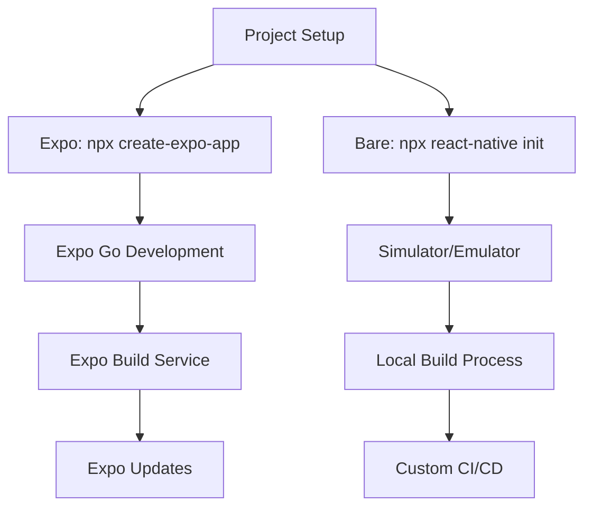

# ⚖️ **Expo vs Bare Comparison**

> **Master the comparison between Expo and Bare React Native workflows, trade-offs, and decision criteria**

<link rel="stylesheet" href="../../common-styles.css">

---

## 📚 **Table of Contents**

- [Workflow Comparison](#-workflow-comparison)
- [Feature Comparison](#-feature-comparison)
- [Performance Comparison](#-performance-comparison)
- [Development Experience](#-development-experience)
- [Migration Strategies](#-migration-strategies)
- [Decision Matrix](#-decision-matrix)
- [Interview Questions](#-interview-questions)

---

## ⚖️ **Workflow Comparison**

### **Development Workflow Comparison**



### **Key Differences**

<button onclick="copyCode(this)" class="copy-btn">📋 Copy</button>
```javascript
// Workflow comparison data
const WorkflowComparison = {
  setup: {
    expo: {
      time: '2-5 minutes',
      complexity: 'Low',
      requirements: ['Node.js', 'Expo CLI'],
      steps: [
        'npx create-expo-app MyApp',
        'cd MyApp',
        'npx expo start'
      ]
    },
    bare: {
      time: '15-30 minutes',
      complexity: 'High',
      requirements: ['Node.js', 'Android Studio', 'Xcode', 'Java', 'CocoaPods'],
      steps: [
        'npx react-native init MyApp',
        'cd MyApp',
        'cd android && ./gradlew clean',
        'cd ios && pod install',
        'npx react-native run-android/ios'
      ]
    }
  },

  development: {
    expo: {
      hotReload: 'Instant',
      debugging: 'Expo DevTools',
      testing: 'Expo Go app',
      limitations: 'Expo SDK only'
    },
    bare: {
      hotReload: 'Fast',
      debugging: 'Flipper, Chrome DevTools',
      testing: 'Simulator/Emulator',
      limitations: 'None'
    }
  },

  building: {
    expo: {
      process: 'Cloud-based',
      time: '10-20 minutes',
      control: 'Limited',
      cost: 'Free tier available'
    },
    bare: {
      process: 'Local',
      time: '5-15 minutes',
      control: 'Full',
      cost: 'Free'
    }
  }
};

// Development experience comparison
const DevelopmentExperience = {
  expo: {
    pros: [
      'Rapid prototyping',
      'No native setup required',
      'Built-in services',
      'Easy sharing and testing',
      'Automatic updates'
    ],
    cons: [
      'Limited native access',
      'Bundle size overhead',
      'Expo SDK dependency',
      'Less control over build process'
    ]
  },
  bare: {
    pros: [
      'Full native access',
      'Custom native modules',
      'Complete build control',
      'Better performance',
      'No vendor lock-in'
    ],
    cons: [
      'Complex setup',
      'Native development required',
      'Manual updates',
      'Platform-specific knowledge needed'
    ]
  }
};

export { WorkflowComparison, DevelopmentExperience };
```

---

## 🎯 **Feature Comparison**

### **Feature Availability Matrix**

<button onclick="copyCode(this)" class="copy-btn">📋 Copy</button>
```javascript
// Feature comparison matrix
const FeatureComparison = {
  // Core React Native features
  coreFeatures: {
    'React Native Core': { expo: true, bare: true, notes: 'Both support full React Native' },
    'JavaScript Bridge': { expo: true, bare: true, notes: 'Native bridge available in both' },
    'Hot Reload': { expo: true, bare: true, notes: 'Both support fast refresh' },
    'Debugging': { expo: true, bare: true, notes: 'Different tools available' },
  },

  // Native APIs
  nativeAPIs: {
    'Camera': { expo: 'expo-camera', bare: 'react-native-camera', notes: 'Different implementations' },
    'Location': { expo: 'expo-location', bare: 'react-native-geolocation', notes: 'Similar functionality' },
    'Push Notifications': { expo: 'expo-notifications', bare: 'react-native-push-notification', notes: 'Expo has built-in service' },
    'File System': { expo: 'expo-file-system', bare: 'react-native-fs', notes: 'Different APIs' },
    'Secure Storage': { expo: 'expo-secure-store', bare: 'react-native-keychain', notes: 'Similar functionality' },
    'Biometrics': { expo: 'expo-local-authentication', bare: 'react-native-touch-id', notes: 'Different implementations' },
  },

  // Build and deployment
  buildDeployment: {
    'OTA Updates': { expo: 'Built-in', bare: 'CodePush', notes: 'Expo has native support' },
    'App Store Builds': { expo: 'EAS Build', bare: 'Local/Xcode', notes: 'Different processes' },
    'Custom Native Code': { expo: 'Limited', bare: 'Full', notes: 'Bare has complete control' },
    'Third-party Libraries': { expo: 'Expo-compatible only', bare: 'Any React Native library', notes: 'Bare has more options' },
  },

  // Development tools
  developmentTools: {
    'Expo Go': { expo: true, bare: false, notes: 'Expo-specific development app' },
    'Flipper': { expo: false, bare: true, notes: 'Advanced debugging tool' },
    'Metro': { expo: true, bare: true, notes: 'Both use Metro bundler' },
    'Fastlane': { expo: 'Limited', bare: 'Full', notes: 'Bare has more automation options' },
  }
};

// Feature implementation examples
const FeatureImplementation = {
  // Camera implementation comparison
  camera: {
    expo: `
import { Camera } from 'expo-camera';

const ExpoCamera = () => {
  const [hasPermission, setHasPermission] = useState(null);
  
  useEffect(() => {
    (async () => {
      const { status } = await Camera.requestCameraPermissionsAsync();
      setHasPermission(status === 'granted');
    })();
  }, []);

  if (hasPermission === null) {
    return <View />;
  }
  if (hasPermission === false) {
    return <Text>No access to camera</Text>;
  }
  
  return (
    <Camera style={{#123;{{#123; flex: 1 }}#125;}}#125; type={Camera.Constants.Type.back}>
      <View style={{#123;{{#123; flex: 1, backgroundColor: 'transparent', flexDirection: 'row' }}#125;}}#125;>
        <TouchableOpacity
          style={{#123;{{#123; flex: 0.1, alignSelf: 'flex-end', alignItems: 'center' }}#125;}}#125;
          onPress={() => {
            setType(
              type === Camera.Constants.Type.back
                ? Camera.Constants.Type.front
                : Camera.Constants.Type.back
            );
          }}#125;}}#125;>
          <Text style={{#123;{{#123; fontSize: 18, marginBottom: 10, color: 'white' }}#125;}}#125;> Flip </Text>
        </TouchableOpacity>
      </View>
    </Camera>
  );
};`,

    bare: `
import { RNCamera } from 'react-native-camera';

const BareCamera = () => {
  const [hasPermission, setHasPermission] = useState(null);
  
  useEffect(() => {
    (async () => {
      const { status } = await RNCamera.requestCameraPermission();
      setHasPermission(status === 'authorized');
    })();
  }, []);

  if (hasPermission === null) {
    return <View />;
  }
  if (hasPermission === false) {
    return <Text>No access to camera</Text>;
  }
  
  return (
    <RNCamera
      style={{#123;{{#123; flex: 1 }}#125;}}#125;
      type={RNCamera.Constants.Type.back}
      flashMode={RNCamera.Constants.FlashMode.on}
      androidCameraPermissionOptions={{#123;{{#123;
        title: 'Permission to use camera',
        message: 'We need your permission to use your camera',
        buttonPositive: 'Ok',
        buttonNegative: 'Cancel',
      }}#125;}}#125;
    >
      <View style={{#123;{{#123; flex: 1, backgroundColor: 'transparent', flexDirection: 'row' }}#125;}}#125;>
        <TouchableOpacity
          style={{#123;{{#123; flex: 0.1, alignSelf: 'flex-end', alignItems: 'center' }}#125;}}#125;
          onPress={() => {
            setType(
              type === RNCamera.Constants.Type.back
                ? RNCamera.Constants.Type.front
                : RNCamera.Constants.Type.back
            );
          }}#125;}}#125;>
          <Text style={{#123;{{#123; fontSize: 18, marginBottom: 10, color: 'white' }}#125;}}#125;> Flip </Text>
        </TouchableOpacity>
      </View>
    </RNCamera>
  );
};`
  }
};

export { FeatureComparison, FeatureImplementation };
```

---

## ⚡ **Performance Comparison**

### **Performance Metrics**

<button onclick="copyCode(this)" class="copy-btn">📋 Copy</button>
```javascript
// Performance comparison data
const PerformanceComparison = {
  // Bundle size comparison
  bundleSize: {
    expo: {
      baseSize: '15-25 MB',
      withExpoSDK: '20-30 MB',
      overhead: '5-10 MB',
      factors: ['Expo SDK', 'Built-in modules', 'Development tools']
    },
    bare: {
      baseSize: '8-15 MB',
      withLibraries: '10-20 MB',
      overhead: '2-5 MB',
      factors: ['Only required libraries', 'Custom optimizations', 'Tree shaking']
    }
  },

  // Startup time comparison
  startupTime: {
    expo: {
      coldStart: '2-4 seconds',
      warmStart: '1-2 seconds',
      factors: ['Expo SDK initialization', 'Module loading', 'Bundle parsing']
    },
    bare: {
      coldStart: '1-3 seconds',
      warmStart: '0.5-1 second',
      factors: ['Direct native initialization', 'Optimized bundle', 'Custom loading']
    }
  },

  // Runtime performance
  runtimePerformance: {
    expo: {
      jsExecution: 'Good',
      nativeBridge: 'Standard',
      memoryUsage: 'Higher',
      factors: ['Expo SDK overhead', 'Additional abstractions']
    },
    bare: {
      jsExecution: 'Excellent',
      nativeBridge: 'Optimized',
      memoryUsage: 'Lower',
      factors: ['Direct native calls', 'Custom optimizations']
    }
  },

  // Build performance
  buildPerformance: {
    expo: {
      buildTime: '10-20 minutes',
      buildLocation: 'Cloud',
      parallelBuilds: 'Limited',
      factors: ['Queue time', 'Network latency', 'Shared resources']
    },
    bare: {
      buildTime: '5-15 minutes',
      buildLocation: 'Local',
      parallelBuilds: 'Unlimited',
      factors: ['Local resources', 'Custom configuration', 'Incremental builds']
    }
  }
};

// Performance testing utilities
const PerformanceTesting = {
  // Bundle size analysis
  analyzeBundleSize: async (projectPath) => {
    const bundleAnalyzer = require('@react-native-community/cli-plugin-metro/build/commands/bundle/bundleCommand');
    
    try {
      const result = await bundleAnalyzer({
        platform: 'android',
        dev: false,
        minify: true,
        bundleOutput: 'bundle-analysis.json',
        sourcemapOutput: 'bundle-analysis.map',
      });
      
      return {
        bundleSize: result.bundleSize,
        gzipSize: result.gzipSize,
        modules: result.modules,
        chunks: result.chunks
      };
    } catch (error) {
      console.error('Bundle analysis failed:', error);
      return null;
    }
  },

  // Startup time measurement
  measureStartupTime: () => {
    const startTime = performance.now();
    
    return {
      start: () => {
        startTime = performance.now();
      },
      end: () => {
        const endTime = performance.now();
        return endTime - startTime;
      }
    };
  },

  // Memory usage monitoring
  monitorMemoryUsage: () => {
    const memoryInfo = {
      jsHeapSizeLimit: performance.memory?.jsHeapSizeLimit || 0,
      totalJSHeapSize: performance.memory?.totalJSHeapSize || 0,
      usedJSHeapSize: performance.memory?.usedJSHeapSize || 0,
    };
    
    return {
      getCurrentUsage: () => memoryInfo,
      getUsagePercentage: () => {
        return (memoryInfo.usedJSHeapSize / memoryInfo.jsHeapSizeLimit) * 100;
      }
    };
  }
};

export { PerformanceComparison, PerformanceTesting };
```

---

## 🔄 **Migration Strategies**

### **Expo to Bare Migration**

<button onclick="copyCode(this)" class="copy-btn">📋 Copy</button>
```javascript
// Migration strategies and tools
const MigrationStrategies = {
  // Expo to Bare migration
  expoToBare: {
    steps: [
      'Run expo eject command',
      'Install native dependencies',
      'Update build configurations',
      'Test on both platforms',
      'Update CI/CD pipelines'
    ],
    
    commands: {
      eject: 'npx expo eject',
      installDeps: 'cd ios && pod install',
      cleanBuild: 'cd android && ./gradlew clean',
      testBuild: 'npx react-native run-android && npx react-native run-ios'
    },
    
    considerations: [
      'Backup project before migration',
      'Test all features after migration',
      'Update documentation',
      'Train team on new workflow',
      'Update deployment processes'
    ]
  },

  // Bare to Expo migration
  bareToExpo: {
    steps: [
      'Create new Expo project',
      'Migrate source code',
      'Replace native modules with Expo equivalents',
      'Update dependencies',
      'Test functionality'
    ],
    
    commands: {
      createProject: 'npx create-expo-app MyApp',
      installDeps: 'npx expo install',
      start: 'npx expo start'
    },
    
    considerations: [
      'Check Expo SDK compatibility',
      'Replace incompatible libraries',
      'Update native code to Expo modules',
      'Test all features',
      'Update build processes'
    ]
  }
};

// Migration helper utilities
const MigrationHelpers = {
  // Check Expo compatibility
  checkExpoCompatibility: (packageJson) => {
    const incompatiblePackages = [];
    const expoCompatiblePackages = [];
    
    Object.keys(packageJson.dependencies || {}).forEach(packageName => {
      if (packageName.startsWith('react-native-')) {
        // Check if package is Expo compatible
        const isExpoCompatible = checkExpoCompatibility(packageName);
        if (isExpoCompatible) {
          expoCompatiblePackages.push(packageName);
        } else {
          incompatiblePackages.push(packageName);
        }
      }
    });
    
    return {
      compatible: expoCompatiblePackages,
      incompatible: incompatiblePackages,
      recommendations: generateMigrationRecommendations(incompatiblePackages)
    };
  },

  // Generate migration recommendations
  generateMigrationRecommendations: (incompatiblePackages) => {
    const recommendations = [];
    
    incompatiblePackages.forEach(packageName => {
      const recommendation = getExpoAlternative(packageName);
      if (recommendation) {
        recommendations.push({
          original: packageName,
          alternative: recommendation.alternative,
          migrationSteps: recommendation.steps
        });
      }
    });
    
    return recommendations;
  },

  // Get Expo alternatives
  getExpoAlternative: (packageName) => {
    const alternatives = {
      'react-native-camera': {
        alternative: 'expo-camera',
        steps: [
          'Remove react-native-camera',
          'Install expo-camera',
          'Update import statements',
          'Update API calls'
        ]
      },
      'react-native-geolocation': {
        alternative: 'expo-location',
        steps: [
          'Remove react-native-geolocation',
          'Install expo-location',
          'Update import statements',
          'Update API calls'
        ]
      },
      'react-native-push-notification': {
        alternative: 'expo-notifications',
        steps: [
          'Remove react-native-push-notification',
          'Install expo-notifications',
          'Update import statements',
          'Update API calls'
        ]
      }
    };
    
    return alternatives[packageName] || null;
  }
};

export { MigrationStrategies, MigrationHelpers };
```

---

## 🎯 **Decision Matrix**

### **Decision Criteria**

<button onclick="copyCode(this)" class="copy-btn">📋 Copy</button>
```javascript
// Decision matrix for choosing between Expo and Bare
const DecisionMatrix = {
  // Project requirements
  projectRequirements: {
    rapidPrototyping: {
      expo: 9,
      bare: 4,
      weight: 0.15,
      description: 'How quickly can you build and test ideas?'
    },
    nativeCustomization: {
      expo: 3,
      bare: 9,
      weight: 0.20,
      description: 'Need for custom native functionality'
    },
    teamExpertise: {
      expo: 8,
      bare: 5,
      weight: 0.15,
      description: 'Team familiarity with React Native'
    },
    performance: {
      expo: 6,
      bare: 9,
      weight: 0.15,
      description: 'App performance requirements'
    },
    budget: {
      expo: 7,
      bare: 8,
      weight: 0.10,
      description: 'Development and maintenance costs'
    },
    timeToMarket: {
      expo: 9,
      bare: 6,
      weight: 0.15,
      description: 'How quickly do you need to launch?'
    },
    scalability: {
      expo: 6,
      bare: 9,
      weight: 0.10,
      description: 'Long-term scalability needs'
    }
  },

  // Calculate weighted score
  calculateScore: (requirements) => {
    let expoScore = 0;
    let bareScore = 0;
    
    Object.entries(requirements).forEach(([criterion, data]) => {
      expoScore += data.expo * data.weight;
      bareScore += data.bare * data.weight;
    });
    
    return {
      expo: expoScore,
      bare: bareScore,
      recommendation: expoScore > bareScore ? 'Expo' : 'Bare'
    };
  },

  // Use case recommendations
  useCaseRecommendations: {
    'MVP/Prototype': {
      recommendation: 'Expo',
      reasoning: 'Fast development, easy testing, built-in services',
      score: { expo: 8.5, bare: 4.5 }
    },
    'Enterprise App': {
      recommendation: 'Bare',
      reasoning: 'Full control, custom native modules, performance',
      score: { expo: 5.5, bare: 8.5 }
    },
    'Consumer App': {
      recommendation: 'Expo',
      reasoning: 'Rapid iteration, easy updates, good performance',
      score: { expo: 7.5, bare: 6.5 }
    },
    'Gaming App': {
      recommendation: 'Bare',
      reasoning: 'Performance critical, custom native code needed',
      score: { expo: 4.0, bare: 9.0 }
    },
    'E-commerce App': {
      recommendation: 'Expo',
      reasoning: 'Standard features, fast development, easy maintenance',
      score: { expo: 7.0, bare: 6.0 }
    }
  }
};

// Decision helper
const DecisionHelper = {
  // Get recommendation based on project details
  getRecommendation: (projectDetails) => {
    const { type, teamSize, timeline, budget, requirements } = projectDetails;
    
    // Calculate scores based on project details
    const scores = DecisionMatrix.calculateScore(DecisionMatrix.projectRequirements);
    
    // Adjust scores based on project details
    if (type === 'MVP' || type === 'Prototype') {
      scores.expo += 2;
    } else if (type === 'Enterprise' || type === 'Gaming') {
      scores.bare += 2;
    }
    
    if (teamSize < 5) {
      scores.expo += 1;
    } else if (teamSize > 10) {
      scores.bare += 1;
    }
    
    if (timeline === 'urgent') {
      scores.expo += 2;
    }
    
    return {
      recommendation: scores.expo > scores.bare ? 'Expo' : 'Bare',
      confidence: Math.abs(scores.expo - scores.bare) / 10,
      scores,
      reasoning: generateReasoning(scores, projectDetails)
    };
  },

  // Generate reasoning for recommendation
  generateReasoning: (scores, projectDetails) => {
    const reasons = [];
    
    if (scores.expo > scores.bare) {
      reasons.push('Expo provides faster development and easier maintenance');
      if (projectDetails.timeline === 'urgent') {
        reasons.push('Expo is better for tight deadlines');
      }
      if (projectDetails.teamSize < 5) {
        reasons.push('Expo requires less native development expertise');
      }
    } else {
      reasons.push('Bare React Native provides more control and flexibility');
      if (projectDetails.requirements.includes('custom-native')) {
        reasons.push('Bare allows custom native module development');
      }
      if (projectDetails.requirements.includes('performance')) {
        reasons.push('Bare provides better performance optimization');
      }
    }
    
    return reasons;
  }
};

export { DecisionMatrix, DecisionHelper };
```

---

## 🎯 **Best Practices**

### **1. Choosing the Right Workflow**
- Evaluate project requirements
- Consider team expertise
- Plan for long-term maintenance
- Test both approaches

### **2. Migration Planning**
- Backup existing projects
- Test thoroughly after migration
- Update documentation
- Train team members

### **3. Hybrid Approach**
- Use Expo for rapid prototyping
- Migrate to Bare for production
- Leverage both workflows
- Plan migration strategy

---

## ❓ **Interview Questions**

### **Basic Questions**
1. **What are the main differences between Expo and Bare React Native?**
2. **When would you choose Expo over Bare workflow?**
3. **What are the limitations of Expo?**

### **Advanced Questions**
1. **How would you migrate from Expo to Bare React Native?**
2. **Explain the performance differences between Expo and Bare.**
3. **How do you decide between Expo and Bare for a new project?**

### **Practical Questions**
1. **Create a decision matrix for choosing between Expo and Bare.**
2. **Implement a migration strategy from Expo to Bare.**
3. **Compare the development experience of both workflows.**

---

## 🧭 Navigation

<div class="navigation">
    <a href="./02-Bare-Workflow.md" class="nav-link prev">⬅️ Previous: Bare Workflow</a>
    <a href="./04-Migration-Strategies.md" class="nav-link next">Next: Migration Strategies ➡️</a>
</div>

---

<script src="../../common-scripts.js"></script>

*Last updated: December 2024*
