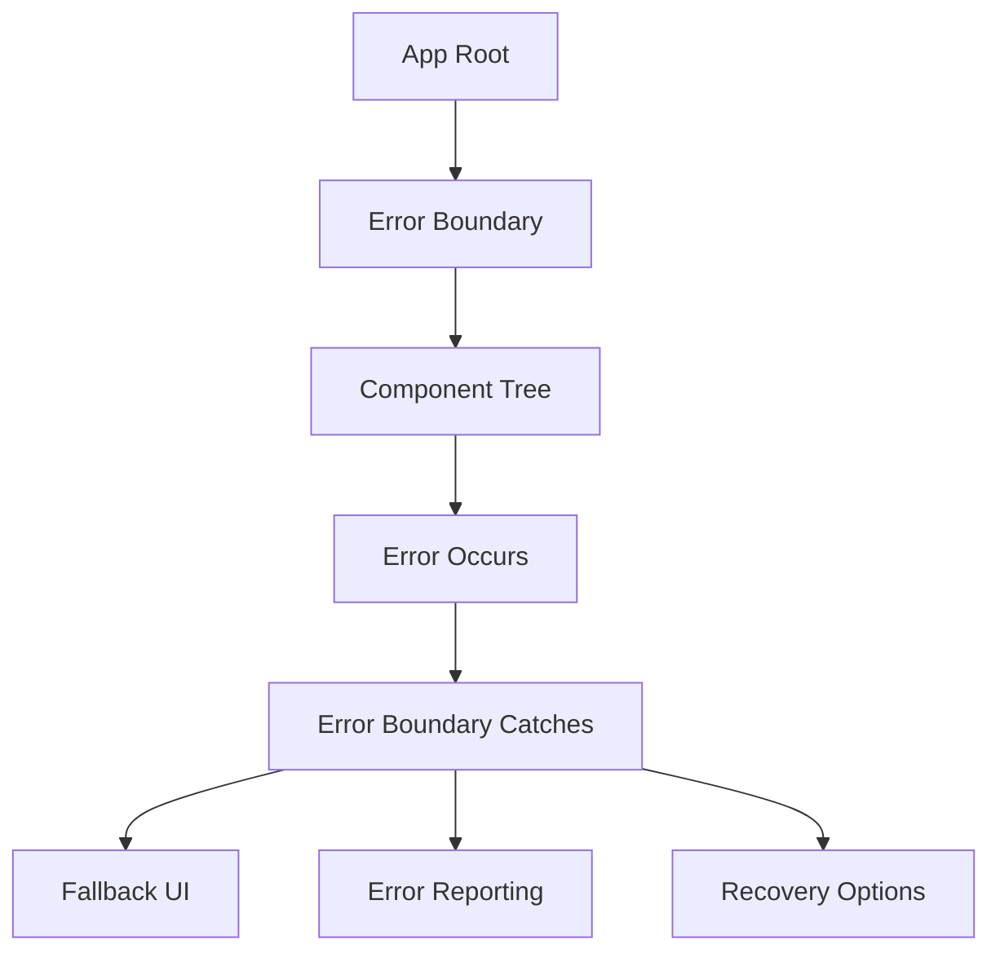

# 🛡️ **Error Boundaries**

> **Master error boundaries, error handling strategies, and recovery mechanisms for React Native applications**

<link rel="stylesheet" href="../../common-styles.css">

---

## 📚 **Table of Contents**

- [Error Boundaries Overview](#-error-boundaries-overview)
- [Error Boundary Implementation](#-error-boundary-implementation)
- [Error Recovery Strategies](#-error-recovery-strategies)
- [Error Reporting](#-error-reporting)
- [Best Practices](#-best-practices)
- [Interview Questions](#-interview-questions)

---

## 🛡️ **Error Boundaries Overview**

### **Error Boundary Architecture**



### **Key Concepts**
- **Error Boundaries**: Catch JavaScript errors in component tree
- **Fallback UI**: Display when errors occur
- **Error Reporting**: Log and track errors
- **Recovery**: Allow users to recover from errors

---

## 🛡️ **Error Boundary Implementation**

### **Basic Error Boundary**

<button onclick="copyCode(this)" class="copy-btn">📋 Copy</button>
```javascript
import React, { useState, useEffect } from 'react';
import { View, Text, TouchableOpacity, StyleSheet, Alert } from 'react-native';

const ErrorBoundary = ({ children, fallback, onError }) => {
  const [hasError, setHasError] = useState(false);
  const [error, setError] = useState(null);
  const [errorInfo, setErrorInfo] = useState(null);

  useEffect(() => {
    const handleError = (error, errorInfo) => {
      setHasError(true);
      setError(error);
      setErrorInfo(errorInfo);
      
      // Report error
      if (onError) {
        onError(error, errorInfo);
      }
      
      // Log error
      console.error('Error Boundary caught an error:', error, errorInfo);
    };

    // Set up error handler
    const originalConsoleError = console.error;
    console.error = (...args) => {
      originalConsoleError(...args);
      if (args[0] instanceof Error) {
        handleError(args[0], { componentStack: args[1] });
      }
    };

    return () => {
      console.error = originalConsoleError;
    };
  }, [onError]);

  const handleRetry = () => {
    setHasError(false);
    setError(null);
    setErrorInfo(null);
  };

  const handleReportError = () => {
    Alert.alert(
      'Report Error',
      'Would you like to report this error to help us improve the app?',
      [
        { text: 'Cancel', style: 'cancel' },
        { 
          text: 'Report', 
          onPress: () => {
            // Report error to service
            reportErrorToService(error, errorInfo);
          }
        }
      ]
    );
  };

  if (hasError) {
    if (fallback) {
      return fallback(error, errorInfo, handleRetry);
    }

    return (
      <View style={styles.errorContainer}>
        <Text style={styles.errorTitle}>Something went wrong</Text>
        <Text style={styles.errorMessage}>
          We're sorry, but something unexpected happened. Please try again.
        </Text>
        
        {__DEV__ && (
          <View style={styles.debugInfo}>
            <Text style={styles.debugTitle}>Debug Information:</Text>
            <Text style={styles.debugText}>{error?.message}</Text>
            <Text style={styles.debugText}>{errorInfo?.componentStack}</Text>
          </View>
        )}
        
        <View style={styles.buttonContainer}>
          <TouchableOpacity 
            style={styles.retryButton}
            onPress={handleRetry}
          >
            <Text style={styles.buttonText}>Try Again</Text>
          </TouchableOpacity>
          
          <TouchableOpacity 
            style={styles.reportButton}
            onPress={handleReportError}
          >
            <Text style={styles.buttonText}>Report Error</Text>
          </TouchableOpacity>
        </View>
      </View>
    );
  }

  return children;
};

// Error reporting service
const reportErrorToService = (error, errorInfo) => {
  const errorReport = {
    message: error.message,
    stack: error.stack,
    componentStack: errorInfo?.componentStack,
    timestamp: new Date().toISOString(),
    userAgent: 'React Native',
    platform: 'mobile'
  };
  
  // Send to error reporting service
  console.log('Reporting error:', errorReport);
  
  // In a real app, you would send this to a service like Sentry, Bugsnag, etc.
  // Example: Sentry.captureException(error, { extra: errorInfo });
};

const styles = StyleSheet.create({
  errorContainer: {
    flex: 1,
    justifyContent: 'center',
    alignItems: 'center',
    padding: 20,
    backgroundColor: '#fff',
  },
  errorTitle: {
    fontSize: 24,
    fontWeight: 'bold',
    color: '#dc3545',
    marginBottom: 10,
    textAlign: 'center',
  },
  errorMessage: {
    fontSize: 16,
    color: '#666',
    textAlign: 'center',
    marginBottom: 20,
    lineHeight: 24,
  },
  debugInfo: {
    backgroundColor: '#f8f9fa',
    padding: 15,
    borderRadius: 8,
    marginBottom: 20,
    width: '100%',
  },
  debugTitle: {
    fontSize: 14,
    fontWeight: 'bold',
    color: '#333',
    marginBottom: 10,
  },
  debugText: {
    fontSize: 12,
    color: '#666',
    fontFamily: 'monospace',
    marginBottom: 5,
  },
  buttonContainer: {
    flexDirection: 'row',
    gap: 10,
  },
  retryButton: {
    backgroundColor: '#007bff',
    paddingHorizontal: 20,
    paddingVertical: 10,
    borderRadius: 5,
  },
  reportButton: {
    backgroundColor: '#6c757d',
    paddingHorizontal: 20,
    paddingVertical: 10,
    borderRadius: 5,
  },
  buttonText: {
    color: '#fff',
    fontSize: 16,
    fontWeight: 'bold',
  },
});

export default ErrorBoundary;
```

### **Advanced Error Boundary with Context**

<button onclick="copyCode(this)" class="copy-btn">📋 Copy</button>
```javascript
import React, { createContext, useContext, useState, useCallback } from 'react';
import { View, Text, TouchableOpacity, StyleSheet, Alert } from 'react-native';

// Error context
const ErrorContext = createContext();

// Error provider
const ErrorProvider = ({ children }) => {
  const [errors, setErrors] = useState([]);
  const [isErrorVisible, setIsErrorVisible] = useState(false);

  const addError = useCallback((error, errorInfo) => {
    const newError = {
      id: Date.now(),
      error,
      errorInfo,
      timestamp: new Date().toISOString(),
      resolved: false
    };
    
    setErrors(prev => [...prev, newError]);
    setIsErrorVisible(true);
    
    // Auto-hide error after 5 seconds
    setTimeout(() => {
      setIsErrorVisible(false);
    }, 5000);
  }, []);

  const resolveError = useCallback((errorId) => {
    setErrors(prev => prev.map(error => 
      error.id === errorId ? { ...error, resolved: true } : error
    ));
  }, []);

  const clearErrors = useCallback(() => {
    setErrors([]);
    setIsErrorVisible(false);
  }, []);

  const value = {
    errors,
    isErrorVisible,
    addError,
    resolveError,
    clearErrors
  };

  return (
    <ErrorContext.Provider value={value}>
      {children}
    </ErrorContext.Provider>
  );
};

// Error boundary with context
const ContextualErrorBoundary = ({ children, fallback }) => {
  const { addError } = useContext(ErrorContext);
  const [hasError, setHasError] = useState(false);
  const [error, setError] = useState(null);
  const [errorInfo, setErrorInfo] = useState(null);

  const handleError = useCallback((error, errorInfo) => {
    setHasError(true);
    setError(error);
    setErrorInfo(errorInfo);
    
    // Add to error context
    addError(error, errorInfo);
  }, [addError]);

  const handleRetry = useCallback(() => {
    setHasError(false);
    setError(null);
    setErrorInfo(null);
  }, []);

  // Set up error handling
  React.useEffect(() => {
    const originalConsoleError = console.error;
    console.error = (...args) => {
      originalConsoleError(...args);
      if (args[0] instanceof Error) {
        handleError(args[0], { componentStack: args[1] });
      }
    };

    return () => {
      console.error = originalConsoleError;
    };
  }, [handleError]);

  if (hasError) {
    if (fallback) {
      return fallback(error, errorInfo, handleRetry);
    }

    return (
      <View style={styles.errorContainer}>
        <Text style={styles.errorTitle}>Error Occurred</Text>
        <Text style={styles.errorMessage}>
          {error?.message || 'An unexpected error occurred'}
        </Text>
        
        <TouchableOpacity 
          style={styles.retryButton}
          onPress={handleRetry}
        >
          <Text style={styles.buttonText}>Retry</Text>
        </TouchableOpacity>
      </View>
    );
  }

  return children;
};

// Error notification component
const ErrorNotification = () => {
  const { errors, isErrorVisible, resolveError, clearErrors } = useContext(ErrorContext);

  if (!isErrorVisible || errors.length === 0) {
    return null;
  }

  const latestError = errors[errors.length - 1];

  return (
    <View style={styles.notificationContainer}>
      <View style={styles.notificationContent}>
        <Text style={styles.notificationTitle}>Error</Text>
        <Text style={styles.notificationMessage}>
          {latestError.error.message}
        </Text>
        
        <View style={styles.notificationActions}>
          <TouchableOpacity 
            style={styles.notificationButton}
            onPress={() => resolveError(latestError.id)}
          >
            <Text style={styles.notificationButtonText}>Dismiss</Text>
          </TouchableOpacity>
          
          <TouchableOpacity 
            style={styles.notificationButton}
            onPress={clearErrors}
          >
            <Text style={styles.notificationButtonText}>Clear All</Text>
          </TouchableOpacity>
        </View>
      </View>
    </View>
  );
};

// Hook to use error context
const useError = () => {
  const context = useContext(ErrorContext);
  if (!context) {
    throw new Error('useError must be used within an ErrorProvider');
  }
  return context;
};

const styles = StyleSheet.create({
  errorContainer: {
    flex: 1,
    justifyContent: 'center',
    alignItems: 'center',
    padding: 20,
    backgroundColor: '#fff',
  },
  errorTitle: {
    fontSize: 24,
    fontWeight: 'bold',
    color: '#dc3545',
    marginBottom: 10,
    textAlign: 'center',
  },
  errorMessage: {
    fontSize: 16,
    color: '#666',
    textAlign: 'center',
    marginBottom: 20,
    lineHeight: 24,
  },
  retryButton: {
    backgroundColor: '#007bff',
    paddingHorizontal: 20,
    paddingVertical: 10,
    borderRadius: 5,
  },
  buttonText: {
    color: '#fff',
    fontSize: 16,
    fontWeight: 'bold',
  },
  notificationContainer: {
    position: 'absolute',
    top: 50,
    left: 20,
    right: 20,
    backgroundColor: '#dc3545',
    borderRadius: 8,
    padding: 15,
    zIndex: 1000,
  },
  notificationContent: {
    flex: 1,
  },
  notificationTitle: {
    fontSize: 16,
    fontWeight: 'bold',
    color: '#fff',
    marginBottom: 5,
  },
  notificationMessage: {
    fontSize: 14,
    color: '#fff',
    marginBottom: 10,
  },
  notificationActions: {
    flexDirection: 'row',
    gap: 10,
  },
  notificationButton: {
    backgroundColor: 'rgba(255, 255, 255, 0.2)',
    paddingHorizontal: 15,
    paddingVertical: 5,
    borderRadius: 3,
  },
  notificationButtonText: {
    color: '#fff',
    fontSize: 12,
    fontWeight: 'bold',
  },
});

export { ErrorProvider, ContextualErrorBoundary, ErrorNotification, useError };
```

---

## 🔄 **Error Recovery Strategies**

### **Recovery Mechanisms**

<button onclick="copyCode(this)" class="copy-btn">📋 Copy</button>
```javascript
import React, { useState, useCallback } from 'react';
import { View, Text, TouchableOpacity, StyleSheet, Alert } from 'react-native';

// Error recovery strategies
const ErrorRecoveryStrategies = {
  // Retry with exponential backoff
  retryWithBackoff: async (fn, maxRetries = 3, baseDelay = 1000) => {
    for (let attempt = 1; attempt <= maxRetries; attempt++) {
      try {
        return await fn();
      } catch (error) {
        if (attempt === maxRetries) {
          throw error;
        }
        
        const delay = baseDelay * Math.pow(2, attempt - 1);
        await new Promise(resolve => setTimeout(resolve, delay));
      }
    }
  },

  // Circuit breaker pattern
  createCircuitBreaker: (fn, failureThreshold = 5, timeout = 60000) => {
    let failureCount = 0;
    let lastFailureTime = null;
    let state = 'CLOSED'; // CLOSED, OPEN, HALF_OPEN

    return async (...args) => {
      if (state === 'OPEN') {
        if (Date.now() - lastFailureTime > timeout) {
          state = 'HALF_OPEN';
        } else {
          throw new Error('Circuit breaker is OPEN');
        }
      }

      try {
        const result = await fn(...args);
        if (state === 'HALF_OPEN') {
          state = 'CLOSED';
          failureCount = 0;
        }
        return result;
      } catch (error) {
        failureCount++;
        lastFailureTime = Date.now();
        
        if (failureCount >= failureThreshold) {
          state = 'OPEN';
        }
        
        throw error;
      }
    };
  },

  // Fallback mechanism
  withFallback: (primaryFn, fallbackFn) => {
    return async (...args) => {
      try {
        return await primaryFn(...args);
      } catch (error) {
        console.warn('Primary function failed, using fallback:', error);
        return await fallbackFn(...args);
      }
    };
  }
};

// Error recovery component
const ErrorRecoveryDemo = () => {
  const [loading, setLoading] = useState(false);
  const [result, setResult] = useState(null);
  const [error, setError] = useState(null);

  // Simulate API call that might fail
  const simulateAPICall = async (shouldFail = false) => {
    await new Promise(resolve => setTimeout(resolve, 1000));
    
    if (shouldFail) {
      throw new Error('API call failed');
    }
    
    return { data: 'Success!', timestamp: new Date().toISOString() };
  };

  // Retry with backoff
  const handleRetryWithBackoff = async () => {
    setLoading(true);
    setError(null);
    
    try {
      const result = await ErrorRecoveryStrategies.retryWithBackoff(
        () => simulateAPICall(Math.random() > 0.5),
        3,
        1000
      );
      setResult(result);
    } catch (error) {
      setError(error.message);
    } finally {
      setLoading(false);
    }
  };

  // Circuit breaker
  const circuitBreaker = ErrorRecoveryStrategies.createCircuitBreaker(
    simulateAPICall,
    3,
    5000
  );

  const handleCircuitBreaker = async () => {
    setLoading(true);
    setError(null);
    
    try {
      const result = await circuitBreaker(false);
      setResult(result);
    } catch (error) {
      setError(error.message);
    } finally {
      setLoading(false);
    }
  };

  // Fallback mechanism
  const handleFallback = async () => {
    setLoading(true);
    setError(null);
    
    try {
      const result = await ErrorRecoveryStrategies.withFallback(
        () => simulateAPICall(true), // Primary will fail
        () => simulateAPICall(false) // Fallback will succeed
      );
      setResult(result);
    } catch (error) {
      setError(error.message);
    } finally {
      setLoading(false);
    }
  };

  return (
    <View style={styles.container}>
      <Text style={styles.title}>Error Recovery Strategies</Text>
      
      <View style={styles.buttonContainer}>
        <TouchableOpacity 
          style={styles.button}
          onPress={handleRetryWithBackoff}
          disabled={loading}
        >
          <Text style={styles.buttonText}>
            {loading ? 'Loading...' : 'Retry with Backoff'}
          </Text>
        </TouchableOpacity>

        <TouchableOpacity 
          style={styles.button}
          onPress={handleCircuitBreaker}
          disabled={loading}
        >
          <Text style={styles.buttonText}>
            {loading ? 'Loading...' : 'Circuit Breaker'}
          </Text>
        </TouchableOpacity>

        <TouchableOpacity 
          style={styles.button}
          onPress={handleFallback}
          disabled={loading}
        >
          <Text style={styles.buttonText}>
            {loading ? 'Loading...' : 'Fallback Mechanism'}
          </Text>
        </TouchableOpacity>
      </View>

      {result && (
        <View style={styles.resultContainer}>
          <Text style={styles.resultTitle}>Result:</Text>
          <Text style={styles.resultText}>{JSON.stringify(result, null, 2)}</Text>
        </View>
      )}

      {error && (
        <View style={styles.errorContainer}>
          <Text style={styles.errorTitle}>Error:</Text>
          <Text style={styles.errorText}>{error}</Text>
        </View>
      )}
    </View>
  );
};

const styles = StyleSheet.create({
  container: {
    flex: 1,
    padding: 20,
    backgroundColor: '#fff',
  },
  title: {
    fontSize: 24,
    fontWeight: 'bold',
    marginBottom: 20,
    color: '#333',
  },
  buttonContainer: {
    marginBottom: 20,
  },
  button: {
    backgroundColor: '#007bff',
    padding: 15,
    borderRadius: 8,
    marginBottom: 10,
    alignItems: 'center',
  },
  buttonText: {
    color: '#fff',
    fontSize: 16,
    fontWeight: 'bold',
  },
  resultContainer: {
    backgroundColor: '#d4edda',
    padding: 15,
    borderRadius: 8,
    marginBottom: 10,
  },
  resultTitle: {
    fontSize: 16,
    fontWeight: 'bold',
    color: '#155724',
    marginBottom: 5,
  },
  resultText: {
    fontSize: 14,
    color: '#155724',
    fontFamily: 'monospace',
  },
  errorContainer: {
    backgroundColor: '#f8d7da',
    padding: 15,
    borderRadius: 8,
  },
  errorTitle: {
    fontSize: 16,
    fontWeight: 'bold',
    color: '#721c24',
    marginBottom: 5,
  },
  errorText: {
    fontSize: 14,
    color: '#721c24',
  },
});

export { ErrorRecoveryStrategies, ErrorRecoveryDemo };
```

---

## 📊 **Error Reporting**

### **Error Reporting Service**

<button onclick="copyCode(this)" class="copy-btn">📋 Copy</button>
```javascript
import { Platform } from 'react-native';

// Error reporting service
const ErrorReportingService = {
  // Initialize error reporting
  initialize: (config = {}) => {
    const defaultConfig = {
      enabled: true,
      environment: __DEV__ ? 'development' : 'production',
      userId: null,
      sessionId: generateSessionId(),
      ...config
    };
    
    ErrorReportingService.config = defaultConfig;
    
    // Set up global error handlers
    ErrorReportingService.setupGlobalHandlers();
    
    console.log('Error reporting initialized:', defaultConfig);
  },

  // Set up global error handlers
  setupGlobalHandlers: () => {
    // Handle unhandled promise rejections
    const originalHandler = global.ErrorUtils?.getGlobalHandler();
    
    global.ErrorUtils?.setGlobalHandler((error, isFatal) => {
      ErrorReportingService.reportError(error, {
        isFatal,
        type: 'unhandled',
        timestamp: new Date().toISOString()
      });
      
      if (originalHandler) {
        originalHandler(error, isFatal);
      }
    });

    // Handle unhandled promise rejections
    const originalUnhandledRejection = global.onunhandledrejection;
    global.onunhandledrejection = (event) => {
      ErrorReportingService.reportError(event.reason, {
        type: 'unhandledRejection',
        timestamp: new Date().toISOString()
      });
      
      if (originalUnhandledRejection) {
        originalUnhandledRejection(event);
      }
    };
  },

  // Report error
  reportError: (error, context = {}) => {
    if (!ErrorReportingService.config?.enabled) {
      return;
    }

    const errorReport = {
      id: generateErrorId(),
      message: error.message || 'Unknown error',
      stack: error.stack,
      name: error.name,
      timestamp: new Date().toISOString(),
      platform: Platform.OS,
      version: Platform.Version,
      environment: ErrorReportingService.config.environment,
      sessionId: ErrorReportingService.config.sessionId,
      userId: ErrorReportingService.config.userId,
      context: {
        ...context,
        userAgent: 'React Native',
        screenSize: `${Platform.select({ ios: 'iOS', android: 'Android' })} ${Platform.Version}`,
      }
    };

    // Send to reporting service
    ErrorReportingService.sendErrorReport(errorReport);
  },

  // Send error report
  sendErrorReport: async (errorReport) => {
    try {
      // In a real app, you would send this to a service like Sentry, Bugsnag, etc.
      console.log('Sending error report:', errorReport);
      
      // Example: Sentry.captureException(error, { extra: errorReport });
      // Example: Bugsnag.notify(error, { metaData: errorReport });
      
      // For demo purposes, we'll just log it
      await ErrorReportingService.logErrorReport(errorReport);
    } catch (error) {
      console.error('Failed to send error report:', error);
    }
  },

  // Log error report (for demo purposes)
  logErrorReport: async (errorReport) => {
    // In a real app, you might store this locally and send it later
    const errorLogs = await ErrorReportingService.getStoredErrorLogs();
    errorLogs.push(errorReport);
    
    // Store locally (in a real app, you'd use AsyncStorage or similar)
    ErrorReportingService.storeErrorLogs(errorLogs);
  },

  // Get stored error logs
  getStoredErrorLogs: async () => {
    // In a real app, you'd retrieve from AsyncStorage
    return ErrorReportingService.storedErrorLogs || [];
  },

  // Store error logs
  storeErrorLogs: (errorLogs) => {
    // In a real app, you'd store in AsyncStorage
    ErrorReportingService.storedErrorLogs = errorLogs;
  },

  // Set user context
  setUserContext: (userId, userInfo = {}) => {
    ErrorReportingService.config.userId = userId;
    ErrorReportingService.config.userInfo = userInfo;
  },

  // Add breadcrumb
  addBreadcrumb: (message, category = 'user', level = 'info', data = {}) => {
    const breadcrumb = {
      message,
      category,
      level,
      data,
      timestamp: new Date().toISOString()
    };
    
    if (!ErrorReportingService.breadcrumbs) {
      ErrorReportingService.breadcrumbs = [];
    }
    
    ErrorReportingService.breadcrumbs.push(breadcrumb);
    
    // Keep only last 100 breadcrumbs
    if (ErrorReportingService.breadcrumbs.length > 100) {
      ErrorReportingService.breadcrumbs = ErrorReportingService.breadcrumbs.slice(-100);
    }
  },

  // Get breadcrumbs
  getBreadcrumbs: () => {
    return ErrorReportingService.breadcrumbs || [];
  }
};

// Utility functions
const generateSessionId = () => {
  return `session_${Date.now()}_${Math.random().toString(36).substr(2, 9)}`;
};

const generateErrorId = () => {
  return `error_${Date.now()}_${Math.random().toString(36).substr(2, 9)}`;
};

// Error reporting hook
const useErrorReporting = () => {
  const reportError = useCallback((error, context = {}) => {
    ErrorReportingService.reportError(error, context);
  }, []);

  const addBreadcrumb = useCallback((message, category, level, data) => {
    ErrorReportingService.addBreadcrumb(message, category, level, data);
  }, []);

  const setUserContext = useCallback((userId, userInfo) => {
    ErrorReportingService.setUserContext(userId, userInfo);
  }, []);

  return {
    reportError,
    addBreadcrumb,
    setUserContext
  };
};

export { ErrorReportingService, useErrorReporting };
```

---

## 🎯 **Best Practices**

### **1. Error Boundary Design**
- Place error boundaries strategically
- Provide meaningful fallback UI
- Include recovery options
- Log errors appropriately

### **2. Error Recovery**
- Implement retry mechanisms
- Use circuit breakers for external services
- Provide fallback functionality
- Test error scenarios

### **3. Error Reporting**
- Use professional error reporting services
- Include relevant context
- Implement proper error categorization
- Monitor error trends

---

## ❓ **Interview Questions**

### **Basic Questions**
1. **What are error boundaries in React Native?**
2. **How do you implement error recovery?**
3. **What is the purpose of error reporting?**

### **Advanced Questions**
1. **How would you implement a circuit breaker pattern?**
2. **Explain different error recovery strategies.**
3. **How do you handle errors in async operations?**

### **Practical Questions**
1. **Create an error boundary with recovery options.**
2. **Implement error reporting for a React Native app.**
3. **Design an error recovery system.**

---

## 🧭 Navigation

<div class="navigation">
    <a href="../14-Expo-vs-Bare-Workflow/04-Migration-Strategies.md" class="nav-link prev">⬅️ Previous: Migration Strategies</a>
    <a href="./02-Error-Handling-Patterns.md" class="nav-link next">Next: Error Handling Patterns ➡️</a>
</div>

---

<script src="../../common-scripts.js"></script>

*Last updated: December 2024*
