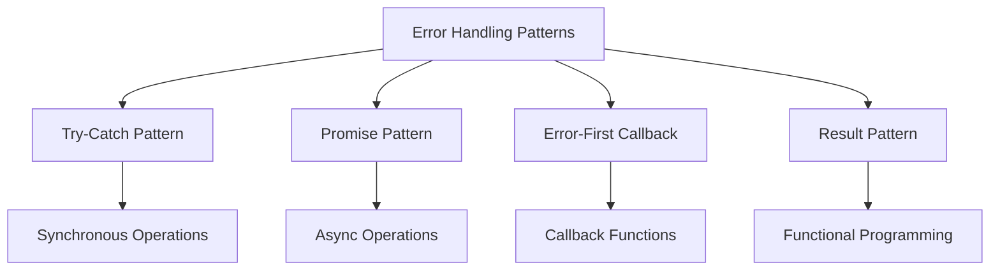

# 🔧 **Error Handling Patterns**

> **Master error handling patterns, strategies, and implementation techniques for React Native applications**

<link rel="stylesheet" href="../../common-styles.css">

---

## 📚 **Table of Contents**

- [Error Handling Patterns](#-error-handling-patterns)
- [Async Error Handling](#-async-error-handling)
- [Network Error Handling](#-network-error-handling)
- [Validation Error Handling](#-validation-error-handling)
- [Error Handling Utilities](#-error-handling-utilities)
- [Best Practices](#-best-practices)
- [Interview Questions](#-interview-questions)

---

## 🔧 **Error Handling Patterns**

### **Common Error Handling Patterns**



### **Pattern Categories**
- **Synchronous**: Try-catch blocks for immediate operations
- **Asynchronous**: Promise-based error handling
- **Functional**: Result patterns and error monads
- **Reactive**: Error handling in streams and observables

---

## 🔄 **Async Error Handling**

### **Promise-Based Error Handling**

<button onclick="copyCode(this)" class="copy-btn">📋 Copy</button>
```javascript
import React, { useState, useCallback } from 'react';
import { View, Text, TouchableOpacity, StyleSheet, Alert } from 'react-native';

// Async error handling patterns
const AsyncErrorHandling = {
  // Basic promise error handling
  handlePromise: async (promise) => {
    try {
      const result = await promise;
      return { success: true, data: result, error: null };
    } catch (error) {
      return { success: false, data: null, error: error.message };
    }
  },

  // Promise with timeout
  withTimeout: (promise, timeoutMs = 5000) => {
    return Promise.race([
      promise,
      new Promise((_, reject) => 
        setTimeout(() => reject(new Error('Operation timed out')), timeoutMs)
      )
    ]);
  },

  // Retry with exponential backoff
  retryWithBackoff: async (fn, maxRetries = 3, baseDelay = 1000) => {
    for (let attempt = 1; attempt <= maxRetries; attempt++) {
      try {
        return await fn();
      } catch (error) {
        if (attempt === maxRetries) {
          throw error;
        }
        
        const delay = baseDelay * Math.pow(2, attempt - 1);
        await new Promise(resolve => setTimeout(resolve, delay));
      }
    }
  },

  // Parallel execution with error handling
  parallelWithErrorHandling: async (promises) => {
    const results = await Promise.allSettled(promises);
    
    return results.map((result, index) => ({
      index,
      success: result.status === 'fulfilled',
      data: result.status === 'fulfilled' ? result.value : null,
      error: result.status === 'rejected' ? result.reason : null
    }));
  },

  // Sequential execution with error handling
  sequentialWithErrorHandling: async (promises) => {
    const results = [];
    
    for (let i = 0; i < promises.length; i++) {
      try {
        const result = await promises[i]();
        results.push({ success: true, data: result, error: null });
      } catch (error) {
        results.push({ success: false, data: null, error: error.message });
        // Continue with next promise or break based on requirements
      }
    }
    
    return results;
  }
};

// Async error handling demo component
const AsyncErrorHandlingDemo = () => {
  const [loading, setLoading] = useState(false);
  const [results, setResults] = useState([]);
  const [error, setError] = useState(null);

  // Simulate API call
  const simulateAPICall = async (shouldFail = false, delay = 1000) => {
    await new Promise(resolve => setTimeout(resolve, delay));
    
    if (shouldFail) {
      throw new Error(`API call failed after ${delay}ms`);
    }
    
    return { data: `Success after ${delay}ms`, timestamp: new Date().toISOString() };
  };

  // Handle promise with error handling
  const handlePromise = async () => {
    setLoading(true);
    setError(null);
    
    const result = await AsyncErrorHandling.handlePromise(
      simulateAPICall(Math.random() > 0.5)
    );
    
    setResults([result]);
    setLoading(false);
  };

  // Handle promise with timeout
  const handleTimeout = async () => {
    setLoading(true);
    setError(null);
    
    try {
      const result = await AsyncErrorHandling.withTimeout(
        simulateAPICall(false, 3000), // This will timeout
        2000 // 2 second timeout
      );
      setResults([{ success: true, data: result, error: null }]);
    } catch (error) {
      setError(error.message);
    } finally {
      setLoading(false);
    }
  };

  // Handle retry with backoff
  const handleRetry = async () => {
    setLoading(true);
    setError(null);
    
    try {
      const result = await AsyncErrorHandling.retryWithBackoff(
        () => simulateAPICall(Math.random() > 0.7), // 30% success rate
        3,
        1000
      );
      setResults([{ success: true, data: result, error: null }]);
    } catch (error) {
      setError(error.message);
    } finally {
      setLoading(false);
    }
  };

  // Handle parallel execution
  const handleParallel = async () => {
    setLoading(true);
    setError(null);
    
    const promises = [
      () => simulateAPICall(false, 1000),
      () => simulateAPICall(true, 1500), // This will fail
      () => simulateAPICall(false, 2000),
    ];
    
    const results = await AsyncErrorHandling.parallelWithErrorHandling(promises);
    setResults(results);
    setLoading(false);
  };

  // Handle sequential execution
  const handleSequential = async () => {
    setLoading(true);
    setError(null);
    
    const promises = [
      () => simulateAPICall(false, 1000),
      () => simulateAPICall(true, 1500), // This will fail
      () => simulateAPICall(false, 2000),
    ];
    
    const results = await AsyncErrorHandling.sequentialWithErrorHandling(promises);
    setResults(results);
    setLoading(false);
  };

  return (
    <View style={styles.container}>
      <Text style={styles.title}>Async Error Handling Patterns</Text>
      
      <View style={styles.buttonContainer}>
        <TouchableOpacity 
          style={styles.button}
          onPress={handlePromise}
          disabled={loading}
        >
          <Text style={styles.buttonText}>
            {loading ? 'Loading...' : 'Handle Promise'}
          </Text>
        </TouchableOpacity>

        <TouchableOpacity 
          style={styles.button}
          onPress={handleTimeout}
          disabled={loading}
        >
          <Text style={styles.buttonText}>
            {loading ? 'Loading...' : 'Handle Timeout'}
          </Text>
        </TouchableOpacity>

        <TouchableOpacity 
          style={styles.button}
          onPress={handleRetry}
          disabled={loading}
        >
          <Text style={styles.buttonText}>
            {loading ? 'Loading...' : 'Handle Retry'}
          </Text>
        </TouchableOpacity>

        <TouchableOpacity 
          style={styles.button}
          onPress={handleParallel}
          disabled={loading}
        >
          <Text style={styles.buttonText}>
            {loading ? 'Loading...' : 'Handle Parallel'}
          </Text>
        </TouchableOpacity>

        <TouchableOpacity 
          style={styles.button}
          onPress={handleSequential}
          disabled={loading}
        >
          <Text style={styles.buttonText}>
            {loading ? 'Loading...' : 'Handle Sequential'}
          </Text>
        </TouchableOpacity>
      </View>

      {results.length > 0 && (
        <View style={styles.resultsContainer}>
          <Text style={styles.resultsTitle}>Results:</Text>
          {results.map((result, index) => (
            <View key={index} style={[
              styles.resultItem,
              { backgroundColor: result.success ? '#d4edda' : '#f8d7da' }
            ]}>
              <Text style={[
                styles.resultText,
                { color: result.success ? '#155724' : '#721c24' }
              ]}>
                {result.success ? 'Success' : 'Error'}: {result.data ? JSON.stringify(result.data) : result.error}
              </Text>
            </View>
          ))}
        </View>
      )}

      {error && (
        <View style={styles.errorContainer}>
          <Text style={styles.errorText}>{error}</Text>
        </View>
      )}
    </View>
  );
};

const styles = StyleSheet.create({
  container: {
    flex: 1,
    padding: 20,
    backgroundColor: '#fff',
  },
  title: {
    fontSize: 24,
    fontWeight: 'bold',
    marginBottom: 20,
    color: '#333',
  },
  buttonContainer: {
    marginBottom: 20,
  },
  button: {
    backgroundColor: '#007bff',
    padding: 15,
    borderRadius: 8,
    marginBottom: 10,
    alignItems: 'center',
  },
  buttonText: {
    color: '#fff',
    fontSize: 16,
    fontWeight: 'bold',
  },
  resultsContainer: {
    marginBottom: 20,
  },
  resultsTitle: {
    fontSize: 18,
    fontWeight: 'bold',
    marginBottom: 10,
    color: '#333',
  },
  resultItem: {
    padding: 10,
    borderRadius: 5,
    marginBottom: 5,
  },
  resultText: {
    fontSize: 14,
    fontFamily: 'monospace',
  },
  errorContainer: {
    backgroundColor: '#f8d7da',
    padding: 15,
    borderRadius: 8,
  },
  errorText: {
    color: '#721c24',
    fontSize: 14,
  },
});

export { AsyncErrorHandling, AsyncErrorHandlingDemo };
```

---

## 🌐 **Network Error Handling**

### **Network Error Handling Patterns**

<button onclick="copyCode(this)" class="copy-btn">📋 Copy</button>
```javascript
import React, { useState, useCallback } from 'react';
import { View, Text, TouchableOpacity, StyleSheet, Alert } from 'react-native';
import NetInfo from '@react-native-community/netinfo';

// Network error handling patterns
const NetworkErrorHandling = {
  // Check network connectivity
  checkConnectivity: async () => {
    try {
      const netInfo = await NetInfo.fetch();
      return {
        isConnected: netInfo.isConnected,
        type: netInfo.type,
        isInternetReachable: netInfo.isInternetReachable
      };
    } catch (error) {
      return {
        isConnected: false,
        type: 'unknown',
        isInternetReachable: false,
        error: error.message
      };
    }
  },

  // Handle network errors
  handleNetworkError: (error) => {
    if (error.code === 'NETWORK_ERROR') {
      return {
        type: 'network',
        message: 'Network connection failed',
        retryable: true,
        userMessage: 'Please check your internet connection and try again'
      };
    }
    
    if (error.code === 'TIMEOUT') {
      return {
        type: 'timeout',
        message: 'Request timed out',
        retryable: true,
        userMessage: 'The request took too long. Please try again'
      };
    }
    
    if (error.status >= 500) {
      return {
        type: 'server',
        message: 'Server error',
        retryable: true,
        userMessage: 'Server is temporarily unavailable. Please try again later'
      };
    }
    
    if (error.status === 401) {
      return {
        type: 'unauthorized',
        message: 'Unauthorized access',
        retryable: false,
        userMessage: 'Please log in again'
      };
    }
    
    if (error.status === 403) {
      return {
        type: 'forbidden',
        message: 'Access forbidden',
        retryable: false,
        userMessage: 'You do not have permission to access this resource'
      };
    }
    
    if (error.status === 404) {
      return {
        type: 'not_found',
        message: 'Resource not found',
        retryable: false,
        userMessage: 'The requested resource was not found'
      };
    }
    
    return {
      type: 'unknown',
      message: error.message || 'An unknown error occurred',
      retryable: true,
      userMessage: 'Something went wrong. Please try again'
    };
  },

  // Retry network request
  retryNetworkRequest: async (requestFn, maxRetries = 3, baseDelay = 1000) => {
    for (let attempt = 1; attempt <= maxRetries; attempt++) {
      try {
        // Check connectivity before retry
        const connectivity = await NetworkErrorHandling.checkConnectivity();
        if (!connectivity.isConnected) {
          throw new Error('No network connection');
        }
        
        return await requestFn();
      } catch (error) {
        const errorInfo = NetworkErrorHandling.handleNetworkError(error);
        
        if (attempt === maxRetries || !errorInfo.retryable) {
          throw error;
        }
        
        const delay = baseDelay * Math.pow(2, attempt - 1);
        await new Promise(resolve => setTimeout(resolve, delay));
      }
    }
  },

  // Handle offline scenarios
  handleOfflineScenario: async (requestFn, fallbackData = null) => {
    try {
      const connectivity = await NetworkErrorHandling.checkConnectivity();
      
      if (!connectivity.isConnected) {
        if (fallbackData) {
          return { success: true, data: fallbackData, fromCache: true };
        } else {
          throw new Error('No network connection and no cached data available');
        }
      }
      
      return await requestFn();
    } catch (error) {
      if (fallbackData) {
        return { success: true, data: fallbackData, fromCache: true };
      }
      throw error;
    }
  }
};

// Network error handling demo component
const NetworkErrorHandlingDemo = () => {
  const [loading, setLoading] = useState(false);
  const [result, setResult] = useState(null);
  const [error, setError] = useState(null);
  const [connectivity, setConnectivity] = useState(null);

  // Check connectivity
  const handleCheckConnectivity = async () => {
    setLoading(true);
    setError(null);
    
    try {
      const result = await NetworkErrorHandling.checkConnectivity();
      setConnectivity(result);
      setResult({ type: 'connectivity', data: result });
    } catch (error) {
      setError(error.message);
    } finally {
      setLoading(false);
    }
  };

  // Simulate network request
  const simulateNetworkRequest = async (shouldFail = false, errorType = 'network') => {
    await new Promise(resolve => setTimeout(resolve, 1000));
    
    if (shouldFail) {
      const error = new Error('Network request failed');
      error.code = errorType.toUpperCase();
      error.status = errorType === 'server' ? 500 : 404;
      throw error;
    }
    
    return { data: 'Network request successful', timestamp: new Date().toISOString() };
  };

  // Handle network request
  const handleNetworkRequest = async (shouldFail = false, errorType = 'network') => {
    setLoading(true);
    setError(null);
    
    try {
      const result = await NetworkErrorHandling.retryNetworkRequest(
        () => simulateNetworkRequest(shouldFail, errorType),
        3,
        1000
      );
      setResult({ type: 'request', data: result });
    } catch (error) {
      const errorInfo = NetworkErrorHandling.handleNetworkError(error);
      setError(errorInfo.userMessage);
    } finally {
      setLoading(false);
    }
  };

  // Handle offline scenario
  const handleOfflineScenario = async () => {
    setLoading(true);
    setError(null);
    
    try {
      const result = await NetworkErrorHandling.handleOfflineScenario(
        () => simulateNetworkRequest(true, 'network'),
        { data: 'Cached data', timestamp: new Date().toISOString() }
      );
      setResult({ type: 'offline', data: result });
    } catch (error) {
      setError(error.message);
    } finally {
      setLoading(false);
    }
  };

  return (
    <View style={styles.container}>
      <Text style={styles.title}>Network Error Handling</Text>
      
      <View style={styles.buttonContainer}>
        <TouchableOpacity 
          style={styles.button}
          onPress={handleCheckConnectivity}
          disabled={loading}
        >
          <Text style={styles.buttonText}>
            {loading ? 'Loading...' : 'Check Connectivity'}
          </Text>
        </TouchableOpacity>

        <TouchableOpacity 
          style={styles.button}
          onPress={() => handleNetworkRequest(false)}
          disabled={loading}
        >
          <Text style={styles.buttonText}>
            {loading ? 'Loading...' : 'Successful Request'}
          </Text>
        </TouchableOpacity>

        <TouchableOpacity 
          style={styles.button}
          onPress={() => handleNetworkRequest(true, 'network')}
          disabled={loading}
        >
          <Text style={styles.buttonText}>
            {loading ? 'Loading...' : 'Network Error'}
          </Text>
        </TouchableOpacity>

        <TouchableOpacity 
          style={styles.button}
          onPress={() => handleNetworkRequest(true, 'server')}
          disabled={loading}
        >
          <Text style={styles.buttonText}>
            {loading ? 'Loading...' : 'Server Error'}
          </Text>
        </TouchableOpacity>

        <TouchableOpacity 
          style={styles.button}
          onPress={handleOfflineScenario}
          disabled={loading}
        >
          <Text style={styles.buttonText}>
            {loading ? 'Loading...' : 'Offline Scenario'}
          </Text>
        </TouchableOpacity>
      </View>

      {result && (
        <View style={styles.resultContainer}>
          <Text style={styles.resultTitle}>Result:</Text>
          <Text style={styles.resultText}>{JSON.stringify(result, null, 2)}</Text>
        </View>
      )}

      {error && (
        <View style={styles.errorContainer}>
          <Text style={styles.errorText}>{error}</Text>
        </View>
      )}
    </View>
  );
};

const styles = StyleSheet.create({
  container: {
    flex: 1,
    padding: 20,
    backgroundColor: '#fff',
  },
  title: {
    fontSize: 24,
    fontWeight: 'bold',
    marginBottom: 20,
    color: '#333',
  },
  buttonContainer: {
    marginBottom: 20,
  },
  button: {
    backgroundColor: '#007bff',
    padding: 15,
    borderRadius: 8,
    marginBottom: 10,
    alignItems: 'center',
  },
  buttonText: {
    color: '#fff',
    fontSize: 16,
    fontWeight: 'bold',
  },
  resultContainer: {
    backgroundColor: '#d4edda',
    padding: 15,
    borderRadius: 8,
    marginBottom: 10,
  },
  resultTitle: {
    fontSize: 16,
    fontWeight: 'bold',
    color: '#155724',
    marginBottom: 5,
  },
  resultText: {
    fontSize: 14,
    color: '#155724',
    fontFamily: 'monospace',
  },
  errorContainer: {
    backgroundColor: '#f8d7da',
    padding: 15,
    borderRadius: 8,
  },
  errorText: {
    color: '#721c24',
    fontSize: 14,
  },
});

export { NetworkErrorHandling, NetworkErrorHandlingDemo };
```

---

## ✅ **Validation Error Handling**

### **Form Validation Error Handling**

<button onclick="copyCode(this)" class="copy-btn">📋 Copy</button>
```javascript
import React, { useState, useCallback } from 'react';
import { View, Text, TextInput, TouchableOpacity, StyleSheet, Alert } from 'react-native';

// Validation error handling patterns
const ValidationErrorHandling = {
  // Validate email
  validateEmail: (email) => {
    const emailRegex = /^[^\s@]+@[^\s@]+\.[^\s@]+$/;
    if (!email || email.trim().length === 0) {
      return { valid: false, error: 'Email is required' };
    }
    if (!emailRegex.test(email)) {
      return { valid: false, error: 'Please enter a valid email address' };
    }
    return { valid: true, error: null };
  },

  // Validate password
  validatePassword: (password) => {
    if (!password || password.length === 0) {
      return { valid: false, error: 'Password is required' };
    }
    if (password.length < 8) {
      return { valid: false, error: 'Password must be at least 8 characters long' };
    }
    if (!/(?=.*[a-z])/.test(password)) {
      return { valid: false, error: 'Password must contain at least one lowercase letter' };
    }
    if (!/(?=.*[A-Z])/.test(password)) {
      return { valid: false, error: 'Password must contain at least one uppercase letter' };
    }
    if (!/(?=.*\d)/.test(password)) {
      return { valid: false, error: 'Password must contain at least one number' };
    }
    return { valid: true, error: null };
  },

  // Validate phone number
  validatePhoneNumber: (phoneNumber) => {
    const phoneRegex = /^\+?[\d\s\-\(\)]+$/;
    if (!phoneNumber || phoneNumber.trim().length === 0) {
      return { valid: false, error: 'Phone number is required' };
    }
    if (!phoneRegex.test(phoneNumber)) {
      return { valid: false, error: 'Please enter a valid phone number' };
    }
    if (phoneNumber.replace(/\D/g, '').length < 10) {
      return { valid: false, error: 'Phone number must be at least 10 digits' };
    }
    return { valid: true, error: null };
  },

  // Validate required field
  validateRequired: (value, fieldName) => {
    if (!value || value.trim().length === 0) {
      return { valid: false, error: `${fieldName} is required` };
    }
    return { valid: true, error: null };
  },

  // Validate form
  validateForm: (formData, validationRules) => {
    const errors = {};
    let isValid = true;

    Object.keys(validationRules).forEach(fieldName => {
      const value = formData[fieldName];
      const rules = validationRules[fieldName];
      
      for (const rule of rules) {
        const validation = rule.validator(value, formData);
        if (!validation.valid) {
          errors[fieldName] = validation.error;
          isValid = false;
          break; // Stop at first error for this field
        }
      }
    });

    return { isValid, errors };
  }
};

// Form validation demo component
const FormValidationDemo = () => {
  const [formData, setFormData] = useState({
    email: '',
    password: '',
    confirmPassword: '',
    phoneNumber: '',
    name: ''
  });
  
  const [errors, setErrors] = useState({});
  const [touched, setTouched] = useState({});
  const [loading, setLoading] = useState(false);

  // Validation rules
  const validationRules = {
    name: [
      { validator: (value) => ValidationErrorHandling.validateRequired(value, 'Name') }
    ],
    email: [
      { validator: (value) => ValidationErrorHandling.validateRequired(value, 'Email') },
      { validator: ValidationErrorHandling.validateEmail }
    ],
    password: [
      { validator: (value) => ValidationErrorHandling.validateRequired(value, 'Password') },
      { validator: ValidationErrorHandling.validatePassword }
    ],
    confirmPassword: [
      { validator: (value) => ValidationErrorHandling.validateRequired(value, 'Confirm Password') },
      { validator: (value, formData) => {
        if (value !== formData.password) {
          return { valid: false, error: 'Passwords do not match' };
        }
        return { valid: true, error: null };
      }}
    ],
    phoneNumber: [
      { validator: (value) => ValidationErrorHandling.validateRequired(value, 'Phone Number') },
      { validator: ValidationErrorHandling.validatePhoneNumber }
    ]
  };

  // Handle input change
  const handleInputChange = useCallback((fieldName, value) => {
    setFormData(prev => ({ ...prev, [fieldName]: value }));
    
    // Clear error when user starts typing
    if (errors[fieldName]) {
      setErrors(prev => ({ ...prev, [fieldName]: null }));
    }
  }, [errors]);

  // Handle input blur
  const handleInputBlur = useCallback((fieldName) => {
    setTouched(prev => ({ ...prev, [fieldName]: true }));
    
    // Validate field
    const rules = validationRules[fieldName];
    if (rules) {
      for (const rule of rules) {
        const validation = rule.validator(formData[fieldName], formData);
        if (!validation.valid) {
          setErrors(prev => ({ ...prev, [fieldName]: validation.error }));
          break;
        }
      }
    }
  }, [formData, validationRules]);

  // Handle form submission
  const handleSubmit = async () => {
    setLoading(true);
    
    try {
      // Mark all fields as touched
      const allTouched = Object.keys(formData).reduce((acc, key) => {
        acc[key] = true;
        return acc;
      }, {});
      setTouched(allTouched);
      
      // Validate form
      const validation = ValidationErrorHandling.validateForm(formData, validationRules);
      
      if (!validation.isValid) {
        setErrors(validation.errors);
        Alert.alert('Validation Error', 'Please fix the errors and try again');
        return;
      }
      
      // Simulate form submission
      await new Promise(resolve => setTimeout(resolve, 2000));
      
      Alert.alert('Success', 'Form submitted successfully!');
      
      // Reset form
      setFormData({
        email: '',
        password: '',
        confirmPassword: '',
        phoneNumber: '',
        name: ''
      });
      setErrors({});
      setTouched({});
      
    } catch (error) {
      Alert.alert('Error', 'Failed to submit form. Please try again.');
    } finally {
      setLoading(false);
    }
  };

  // Render input field
  const renderInputField = (fieldName, placeholder, secureTextEntry = false) => {
    const hasError = touched[fieldName] && errors[fieldName];
    
    return (
      <View style={styles.inputContainer}>
        <TextInput
          style={[
            styles.input,
            hasError && styles.inputError
          ]}
          value={formData[fieldName]}
          onChangeText={(value) => handleInputChange(fieldName, value)}
          onBlur={() => handleInputBlur(fieldName)}
          placeholder={placeholder}
          secureTextEntry={secureTextEntry}
        />
        {hasError && (
          <Text style={styles.errorText}>{errors[fieldName]}</Text>
        )}
      </View>
    );
  };

  return (
    <View style={styles.container}>
      <Text style={styles.title}>Form Validation Demo</Text>
      
      <View style={styles.form}>
        {renderInputField('name', 'Full Name')}
        {renderInputField('email', 'Email Address')}
        {renderInputField('phoneNumber', 'Phone Number')}
        {renderInputField('password', 'Password', true)}
        {renderInputField('confirmPassword', 'Confirm Password', true)}
        
        <TouchableOpacity 
          style={[styles.submitButton, loading && styles.submitButtonDisabled]}
          onPress={handleSubmit}
          disabled={loading}
        >
          <Text style={styles.submitButtonText}>
            {loading ? 'Submitting...' : 'Submit'}
          </Text>
        </TouchableOpacity>
      </View>
    </View>
  );
};

const styles = StyleSheet.create({
  container: {
    flex: 1,
    padding: 20,
    backgroundColor: '#fff',
  },
  title: {
    fontSize: 24,
    fontWeight: 'bold',
    marginBottom: 20,
    color: '#333',
  },
  form: {
    flex: 1,
  },
  inputContainer: {
    marginBottom: 15,
  },
  input: {
    borderWidth: 1,
    borderColor: '#ccc',
    borderRadius: 8,
    padding: 15,
    fontSize: 16,
    backgroundColor: '#fff',
  },
  inputError: {
    borderColor: '#dc3545',
  },
  errorText: {
    color: '#dc3545',
    fontSize: 14,
    marginTop: 5,
  },
  submitButton: {
    backgroundColor: '#007bff',
    padding: 15,
    borderRadius: 8,
    alignItems: 'center',
    marginTop: 20,
  },
  submitButtonDisabled: {
    backgroundColor: '#6c757d',
  },
  submitButtonText: {
    color: '#fff',
    fontSize: 16,
    fontWeight: 'bold',
  },
});

export { ValidationErrorHandling, FormValidationDemo };
```

---

## 🎯 **Best Practices**

### **1. Error Handling Patterns**
- Use appropriate patterns for different scenarios
- Implement consistent error handling across the app
- Provide meaningful error messages
- Handle errors gracefully

### **2. Async Error Handling**
- Use try-catch with async/await
- Implement proper timeout handling
- Use retry mechanisms for transient errors
- Handle parallel and sequential operations

### **3. Network Error Handling**
- Check connectivity before requests
- Implement proper retry logic
- Handle different HTTP status codes
- Provide offline fallbacks

---

## ❓ **Interview Questions**

### **Basic Questions**
1. **What are common error handling patterns in React Native?**
2. **How do you handle async errors?**
3. **What is the difference between try-catch and promise error handling?**

### **Advanced Questions**
1. **How would you implement retry logic with exponential backoff?**
2. **Explain different network error handling strategies.**
3. **How do you handle validation errors in forms?**

### **Practical Questions**
1. **Implement error handling for async operations.**
2. **Create a network error handling system.**
3. **Build a form validation system with error handling.**

---

## 🧭 Navigation

<div class="navigation">
    <a href="./01-Error-Boundaries.md" class="nav-link prev">⬅️ Previous: Error Boundaries</a>
    <a href="./03-Error-Recovery-Strategies.md" class="nav-link next">Next: Error Recovery Strategies ➡️</a>
</div>

---

<script src="../../common-scripts.js"></script>

*Last updated: December 2024*
