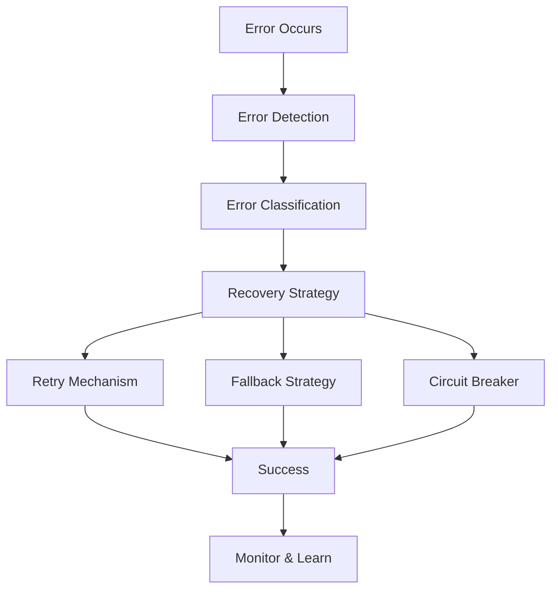

# 🔄 **Error Recovery Strategies**

> **Master error recovery strategies, resilience patterns, and fault tolerance for React Native applications**

<link rel="stylesheet" href="../../common-styles.css">

---

## 📚 **Table of Contents**

- [Error Recovery Overview](#-error-recovery-overview)
- [Resilience Patterns](#-resilience-patterns)
- [Fault Tolerance](#-fault-tolerance)
- [Recovery Mechanisms](#-recovery-mechanisms)
- [Monitoring and Alerting](#-monitoring-and-alerting)
- [Best Practices](#-best-practices)
- [Interview Questions](#-interview-questions)

---

## 🔄 **Error Recovery Overview**

### **Recovery Strategy Architecture**



### **Recovery Principles**
- **Fail Fast**: Detect errors quickly
- **Fail Safe**: Provide fallback mechanisms
- **Self-Healing**: Automatically recover from errors
- **Graceful Degradation**: Maintain partial functionality

---

## 🛡️ **Resilience Patterns**

### **Circuit Breaker Pattern**

<button onclick="copyCode(this)" class="copy-btn">📋 Copy</button>
```javascript
import React, { useState, useCallback } from 'react';
import { View, Text, TouchableOpacity, StyleSheet, Alert } from 'react-native';

// Circuit breaker implementation
const CircuitBreaker = {
  create: (fn, options = {}) => {
    const {
      failureThreshold = 5,
      timeout = 60000,
      resetTimeout = 30000
    } = options;

    let state = 'CLOSED'; // CLOSED, OPEN, HALF_OPEN
    let failureCount = 0;
    let lastFailureTime = null;
    let nextAttemptTime = null;

    return {
      async execute(...args) {
        // Check if circuit is open
        if (state === 'OPEN') {
          if (Date.now() < nextAttemptTime) {
            throw new Error('Circuit breaker is OPEN');
          }
          state = 'HALF_OPEN';
        }

        try {
          const result = await fn(...args);
          
          // Success - reset failure count and close circuit
          if (state === 'HALF_OPEN') {
            state = 'CLOSED';
            failureCount = 0;
          }
          
          return result;
        } catch (error) {
          failureCount++;
          lastFailureTime = Date.now();
          
          // Check if we should open the circuit
          if (failureCount >= failureThreshold) {
            state = 'OPEN';
            nextAttemptTime = Date.now() + resetTimeout;
          }
          
          throw error;
        }
      },
      
      getState() {
        return {
          state,
          failureCount,
          lastFailureTime,
          nextAttemptTime
        };
      },
      
      reset() {
        state = 'CLOSED';
        failureCount = 0;
        lastFailureTime = null;
        nextAttemptTime = null;
      }
    };
  }
};

// Bulkhead pattern
const Bulkhead = {
  create: (fn, options = {}) => {
    const {
      maxConcurrent = 10,
      timeout = 5000
    } = options;

    let activeRequests = 0;
    const queue = [];

    return {
      async execute(...args) {
        return new Promise((resolve, reject) => {
          const request = { args, resolve, reject, timestamp: Date.now() };
          
          if (activeRequests < maxConcurrent) {
            this.processRequest(request);
          } else {
            queue.push(request);
          }
        });
      },
      
      async processRequest(request) {
        activeRequests++;
        
        try {
          const timeoutPromise = new Promise((_, reject) => 
            setTimeout(() => reject(new Error('Request timeout')), timeout)
          );
          
          const result = await Promise.race([
            fn(...request.args),
            timeoutPromise
          ]);
          
          request.resolve(result);
        } catch (error) {
          request.reject(error);
        } finally {
          activeRequests--;
          
          // Process next request in queue
          if (queue.length > 0) {
            const nextRequest = queue.shift();
            this.processRequest(nextRequest);
          }
        }
      },
      
      getStats() {
        return {
          activeRequests,
          queuedRequests: queue.length,
          maxConcurrent
        };
      }
    };
  }
};

// Timeout pattern
const Timeout = {
  create: (fn, timeoutMs = 5000) => {
    return {
      async execute(...args) {
        const timeoutPromise = new Promise((_, reject) => 
          setTimeout(() => reject(new Error('Operation timeout')), timeoutMs)
        );
        
        return Promise.race([
          fn(...args),
          timeoutPromise
        ]);
      }
    };
  }
};

// Resilience patterns demo component
const ResiliencePatternsDemo = () => {
  const [loading, setLoading] = useState(false);
  const [result, setResult] = useState(null);
  const [error, setError] = useState(null);
  const [circuitState, setCircuitState] = useState(null);

  // Simulate API call that might fail
  const simulateAPICall = async (shouldFail = false, delay = 1000) => {
    await new Promise(resolve => setTimeout(resolve, delay));
    
    if (shouldFail) {
      throw new Error('API call failed');
    }
    
    return { data: 'Success!', timestamp: new Date().toISOString() };
  };

  // Circuit breaker demo
  const circuitBreaker = CircuitBreaker.create(
    () => simulateAPICall(Math.random() > 0.3), // 70% success rate
    { failureThreshold: 3, resetTimeout: 5000 }
  );

  const handleCircuitBreaker = async () => {
    setLoading(true);
    setError(null);
    
    try {
      const result = await circuitBreaker.execute();
      setResult({ type: 'circuit-breaker', data: result });
      setCircuitState(circuitBreaker.getState());
    } catch (error) {
      setError(error.message);
      setCircuitState(circuitBreaker.getState());
    } finally {
      setLoading(false);
    }
  };

  // Bulkhead demo
  const bulkhead = Bulkhead.create(
    () => simulateAPICall(false, 2000),
    { maxConcurrent: 3, timeout: 5000 }
  );

  const handleBulkhead = async () => {
    setLoading(true);
    setError(null);
    
    try {
      const promises = Array.from({ length: 5 }, () => bulkhead.execute());
      const results = await Promise.allSettled(promises);
      
      setResult({ 
        type: 'bulkhead', 
        data: results,
        stats: bulkhead.getStats()
      });
    } catch (error) {
      setError(error.message);
    } finally {
      setLoading(false);
    }
  };

  // Timeout demo
  const timeout = Timeout.create(
    () => simulateAPICall(false, 3000),
    2000 // 2 second timeout
  );

  const handleTimeout = async () => {
    setLoading(true);
    setError(null);
    
    try {
      const result = await timeout.execute();
      setResult({ type: 'timeout', data: result });
    } catch (error) {
      setError(error.message);
    } finally {
      setLoading(false);
    }
  };

  // Reset circuit breaker
  const handleResetCircuitBreaker = () => {
    circuitBreaker.reset();
    setCircuitState(circuitBreaker.getState());
    setError(null);
    setResult(null);
  };

  return (
    <View style={styles.container}>
      <Text style={styles.title}>Resilience Patterns Demo</Text>
      
      <View style={styles.buttonContainer}>
        <TouchableOpacity 
          style={styles.button}
          onPress={handleCircuitBreaker}
          disabled={loading}
        >
          <Text style={styles.buttonText}>
            {loading ? 'Loading...' : 'Circuit Breaker'}
          </Text>
        </TouchableOpacity>

        <TouchableOpacity 
          style={styles.button}
          onPress={handleBulkhead}
          disabled={loading}
        >
          <Text style={styles.buttonText}>
            {loading ? 'Loading...' : 'Bulkhead'}
          </Text>
        </TouchableOpacity>

        <TouchableOpacity 
          style={styles.button}
          onPress={handleTimeout}
          disabled={loading}
        >
          <Text style={styles.buttonText}>
            {loading ? 'Loading...' : 'Timeout'}
          </Text>
        </TouchableOpacity>

        <TouchableOpacity 
          style={styles.resetButton}
          onPress={handleResetCircuitBreaker}
        >
          <Text style={styles.buttonText}>Reset Circuit Breaker</Text>
        </TouchableOpacity>
      </View>

      {circuitState && (
        <View style={styles.stateContainer}>
          <Text style={styles.stateTitle}>Circuit Breaker State:</Text>
          <Text style={styles.stateText}>State: {circuitState.state}</Text>
          <Text style={styles.stateText}>Failures: {circuitState.failureCount}</Text>
          <Text style={styles.stateText}>
            Next Attempt: {circuitState.nextAttemptTime ? 
              new Date(circuitState.nextAttemptTime).toLocaleTimeString() : 
              'N/A'
            }
          </Text>
        </View>
      )}

      {result && (
        <View style={styles.resultContainer}>
          <Text style={styles.resultTitle}>Result:</Text>
          <Text style={styles.resultText}>{JSON.stringify(result, null, 2)}</Text>
        </View>
      )}

      {error && (
        <View style={styles.errorContainer}>
          <Text style={styles.errorText}>{error}</Text>
        </View>
      )}
    </View>
  );
};

const styles = StyleSheet.create({
  container: {
    flex: 1,
    padding: 20,
    backgroundColor: '#fff',
  },
  title: {
    fontSize: 24,
    fontWeight: 'bold',
    marginBottom: 20,
    color: '#333',
  },
  buttonContainer: {
    marginBottom: 20,
  },
  button: {
    backgroundColor: '#007bff',
    padding: 15,
    borderRadius: 8,
    marginBottom: 10,
    alignItems: 'center',
  },
  resetButton: {
    backgroundColor: '#6c757d',
    padding: 15,
    borderRadius: 8,
    marginBottom: 10,
    alignItems: 'center',
  },
  buttonText: {
    color: '#fff',
    fontSize: 16,
    fontWeight: 'bold',
  },
  stateContainer: {
    backgroundColor: '#e3f2fd',
    padding: 15,
    borderRadius: 8,
    marginBottom: 10,
  },
  stateTitle: {
    fontSize: 16,
    fontWeight: 'bold',
    color: '#1976d2',
    marginBottom: 5,
  },
  stateText: {
    fontSize: 14,
    color: '#1976d2',
    marginBottom: 2,
  },
  resultContainer: {
    backgroundColor: '#d4edda',
    padding: 15,
    borderRadius: 8,
    marginBottom: 10,
  },
  resultTitle: {
    fontSize: 16,
    fontWeight: 'bold',
    color: '#155724',
    marginBottom: 5,
  },
  resultText: {
    fontSize: 14,
    color: '#155724',
    fontFamily: 'monospace',
  },
  errorContainer: {
    backgroundColor: '#f8d7da',
    padding: 15,
    borderRadius: 8,
  },
  errorText: {
    color: '#721c24',
    fontSize: 14,
  },
});

export { CircuitBreaker, Bulkhead, Timeout, ResiliencePatternsDemo };
```

---

## 🛡️ **Fault Tolerance**

### **Fault Tolerance Patterns**

<button onclick="copyCode(this)" class="copy-btn">📋 Copy</button>
```javascript
import React, { useState, useCallback } from 'react';
import { View, Text, TouchableOpacity, StyleSheet, Alert } from 'react-native';

// Fault tolerance patterns
const FaultTolerance = {
  // Retry with exponential backoff
  retryWithBackoff: async (fn, options = {}) => {
    const {
      maxRetries = 3,
      baseDelay = 1000,
      maxDelay = 10000,
      backoffFactor = 2,
      jitter = true
    } = options;

    for (let attempt = 1; attempt <= maxRetries; attempt++) {
      try {
        return await fn();
      } catch (error) {
        if (attempt === maxRetries) {
          throw error;
        }
        
        let delay = baseDelay * Math.pow(backoffFactor, attempt - 1);
        delay = Math.min(delay, maxDelay);
        
        if (jitter) {
          delay = delay * (0.5 + Math.random() * 0.5);
        }
        
        await new Promise(resolve => setTimeout(resolve, delay));
      }
    }
  },

  // Retry with fixed delay
  retryWithFixedDelay: async (fn, options = {}) => {
    const { maxRetries = 3, delay = 1000 } = options;

    for (let attempt = 1; attempt <= maxRetries; attempt++) {
      try {
        return await fn();
      } catch (error) {
        if (attempt === maxRetries) {
          throw error;
        }
        
        await new Promise(resolve => setTimeout(resolve, delay));
      }
    }
  },

  // Retry with linear backoff
  retryWithLinearBackoff: async (fn, options = {}) => {
    const { maxRetries = 3, baseDelay = 1000 } = options;

    for (let attempt = 1; attempt <= maxRetries; attempt++) {
      try {
        return await fn();
      } catch (error) {
        if (attempt === maxRetries) {
          throw error;
        }
        
        const delay = baseDelay * attempt;
        await new Promise(resolve => setTimeout(resolve, delay));
      }
    }
  },

  // Fallback mechanism
  withFallback: (primaryFn, fallbackFn) => {
    return async (...args) => {
      try {
        return await primaryFn(...args);
      } catch (error) {
        console.warn('Primary function failed, using fallback:', error);
        return await fallbackFn(...args);
      }
    };
  },

  // Timeout with fallback
  withTimeoutAndFallback: (fn, timeoutMs, fallbackFn) => {
    return async (...args) => {
      try {
        const timeoutPromise = new Promise((_, reject) => 
          setTimeout(() => reject(new Error('Operation timeout')), timeoutMs)
        );
        
        return await Promise.race([
          fn(...args),
          timeoutPromise
        ]);
      } catch (error) {
        console.warn('Operation failed or timed out, using fallback:', error);
        return await fallbackFn(...args);
      }
    };
  },

  // Health check
  withHealthCheck: (fn, healthCheckFn, options = {}) => {
    const { checkInterval = 30000, maxFailures = 3 } = options;
    let failureCount = 0;
    let lastHealthCheck = 0;

    return async (...args) => {
      const now = Date.now();
      
      // Check if we need to perform a health check
      if (now - lastHealthCheck > checkInterval) {
        try {
          await healthCheckFn();
          failureCount = 0;
          lastHealthCheck = now;
        } catch (error) {
          failureCount++;
          lastHealthCheck = now;
          
          if (failureCount >= maxFailures) {
            throw new Error('Service is unhealthy');
          }
        }
      }
      
      return await fn(...args);
    };
  }
};

// Fault tolerance demo component
const FaultToleranceDemo = () => {
  const [loading, setLoading] = useState(false);
  const [result, setResult] = useState(null);
  const [error, setError] = useState(null);

  // Simulate API call that might fail
  const simulateAPICall = async (shouldFail = false, delay = 1000) => {
    await new Promise(resolve => setTimeout(resolve, delay));
    
    if (shouldFail) {
      throw new Error('API call failed');
    }
    
    return { data: 'Success!', timestamp: new Date().toISOString() };
  };

  // Simulate fallback function
  const simulateFallback = async () => {
    await new Promise(resolve => setTimeout(resolve, 500));
    return { data: 'Fallback success!', timestamp: new Date().toISOString() };
  };

  // Simulate health check
  const simulateHealthCheck = async () => {
    await new Promise(resolve => setTimeout(resolve, 100));
    
    if (Math.random() > 0.8) {
      throw new Error('Health check failed');
    }
    
    return { status: 'healthy' };
  };

  // Retry with exponential backoff
  const handleExponentialBackoff = async () => {
    setLoading(true);
    setError(null);
    
    try {
      const result = await FaultTolerance.retryWithBackoff(
        () => simulateAPICall(Math.random() > 0.4), // 60% success rate
        { maxRetries: 3, baseDelay: 1000, backoffFactor: 2 }
      );
      setResult({ type: 'exponential-backoff', data: result });
    } catch (error) {
      setError(error.message);
    } finally {
      setLoading(false);
    }
  };

  // Retry with fixed delay
  const handleFixedDelay = async () => {
    setLoading(true);
    setError(null);
    
    try {
      const result = await FaultTolerance.retryWithFixedDelay(
        () => simulateAPICall(Math.random() > 0.5), // 50% success rate
        { maxRetries: 3, delay: 1000 }
      );
      setResult({ type: 'fixed-delay', data: result });
    } catch (error) {
      setError(error.message);
    } finally {
      setLoading(false);
    }
  };

  // Fallback mechanism
  const handleFallback = async () => {
    setLoading(true);
    setError(null);
    
    try {
      const result = await FaultTolerance.withFallback(
        () => simulateAPICall(true), // Primary will fail
        simulateFallback // Fallback will succeed
      )();
      setResult({ type: 'fallback', data: result });
    } catch (error) {
      setError(error.message);
    } finally {
      setLoading(false);
    }
  };

  // Timeout with fallback
  const handleTimeoutWithFallback = async () => {
    setLoading(true);
    setError(null);
    
    try {
      const result = await FaultTolerance.withTimeoutAndFallback(
        () => simulateAPICall(false, 3000), // Will timeout
        2000, // 2 second timeout
        simulateFallback
      )();
      setResult({ type: 'timeout-fallback', data: result });
    } catch (error) {
      setError(error.message);
    } finally {
      setLoading(false);
    }
  };

  // Health check
  const handleHealthCheck = async () => {
    setLoading(true);
    setError(null);
    
    try {
      const result = await FaultTolerance.withHealthCheck(
        () => simulateAPICall(false),
        simulateHealthCheck,
        { checkInterval: 1000, maxFailures: 2 }
      )();
      setResult({ type: 'health-check', data: result });
    } catch (error) {
      setError(error.message);
    } finally {
      setLoading(false);
    }
  };

  return (
    <View style={styles.container}>
      <Text style={styles.title}>Fault Tolerance Patterns</Text>
      
      <View style={styles.buttonContainer}>
        <TouchableOpacity 
          style={styles.button}
          onPress={handleExponentialBackoff}
          disabled={loading}
        >
          <Text style={styles.buttonText}>
            {loading ? 'Loading...' : 'Exponential Backoff'}
          </Text>
        </TouchableOpacity>

        <TouchableOpacity 
          style={styles.button}
          onPress={handleFixedDelay}
          disabled={loading}
        >
          <Text style={styles.buttonText}>
            {loading ? 'Loading...' : 'Fixed Delay'}
          </Text>
        </TouchableOpacity>

        <TouchableOpacity 
          style={styles.button}
          onPress={handleFallback}
          disabled={loading}
        >
          <Text style={styles.buttonText}>
            {loading ? 'Loading...' : 'Fallback'}
          </Text>
        </TouchableOpacity>

        <TouchableOpacity 
          style={styles.button}
          onPress={handleTimeoutWithFallback}
          disabled={loading}
        >
          <Text style={styles.buttonText}>
            {loading ? 'Loading...' : 'Timeout + Fallback'}
          </Text>
        </TouchableOpacity>

        <TouchableOpacity 
          style={styles.button}
          onPress={handleHealthCheck}
          disabled={loading}
        >
          <Text style={styles.buttonText}>
            {loading ? 'Loading...' : 'Health Check'}
          </Text>
        </TouchableOpacity>
      </View>

      {result && (
        <View style={styles.resultContainer}>
          <Text style={styles.resultTitle}>Result:</Text>
          <Text style={styles.resultText}>{JSON.stringify(result, null, 2)}</Text>
        </View>
      )}

      {error && (
        <View style={styles.errorContainer}>
          <Text style={styles.errorText}>{error}</Text>
        </View>
      )}
    </View>
  );
};

const styles = StyleSheet.create({
  container: {
    flex: 1,
    padding: 20,
    backgroundColor: '#fff',
  },
  title: {
    fontSize: 24,
    fontWeight: 'bold',
    marginBottom: 20,
    color: '#333',
  },
  buttonContainer: {
    marginBottom: 20,
  },
  button: {
    backgroundColor: '#007bff',
    padding: 15,
    borderRadius: 8,
    marginBottom: 10,
    alignItems: 'center',
  },
  buttonText: {
    color: '#fff',
    fontSize: 16,
    fontWeight: 'bold',
  },
  resultContainer: {
    backgroundColor: '#d4edda',
    padding: 15,
    borderRadius: 8,
    marginBottom: 10,
  },
  resultTitle: {
    fontSize: 16,
    fontWeight: 'bold',
    color: '#155724',
    marginBottom: 5,
  },
  resultText: {
    fontSize: 14,
    color: '#155724',
    fontFamily: 'monospace',
  },
  errorContainer: {
    backgroundColor: '#f8d7da',
    padding: 15,
    borderRadius: 8,
  },
  errorText: {
    color: '#721c24',
    fontSize: 14,
  },
});

export { FaultTolerance, FaultToleranceDemo };
```

---

## 📊 **Monitoring and Alerting**

### **Error Monitoring System**

<button onclick="copyCode(this)" class="copy-btn">📋 Copy</button>
```javascript
import React, { useState, useCallback } from 'react';
import { View, Text, TouchableOpacity, StyleSheet, Alert } from 'react-native';

// Error monitoring system
const ErrorMonitoring = {
  // Error metrics
  metrics: {
    totalErrors: 0,
    errorsByType: {},
    errorsByTime: [],
    recoveryAttempts: 0,
    successfulRecoveries: 0
  },

  // Record error
  recordError: (error, context = {}) => {
    const errorRecord = {
      id: Date.now(),
      message: error.message,
      stack: error.stack,
      type: error.name || 'Unknown',
      timestamp: new Date().toISOString(),
      context,
      resolved: false
    };

    // Update metrics
    ErrorMonitoring.metrics.totalErrors++;
    ErrorMonitoring.metrics.errorsByType[errorRecord.type] = 
      (ErrorMonitoring.metrics.errorsByType[errorRecord.type] || 0) + 1;
    
    ErrorMonitoring.metrics.errorsByTime.push({
      timestamp: errorRecord.timestamp,
      type: errorRecord.type
    });

    // Keep only last 100 errors
    if (ErrorMonitoring.metrics.errorsByTime.length > 100) {
      ErrorMonitoring.metrics.errorsByTime = 
        ErrorMonitoring.metrics.errorsByTime.slice(-100);
    }

    // Check for error patterns
    ErrorMonitoring.checkErrorPatterns();

    return errorRecord;
  },

  // Record recovery attempt
  recordRecoveryAttempt: (success = false) => {
    ErrorMonitoring.metrics.recoveryAttempts++;
    if (success) {
      ErrorMonitoring.metrics.successfulRecoveries++;
    }
  },

  // Check for error patterns
  checkErrorPatterns: () => {
    const recentErrors = ErrorMonitoring.metrics.errorsByTime.slice(-10);
    const errorTypes = recentErrors.map(e => e.type);
    
    // Check for repeated errors
    const errorCounts = {};
    errorTypes.forEach(type => {
      errorCounts[type] = (errorCounts[type] || 0) + 1;
    });

    // Alert if same error occurs 3+ times in last 10 errors
    Object.entries(errorCounts).forEach(([type, count]) => {
      if (count >= 3) {
        ErrorMonitoring.triggerAlert('repeated_error', {
          type,
          count,
          message: `Error type "${type}" occurred ${count} times recently`
        });
      }
    });
  },

  // Trigger alert
  triggerAlert: (type, data) => {
    const alert = {
      id: Date.now(),
      type,
      data,
      timestamp: new Date().toISOString(),
      acknowledged: false
    };

    console.warn('Error monitoring alert:', alert);
    
    // In a real app, you would send this to a monitoring service
    // Example: Sentry.captureMessage(alert.message, { level: 'warning' });
  },

  // Get error statistics
  getStatistics: () => {
    const totalErrors = ErrorMonitoring.metrics.totalErrors;
    const recoveryRate = ErrorMonitoring.metrics.recoveryAttempts > 0 ? 
      (ErrorMonitoring.metrics.successfulRecoveries / ErrorMonitoring.metrics.recoveryAttempts) * 100 : 0;

    return {
      totalErrors,
      errorsByType: ErrorMonitoring.metrics.errorsByType,
      recoveryAttempts: ErrorMonitoring.metrics.recoveryAttempts,
      successfulRecoveries: ErrorMonitoring.metrics.successfulRecoveries,
      recoveryRate: Math.round(recoveryRate * 100) / 100,
      recentErrors: ErrorMonitoring.metrics.errorsByTime.slice(-10)
    };
  },

  // Reset metrics
  resetMetrics: () => {
    ErrorMonitoring.metrics = {
      totalErrors: 0,
      errorsByType: {},
      errorsByTime: [],
      recoveryAttempts: 0,
      successfulRecoveries: 0
    };
  }
};

// Error monitoring demo component
const ErrorMonitoringDemo = () => {
  const [loading, setLoading] = useState(false);
  const [statistics, setStatistics] = useState(null);
  const [result, setResult] = useState(null);

  // Simulate different types of errors
  const simulateError = (type, message) => {
    const error = new Error(message);
    error.name = type;
    return error;
  };

  // Generate random error
  const generateRandomError = () => {
    const errorTypes = ['NetworkError', 'ValidationError', 'TimeoutError', 'UnknownError'];
    const messages = [
      'Network connection failed',
      'Invalid input data',
      'Operation timed out',
      'Unexpected error occurred'
    ];
    
    const randomIndex = Math.floor(Math.random() * errorTypes.length);
    return simulateError(errorTypes[randomIndex], messages[randomIndex]);
  };

  // Record error
  const handleRecordError = () => {
    const error = generateRandomError();
    const errorRecord = ErrorMonitoring.recordError(error, {
      userId: 'demo-user',
      action: 'button-click',
      screen: 'ErrorMonitoringDemo'
    });
    
    setResult({ type: 'error-recorded', data: errorRecord });
    setStatistics(ErrorMonitoring.getStatistics());
  };

  // Record recovery attempt
  const handleRecordRecovery = (success = false) => {
    ErrorMonitoring.recordRecoveryAttempt(success);
    setResult({ 
      type: 'recovery-recorded', 
      data: { success, timestamp: new Date().toISOString() }
    });
    setStatistics(ErrorMonitoring.getStatistics());
  };

  // Get statistics
  const handleGetStatistics = () => {
    const stats = ErrorMonitoring.getStatistics();
    setStatistics(stats);
    setResult({ type: 'statistics', data: stats });
  };

  // Reset metrics
  const handleResetMetrics = () => {
    ErrorMonitoring.resetMetrics();
    setStatistics(ErrorMonitoring.getStatistics());
    setResult({ type: 'metrics-reset', data: 'Metrics reset successfully' });
  };

  // Simulate error pattern
  const handleSimulatePattern = () => {
    // Generate 5 NetworkError errors to trigger pattern alert
    for (let i = 0; i < 5; i++) {
      const error = simulateError('NetworkError', 'Network connection failed');
      ErrorMonitoring.recordError(error, { attempt: i + 1 });
    }
    
    setStatistics(ErrorMonitoring.getStatistics());
    setResult({ 
      type: 'pattern-simulated', 
      data: 'Generated 5 NetworkError errors to trigger pattern alert'
    });
  };

  return (
    <View style={styles.container}>
      <Text style={styles.title}>Error Monitoring Demo</Text>
      
      <View style={styles.buttonContainer}>
        <TouchableOpacity 
          style={styles.button}
          onPress={handleRecordError}
        >
          <Text style={styles.buttonText}>Record Random Error</Text>
        </TouchableOpacity>

        <TouchableOpacity 
          style={styles.button}
          onPress={() => handleRecordRecovery(true)}
        >
          <Text style={styles.buttonText}>Record Successful Recovery</Text>
        </TouchableOpacity>

        <TouchableOpacity 
          style={styles.button}
          onPress={() => handleRecordRecovery(false)}
        >
          <Text style={styles.buttonText}>Record Failed Recovery</Text>
        </TouchableOpacity>

        <TouchableOpacity 
          style={styles.button}
          onPress={handleGetStatistics}
        >
          <Text style={styles.buttonText}>Get Statistics</Text>
        </TouchableOpacity>

        <TouchableOpacity 
          style={styles.button}
          onPress={handleSimulatePattern}
        >
          <Text style={styles.buttonText}>Simulate Error Pattern</Text>
        </TouchableOpacity>

        <TouchableOpacity 
          style={styles.resetButton}
          onPress={handleResetMetrics}
        >
          <Text style={styles.buttonText}>Reset Metrics</Text>
        </TouchableOpacity>
      </View>

      {statistics && (
        <View style={styles.statisticsContainer}>
          <Text style={styles.statisticsTitle}>Statistics:</Text>
          <Text style={styles.statisticsText}>Total Errors: {statistics.totalErrors}</Text>
          <Text style={styles.statisticsText}>Recovery Rate: {statistics.recoveryRate}%</Text>
          <Text style={styles.statisticsText}>
            Errors by Type: {JSON.stringify(statistics.errorsByType)}
          </Text>
        </View>
      )}

      {result && (
        <View style={styles.resultContainer}>
          <Text style={styles.resultTitle}>Result:</Text>
          <Text style={styles.resultText}>{JSON.stringify(result, null, 2)}</Text>
        </View>
      )}
    </View>
  );
};

const styles = StyleSheet.create({
  container: {
    flex: 1,
    padding: 20,
    backgroundColor: '#fff',
  },
  title: {
    fontSize: 24,
    fontWeight: 'bold',
    marginBottom: 20,
    color: '#333',
  },
  buttonContainer: {
    marginBottom: 20,
  },
  button: {
    backgroundColor: '#007bff',
    padding: 15,
    borderRadius: 8,
    marginBottom: 10,
    alignItems: 'center',
  },
  resetButton: {
    backgroundColor: '#6c757d',
    padding: 15,
    borderRadius: 8,
    marginBottom: 10,
    alignItems: 'center',
  },
  buttonText: {
    color: '#fff',
    fontSize: 16,
    fontWeight: 'bold',
  },
  statisticsContainer: {
    backgroundColor: '#e3f2fd',
    padding: 15,
    borderRadius: 8,
    marginBottom: 10,
  },
  statisticsTitle: {
    fontSize: 16,
    fontWeight: 'bold',
    color: '#1976d2',
    marginBottom: 5,
  },
  statisticsText: {
    fontSize: 14,
    color: '#1976d2',
    marginBottom: 2,
  },
  resultContainer: {
    backgroundColor: '#d4edda',
    padding: 15,
    borderRadius: 8,
    marginBottom: 10,
  },
  resultTitle: {
    fontSize: 16,
    fontWeight: 'bold',
    color: '#155724',
    marginBottom: 5,
  },
  resultText: {
    fontSize: 14,
    color: '#155724',
    fontFamily: 'monospace',
  },
});

export { ErrorMonitoring, ErrorMonitoringDemo };
```

---

## 🎯 **Best Practices**

### **1. Error Recovery Design**
- Implement multiple recovery strategies
- Use appropriate patterns for different scenarios
- Monitor recovery success rates
- Learn from failure patterns

### **2. Resilience Implementation**
- Use circuit breakers for external services
- Implement bulkheads for resource isolation
- Set appropriate timeouts
- Provide fallback mechanisms

### **3. Monitoring and Alerting**
- Track error metrics and patterns
- Set up appropriate alerts
- Monitor recovery success rates
- Use professional monitoring services

---

## ❓ **Interview Questions**

### **Basic Questions**
1. **What are error recovery strategies?**
2. **How do you implement fault tolerance?**
3. **What is the circuit breaker pattern?**

### **Advanced Questions**
1. **How would you implement resilience patterns?**
2. **Explain different retry strategies.**
3. **How do you monitor error recovery success?**

### **Practical Questions**
1. **Implement a circuit breaker pattern.**
2. **Create an error monitoring system.**
3. **Design a fault-tolerant API client.**

---

## 🧭 Navigation

<div class="navigation">
    <a href="./02-Error-Handling-Patterns.md" class="nav-link prev">⬅️ Previous: Error Handling Patterns</a>
    <a href="./04-Error-Reporting-Analytics.md" class="nav-link next">Next: Error Reporting & Analytics ➡️</a>
</div>

---

<script src="../../common-scripts.js"></script>

*Last updated: December 2024*
