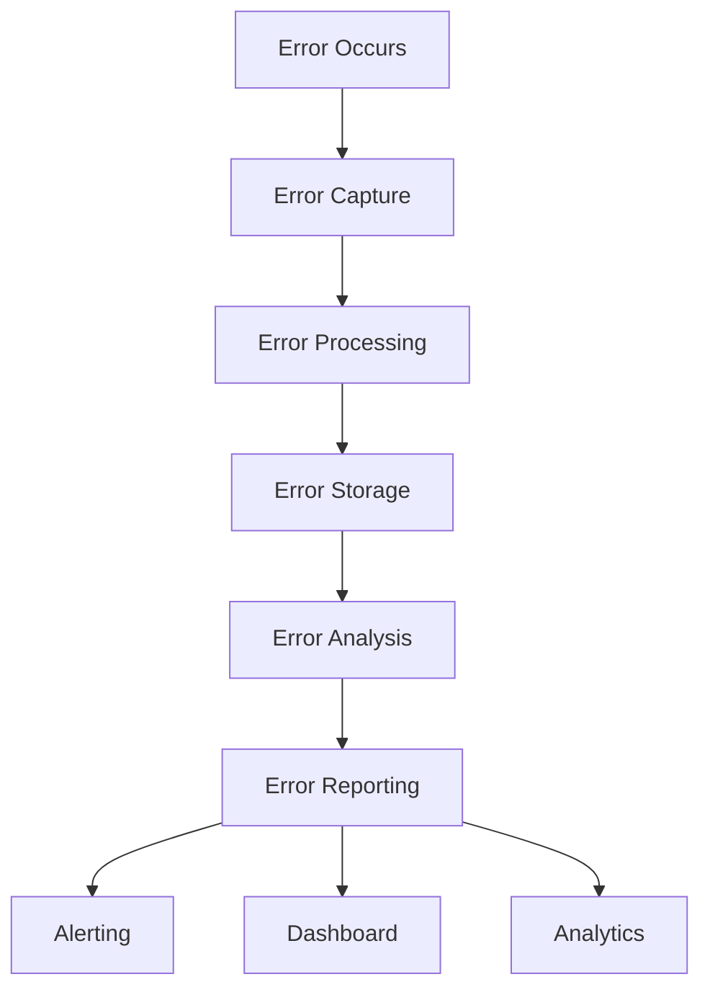

# 📊 **Error Reporting & Analytics**

> **Master error reporting, analytics, and monitoring for React Native applications**

<link rel="stylesheet" href="../../common-styles.css">

---

## 📚 **Table of Contents**

- [Error Reporting Overview](#-error-reporting-overview)
- [Error Analytics](#-error-analytics)
- [Performance Monitoring](#-performance-monitoring)
- [User Experience Tracking](#-user-experience-tracking)
- [Alerting and Notifications](#-alerting-and-notifications)
- [Best Practices](#-best-practices)
- [Interview Questions](#-interview-questions)

---

## 📊 **Error Reporting Overview**

### **Error Reporting Architecture**



### **Key Components**
- **Error Capture**: Collect errors from various sources
- **Error Processing**: Analyze and categorize errors
- **Error Storage**: Store error data for analysis
- **Error Reporting**: Generate reports and insights

---

## 📈 **Error Analytics**

### **Error Analytics System**

<button onclick="copyCode(this)" class="copy-btn">📋 Copy</button>
```javascript
import React, { useState, useCallback } from 'react';
import { View, Text, TouchableOpacity, StyleSheet, Alert } from 'react-native';

// Error analytics system
const ErrorAnalytics = {
  // Error data storage
  errorData: {
    errors: [],
    sessions: [],
    users: [],
    performance: []
  },

  // Record error
  recordError: (error, context = {}) => {
    const errorRecord = {
      id: Date.now(),
      message: error.message,
      stack: error.stack,
      type: error.name || 'Unknown',
      severity: ErrorAnalytics.getSeverity(error),
      timestamp: new Date().toISOString(),
      context: {
        ...context,
        platform: 'React Native',
        version: '1.0.0',
        userId: context.userId || 'anonymous',
        sessionId: context.sessionId || ErrorAnalytics.generateSessionId(),
        screen: context.screen || 'Unknown',
        action: context.action || 'Unknown'
      },
      resolved: false,
      impact: ErrorAnalytics.calculateImpact(error, context)
    };

    ErrorAnalytics.errorData.errors.push(errorRecord);
    
    // Update analytics
    ErrorAnalytics.updateAnalytics(errorRecord);
    
    return errorRecord;
  },

  // Get error severity
  getSeverity: (error) => {
    if (error.name === 'NetworkError') return 'medium';
    if (error.name === 'ValidationError') return 'low';
    if (error.name === 'TimeoutError') return 'medium';
    if (error.name === 'FatalError') return 'high';
    return 'medium';
  },

  // Calculate error impact
  calculateImpact: (error, context) => {
    let impact = 1; // Base impact
    
    // Increase impact based on error type
    if (error.name === 'FatalError') impact += 3;
    if (error.name === 'NetworkError') impact += 2;
    if (error.name === 'TimeoutError') impact += 2;
    
    // Increase impact based on context
    if (context.screen === 'Checkout') impact += 2;
    if (context.screen === 'Login') impact += 1;
    if (context.action === 'payment') impact += 3;
    
    return Math.min(impact, 10); // Cap at 10
  },

  // Update analytics
  updateAnalytics: (errorRecord) => {
    // Update error trends
    const today = new Date().toDateString();
    const existingTrend = ErrorAnalytics.errorData.trends?.find(t => t.date === today);
    
    if (existingTrend) {
      existingTrend.count++;
      existingTrend.errors.push(errorRecord);
    } else {
      if (!ErrorAnalytics.errorData.trends) {
        ErrorAnalytics.errorData.trends = [];
      }
      ErrorAnalytics.errorData.trends.push({
        date: today,
        count: 1,
        errors: [errorRecord]
      });
    }
    
    // Update error distribution
    if (!ErrorAnalytics.errorData.distribution) {
      ErrorAnalytics.errorData.distribution = {};
    }
    
    ErrorAnalytics.errorData.distribution[errorRecord.type] = 
      (ErrorAnalytics.errorData.distribution[errorRecord.type] || 0) + 1;
  },

  // Generate session ID
  generateSessionId: () => {
    return `session_${Date.now()}_${Math.random().toString(36).substr(2, 9)}`;
  },

  // Get error analytics
  getAnalytics: () => {
    const totalErrors = ErrorAnalytics.errorData.errors.length;
    const errorsByType = ErrorAnalytics.errorData.distribution || {};
    const errorsBySeverity = ErrorAnalytics.getErrorsBySeverity();
    const errorsByTime = ErrorAnalytics.getErrorsByTime();
    const topErrors = ErrorAnalytics.getTopErrors();
    const errorTrends = ErrorAnalytics.getErrorTrends();

    return {
      totalErrors,
      errorsByType,
      errorsBySeverity,
      errorsByTime,
      topErrors,
      errorTrends,
      averageImpact: ErrorAnalytics.getAverageImpact(),
      resolutionRate: ErrorAnalytics.getResolutionRate()
    };
  },

  // Get errors by severity
  getErrorsBySeverity: () => {
    const severityCounts = { high: 0, medium: 0, low: 0 };
    
    ErrorAnalytics.errorData.errors.forEach(error => {
      severityCounts[error.severity]++;
    });
    
    return severityCounts;
  },

  // Get errors by time
  getErrorsByTime: () => {
    const timeCounts = {};
    
    ErrorAnalytics.errorData.errors.forEach(error => {
      const hour = new Date(error.timestamp).getHours();
      timeCounts[hour] = (timeCounts[hour] || 0) + 1;
    });
    
    return timeCounts;
  },

  // Get top errors
  getTopErrors: () => {
    const errorCounts = {};
    
    ErrorAnalytics.errorData.errors.forEach(error => {
      const key = `${error.type}: ${error.message}`;
      errorCounts[key] = (errorCounts[key] || 0) + 1;
    });
    
    return Object.entries(errorCounts)
      .sort(([,a], [,b]) => b - a)
      .slice(0, 10)
      .map(([error, count]) => ({ error, count }));
  },

  // Get error trends
  getErrorTrends: () => {
    return ErrorAnalytics.errorData.trends || [];
  },

  // Get average impact
  getAverageImpact: () => {
    if (ErrorAnalytics.errorData.errors.length === 0) return 0;
    
    const totalImpact = ErrorAnalytics.errorData.errors.reduce((sum, error) => sum + error.impact, 0);
    return Math.round((totalImpact / ErrorAnalytics.errorData.errors.length) * 100) / 100;
  },

  // Get resolution rate
  getResolutionRate: () => {
    if (ErrorAnalytics.errorData.errors.length === 0) return 0;
    
    const resolvedErrors = ErrorAnalytics.errorData.errors.filter(error => error.resolved).length;
    return Math.round((resolvedErrors / ErrorAnalytics.errorData.errors.length) * 100);
  },

  // Mark error as resolved
  markAsResolved: (errorId) => {
    const error = ErrorAnalytics.errorData.errors.find(e => e.id === errorId);
    if (error) {
      error.resolved = true;
      error.resolvedAt = new Date().toISOString();
    }
  },

  // Clear analytics data
  clearData: () => {
    ErrorAnalytics.errorData = {
      errors: [],
      sessions: [],
      users: [],
      performance: [],
      trends: [],
      distribution: {}
    };
  }
};

// Error analytics demo component
const ErrorAnalyticsDemo = () => {
  const [loading, setLoading] = useState(false);
  const [analytics, setAnalytics] = useState(null);
  const [result, setResult] = useState(null);

  // Simulate different types of errors
  const simulateError = (type, message, severity = 'medium') => {
    const error = new Error(message);
    error.name = type;
    return error;
  };

  // Generate random error
  const generateRandomError = () => {
    const errorTypes = [
      { type: 'NetworkError', message: 'Network connection failed', severity: 'medium' },
      { type: 'ValidationError', message: 'Invalid input data', severity: 'low' },
      { type: 'TimeoutError', message: 'Operation timed out', severity: 'medium' },
      { type: 'FatalError', message: 'Application crashed', severity: 'high' },
      { type: 'AuthenticationError', message: 'Authentication failed', severity: 'high' }
    ];
    
    const randomError = errorTypes[Math.floor(Math.random() * errorTypes.length)];
    return simulateError(randomError.type, randomError.message, randomError.severity);
  };

  // Record error
  const handleRecordError = () => {
    const error = generateRandomError();
    const context = {
      userId: 'demo-user',
      screen: ['Home', 'Profile', 'Settings', 'Checkout'][Math.floor(Math.random() * 4)],
      action: ['click', 'swipe', 'input', 'navigation'][Math.floor(Math.random() * 4)]
    };
    
    const errorRecord = ErrorAnalytics.recordError(error, context);
    setResult({ type: 'error-recorded', data: errorRecord });
    setAnalytics(ErrorAnalytics.getAnalytics());
  };

  // Get analytics
  const handleGetAnalytics = () => {
    const analyticsData = ErrorAnalytics.getAnalytics();
    setAnalytics(analyticsData);
    setResult({ type: 'analytics', data: analyticsData });
  };

  // Mark error as resolved
  const handleMarkResolved = () => {
    if (ErrorAnalytics.errorData.errors.length > 0) {
      const randomError = ErrorAnalytics.errorData.errors[
        Math.floor(Math.random() * ErrorAnalytics.errorData.errors.length)
      ];
      ErrorAnalytics.markAsResolved(randomError.id);
      setResult({ 
        type: 'error-resolved', 
        data: { errorId: randomError.id, message: randomError.message }
      });
      setAnalytics(ErrorAnalytics.getAnalytics());
    }
  };

  // Generate error report
  const handleGenerateReport = () => {
    const analyticsData = ErrorAnalytics.getAnalytics();
    const report = {
      generatedAt: new Date().toISOString(),
      summary: {
        totalErrors: analyticsData.totalErrors,
        averageImpact: analyticsData.averageImpact,
        resolutionRate: analyticsData.resolutionRate
      },
      details: analyticsData
    };
    
    setResult({ type: 'report-generated', data: report });
    setAnalytics(analyticsData);
  };

  // Clear data
  const handleClearData = () => {
    ErrorAnalytics.clearData();
    setAnalytics(ErrorAnalytics.getAnalytics());
    setResult({ type: 'data-cleared', data: 'All analytics data cleared' });
  };

  return (
    <View style={styles.container}>
      <Text style={styles.title}>Error Analytics Demo</Text>
      
      <View style={styles.buttonContainer}>
        <TouchableOpacity 
          style={styles.button}
          onPress={handleRecordError}
        >
          <Text style={styles.buttonText}>Record Random Error</Text>
        </TouchableOpacity>

        <TouchableOpacity 
          style={styles.button}
          onPress={handleGetAnalytics}
        >
          <Text style={styles.buttonText}>Get Analytics</Text>
        </TouchableOpacity>

        <TouchableOpacity 
          style={styles.button}
          onPress={handleMarkResolved}
        >
          <Text style={styles.buttonText}>Mark Error Resolved</Text>
        </TouchableOpacity>

        <TouchableOpacity 
          style={styles.button}
          onPress={handleGenerateReport}
        >
          <Text style={styles.buttonText}>Generate Report</Text>
        </TouchableOpacity>

        <TouchableOpacity 
          style={styles.resetButton}
          onPress={handleClearData}
        >
          <Text style={styles.buttonText}>Clear Data</Text>
        </TouchableOpacity>
      </View>

      {analytics && (
        <View style={styles.analyticsContainer}>
          <Text style={styles.analyticsTitle}>Analytics Summary:</Text>
          <Text style={styles.analyticsText}>Total Errors: {analytics.totalErrors}</Text>
          <Text style={styles.analyticsText}>Average Impact: {analytics.averageImpact}</Text>
          <Text style={styles.analyticsText}>Resolution Rate: {analytics.resolutionRate}%</Text>
          <Text style={styles.analyticsText}>
            Errors by Severity: {JSON.stringify(analytics.errorsBySeverity)}
          </Text>
          <Text style={styles.analyticsText}>
            Top Errors: {analytics.topErrors.slice(0, 3).map(e => `${e.error} (${e.count})`).join(', ')}
          </Text>
        </View>
      )}

      {result && (
        <View style={styles.resultContainer}>
          <Text style={styles.resultTitle}>Result:</Text>
          <Text style={styles.resultText}>{JSON.stringify(result, null, 2)}</Text>
        </View>
      )}
    </View>
  );
};

const styles = StyleSheet.create({
  container: {
    flex: 1,
    padding: 20,
    backgroundColor: '#fff',
  },
  title: {
    fontSize: 24,
    fontWeight: 'bold',
    marginBottom: 20,
    color: '#333',
  },
  buttonContainer: {
    marginBottom: 20,
  },
  button: {
    backgroundColor: '#007bff',
    padding: 15,
    borderRadius: 8,
    marginBottom: 10,
    alignItems: 'center',
  },
  resetButton: {
    backgroundColor: '#6c757d',
    padding: 15,
    borderRadius: 8,
    marginBottom: 10,
    alignItems: 'center',
  },
  buttonText: {
    color: '#fff',
    fontSize: 16,
    fontWeight: 'bold',
  },
  analyticsContainer: {
    backgroundColor: '#e3f2fd',
    padding: 15,
    borderRadius: 8,
    marginBottom: 10,
  },
  analyticsTitle: {
    fontSize: 16,
    fontWeight: 'bold',
    color: '#1976d2',
    marginBottom: 5,
  },
  analyticsText: {
    fontSize: 14,
    color: '#1976d2',
    marginBottom: 2,
  },
  resultContainer: {
    backgroundColor: '#d4edda',
    padding: 15,
    borderRadius: 8,
    marginBottom: 10,
  },
  resultTitle: {
    fontSize: 16,
    fontWeight: 'bold',
    color: '#155724',
    marginBottom: 5,
  },
  resultText: {
    fontSize: 14,
    color: '#155724',
    fontFamily: 'monospace',
  },
});

export { ErrorAnalytics, ErrorAnalyticsDemo };
```

---

## ⚡ **Performance Monitoring**

### **Performance Monitoring System**

<button onclick="copyCode(this)" class="copy-btn">📋 Copy</button>
```javascript
import React, { useState, useCallback } from 'react';
import { View, Text, TouchableOpacity, StyleSheet, Alert } from 'react-native';

// Performance monitoring system
const PerformanceMonitoring = {
  // Performance data storage
  performanceData: {
    metrics: [],
    sessions: [],
    benchmarks: []
  },

  // Record performance metric
  recordMetric: (name, value, context = {}) => {
    const metric = {
      id: Date.now(),
      name,
      value,
      unit: context.unit || 'ms',
      timestamp: new Date().toISOString(),
      context: {
        ...context,
        platform: 'React Native',
        version: '1.0.0',
        userId: context.userId || 'anonymous',
        sessionId: context.sessionId || PerformanceMonitoring.generateSessionId()
      }
    };

    PerformanceMonitoring.performanceData.metrics.push(metric);
    
    // Update benchmarks
    PerformanceMonitoring.updateBenchmarks(metric);
    
    return metric;
  },

  // Update benchmarks
  updateBenchmarks: (metric) => {
    const existingBenchmark = PerformanceMonitoring.performanceData.benchmarks.find(
      b => b.name === metric.name
    );
    
    if (existingBenchmark) {
      existingBenchmark.count++;
      existingBenchmark.total += metric.value;
      existingBenchmark.average = existingBenchmark.total / existingBenchmark.count;
      existingBenchmark.min = Math.min(existingBenchmark.min, metric.value);
      existingBenchmark.max = Math.max(existingBenchmark.max, metric.value);
      existingBenchmark.lastUpdated = new Date().toISOString();
    } else {
      PerformanceMonitoring.performanceData.benchmarks.push({
        name: metric.name,
        count: 1,
        total: metric.value,
        average: metric.value,
        min: metric.value,
        max: metric.value,
        lastUpdated: new Date().toISOString()
      });
    }
  },

  // Generate session ID
  generateSessionId: () => {
    return `session_${Date.now()}_${Math.random().toString(36).substr(2, 9)}`;
  },

  // Get performance analytics
  getAnalytics: () => {
    const totalMetrics = PerformanceMonitoring.performanceData.metrics.length;
    const benchmarks = PerformanceMonitoring.performanceData.benchmarks;
    const performanceTrends = PerformanceMonitoring.getPerformanceTrends();
    const slowOperations = PerformanceMonitoring.getSlowOperations();
    const performanceScore = PerformanceMonitoring.calculatePerformanceScore();

    return {
      totalMetrics,
      benchmarks,
      performanceTrends,
      slowOperations,
      performanceScore,
      averageResponseTime: PerformanceMonitoring.getAverageResponseTime(),
      memoryUsage: PerformanceMonitoring.getMemoryUsage()
    };
  },

  // Get performance trends
  getPerformanceTrends: () => {
    const trends = {};
    
    PerformanceMonitoring.performanceData.metrics.forEach(metric => {
      const date = new Date(metric.timestamp).toDateString();
      if (!trends[date]) {
        trends[date] = { date, metrics: [] };
      }
      trends[date].metrics.push(metric);
    });
    
    return Object.values(trends).map(trend => ({
      date: trend.date,
      averageValue: trend.metrics.reduce((sum, m) => sum + m.value, 0) / trend.metrics.length,
      count: trend.metrics.length
    }));
  },

  // Get slow operations
  getSlowOperations: () => {
    const slowThresholds = {
      'api-call': 1000,
      'render': 100,
      'navigation': 500,
      'image-load': 2000
    };
    
    const slowOperations = [];
    
    PerformanceMonitoring.performanceData.metrics.forEach(metric => {
      const threshold = slowThresholds[metric.name] || 1000;
      if (metric.value > threshold) {
        slowOperations.push({
          name: metric.name,
          value: metric.value,
          threshold,
          timestamp: metric.timestamp
        });
      }
    });
    
    return slowOperations.sort((a, b) => b.value - a.value).slice(0, 10);
  },

  // Calculate performance score
  calculatePerformanceScore: () => {
    const benchmarks = PerformanceMonitoring.performanceData.benchmarks;
    if (benchmarks.length === 0) return 100;
    
    let totalScore = 0;
    let weightSum = 0;
    
    const weights = {
      'api-call': 0.3,
      'render': 0.2,
      'navigation': 0.2,
      'image-load': 0.2,
      'other': 0.1
    };
    
    benchmarks.forEach(benchmark => {
      const weight = weights[benchmark.name] || weights.other;
      const score = Math.max(0, 100 - (benchmark.average / 10)); // Simple scoring
      totalScore += score * weight;
      weightSum += weight;
    });
    
    return Math.round(totalScore / weightSum);
  },

  // Get average response time
  getAverageResponseTime: () => {
    const apiMetrics = PerformanceMonitoring.performanceData.metrics.filter(
      m => m.name === 'api-call'
    );
    
    if (apiMetrics.length === 0) return 0;
    
    const totalTime = apiMetrics.reduce((sum, metric) => sum + metric.value, 0);
    return Math.round(totalTime / apiMetrics.length);
  },

  // Get memory usage
  getMemoryUsage: () => {
    // In a real app, you would get actual memory usage
    return {
      used: Math.floor(Math.random() * 100) + 50, // Mock data
      total: 100,
      percentage: Math.floor(Math.random() * 50) + 50
    };
  },

  // Clear performance data
  clearData: () => {
    PerformanceMonitoring.performanceData = {
      metrics: [],
      sessions: [],
      benchmarks: []
    };
  }
};

// Performance monitoring demo component
const PerformanceMonitoringDemo = () => {
  const [loading, setLoading] = useState(false);
  const [analytics, setAnalytics] = useState(null);
  const [result, setResult] = useState(null);

  // Simulate performance metric
  const simulateMetric = (name, baseValue, variance = 0.5) => {
    const value = baseValue + (Math.random() - 0.5) * variance * baseValue;
    return Math.round(value);
  };

  // Record random metric
  const handleRecordMetric = () => {
    const metrics = [
      { name: 'api-call', baseValue: 800, variance: 0.3 },
      { name: 'render', baseValue: 50, variance: 0.5 },
      { name: 'navigation', baseValue: 300, variance: 0.4 },
      { name: 'image-load', baseValue: 1200, variance: 0.6 }
    ];
    
    const randomMetric = metrics[Math.floor(Math.random() * metrics.length)];
    const value = simulateMetric(randomMetric.name, randomMetric.baseValue, randomMetric.variance);
    
    const metric = PerformanceMonitoring.recordMetric(randomMetric.name, value, {
      userId: 'demo-user',
      screen: 'PerformanceDemo'
    });
    
    setResult({ type: 'metric-recorded', data: metric });
    setAnalytics(PerformanceMonitoring.getAnalytics());
  };

  // Get analytics
  const handleGetAnalytics = () => {
    const analyticsData = PerformanceMonitoring.getAnalytics();
    setAnalytics(analyticsData);
    setResult({ type: 'analytics', data: analyticsData });
  };

  // Generate performance report
  const handleGenerateReport = () => {
    const analyticsData = PerformanceMonitoring.getAnalytics();
    const report = {
      generatedAt: new Date().toISOString(),
      summary: {
        performanceScore: analyticsData.performanceScore,
        averageResponseTime: analyticsData.averageResponseTime,
        slowOperations: analyticsData.slowOperations.length
      },
      details: analyticsData
    };
    
    setResult({ type: 'report-generated', data: report });
    setAnalytics(analyticsData);
  };

  // Clear data
  const handleClearData = () => {
    PerformanceMonitoring.clearData();
    setAnalytics(PerformanceMonitoring.getAnalytics());
    setResult({ type: 'data-cleared', data: 'All performance data cleared' });
  };

  return (
    <View style={styles.container}>
      <Text style={styles.title}>Performance Monitoring Demo</Text>
      
      <View style={styles.buttonContainer}>
        <TouchableOpacity 
          style={styles.button}
          onPress={handleRecordMetric}
        >
          <Text style={styles.buttonText}>Record Random Metric</Text>
        </TouchableOpacity>

        <TouchableOpacity 
          style={styles.button}
          onPress={handleGetAnalytics}
        >
          <Text style={styles.buttonText}>Get Analytics</Text>
        </TouchableOpacity>

        <TouchableOpacity 
          style={styles.button}
          onPress={handleGenerateReport}
        >
          <Text style={styles.buttonText}>Generate Report</Text>
        </TouchableOpacity>

        <TouchableOpacity 
          style={styles.resetButton}
          onPress={handleClearData}
        >
          <Text style={styles.buttonText}>Clear Data</Text>
        </TouchableOpacity>
      </View>

      {analytics && (
        <View style={styles.analyticsContainer}>
          <Text style={styles.analyticsTitle}>Performance Summary:</Text>
          <Text style={styles.analyticsText}>Performance Score: {analytics.performanceScore}/100</Text>
          <Text style={styles.analyticsText}>Average Response Time: {analytics.averageResponseTime}ms</Text>
          <Text style={styles.analyticsText}>Slow Operations: {analytics.slowOperations.length}</Text>
          <Text style={styles.analyticsText}>
            Memory Usage: {analytics.memoryUsage.percentage}%
          </Text>
        </View>
      )}

      {result && (
        <View style={styles.resultContainer}>
          <Text style={styles.resultTitle}>Result:</Text>
          <Text style={styles.resultText}>{JSON.stringify(result, null, 2)}</Text>
        </View>
      )}
    </View>
  );
};

const styles = StyleSheet.create({
  container: {
    flex: 1,
    padding: 20,
    backgroundColor: '#fff',
  },
  title: {
    fontSize: 24,
    fontWeight: 'bold',
    marginBottom: 20,
    color: '#333',
  },
  buttonContainer: {
    marginBottom: 20,
  },
  button: {
    backgroundColor: '#007bff',
    padding: 15,
    borderRadius: 8,
    marginBottom: 10,
    alignItems: 'center',
  },
  resetButton: {
    backgroundColor: '#6c757d',
    padding: 15,
    borderRadius: 8,
    marginBottom: 10,
    alignItems: 'center',
  },
  buttonText: {
    color: '#fff',
    fontSize: 16,
    fontWeight: 'bold',
  },
  analyticsContainer: {
    backgroundColor: '#e3f2fd',
    padding: 15,
    borderRadius: 8,
    marginBottom: 10,
  },
  analyticsTitle: {
    fontSize: 16,
    fontWeight: 'bold',
    color: '#1976d2',
    marginBottom: 5,
  },
  analyticsText: {
    fontSize: 14,
    color: '#1976d2',
    marginBottom: 2,
  },
  resultContainer: {
    backgroundColor: '#d4edda',
    padding: 15,
    borderRadius: 8,
    marginBottom: 10,
  },
  resultTitle: {
    fontSize: 16,
    fontWeight: 'bold',
    color: '#155724',
    marginBottom: 5,
  },
  resultText: {
    fontSize: 14,
    color: '#155724',
    fontFamily: 'monospace',
  },
});

export { PerformanceMonitoring, PerformanceMonitoringDemo };
```

---

## 🎯 **Best Practices**

### **1. Error Reporting**
- Use professional error reporting services
- Include relevant context and metadata
- Implement proper error categorization
- Set up appropriate alerting

### **2. Analytics Implementation**
- Track key performance metrics
- Monitor user experience indicators
- Analyze error patterns and trends
- Generate actionable insights

### **3. Monitoring and Alerting**
- Set up real-time monitoring
- Configure appropriate alert thresholds
- Implement escalation procedures
- Regular review and optimization

---

## ❓ **Interview Questions**

### **Basic Questions**
1. **What is error reporting and analytics?**
2. **How do you implement performance monitoring?**
3. **What metrics should you track in a React Native app?**

### **Advanced Questions**
1. **How would you design an error analytics system?**
2. **Explain different performance monitoring strategies.**
3. **How do you implement real-time alerting?**

### **Practical Questions**
1. **Implement an error reporting system.**
2. **Create a performance monitoring dashboard.**
3. **Design an analytics and alerting system.**

---

## 🧭 Navigation

<div class="navigation">
    <a href="./03-Error-Recovery-Strategies.md" class="nav-link prev">⬅️ Previous: Error Recovery Strategies</a>
    <a href="../16-Memory-Management/01-Memory-Optimization.md" class="nav-link next">Next: Memory Optimization ➡️</a>
</div>

---

<script src="../../common-scripts.js"></script>

*Last updated: December 2024*

