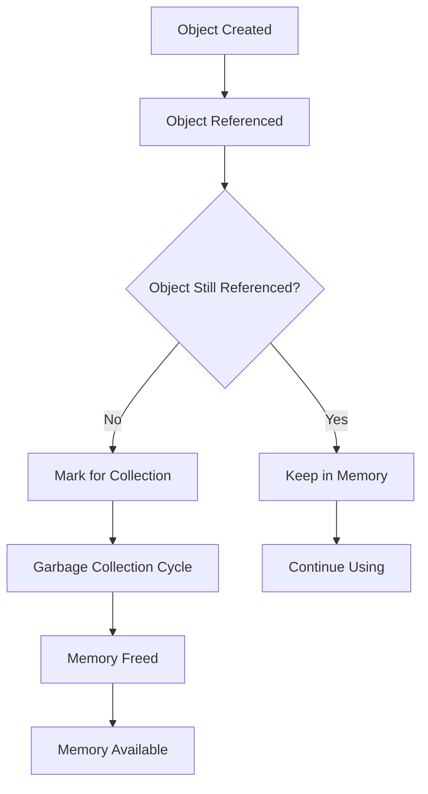

# Garbage Collection Optimization in React Native

## Overview

Garbage Collection (GC) is the automatic memory management process that frees up memory by removing objects that are no longer referenced. Understanding and optimizing garbage collection is crucial for maintaining smooth performance in React Native applications.

## Understanding Garbage Collection

### How Garbage Collection Works







### Types of Garbage Collection

1. **Mark and Sweep**: Marks unreachable objects and sweeps them away
2. **Generational GC**: Separates objects by age (young/old generation)
3. **Incremental GC**: Breaks GC work into smaller chunks
4. **Concurrent GC**: Runs GC alongside application code

## GC Optimization Strategies

### 1. Object Pooling



```javascript
import { useRef, useCallback } from 'react';

// Object pool for frequently created/destroyed objects
class ObjectPool {
  constructor(createFn, resetFn, initialSize = 10) {
    this.createFn = createFn;
    this.resetFn = resetFn;
    this.pool = [];
    this.active = new Set();
    
    // Pre-populate pool
    for (let i = 0; i < initialSize; i++) {
      this.pool.push(this.createFn());
    }
  }

  acquire() {
    let obj = this.pool.pop();
    if (!obj) {
      obj = this.createFn();
    }
    this.active.add(obj);
    return obj;
  }

  release(obj) {
    if (this.active.has(obj)) {
      this.active.delete(obj);
      this.resetFn(obj);
      this.pool.push(obj);
    }
  }

  clear() {
    this.pool.length = 0;
    this.active.clear();
  }
}

// Usage example
const useObjectPool = () => {
  const poolRef = useRef(null);

  useEffect(() => {
    poolRef.current = new ObjectPool(
      () => ({ id: 0, data: null, timestamp: 0 }), // createFn
      (obj) => { // resetFn
        obj.id = 0;
        obj.data = null;
        obj.timestamp = 0;
      }
    );

    return () => {
      poolRef.current?.clear();
    };
  }, []);

  const getObject = useCallback(() => {
    return poolRef.current?.acquire();
  }, []);

  const releaseObject = useCallback((obj) => {
    poolRef.current?.release(obj);
  }, []);

  return { getObject, releaseObject };
};
```



### 2. Efficient Data Structures



```javascript
import { useMemo, useCallback } from 'react';

const EfficientDataStructures = () => {
  const [items, setItems] = useState([]);

  // Use Map for O(1) lookups instead of Array.find()
  const itemsMap = useMemo(() => {
    const map = new Map();
    items.forEach(item => {
      map.set(item.id, item);
    });
    return map;
  }, [items]);

  // Use Set for unique values
  const uniqueCategories = useMemo(() => {
    return new Set(items.map(item => item.category));
  }, [items]);

  // Efficient filtering with pre-computed values
  const filteredItems = useMemo(() => {
    return items.filter(item => item.active);
  }, [items]);

  const getItemById = useCallback((id) => {
    return itemsMap.get(id);
  }, [itemsMap]);

  const hasCategory = useCallback((category) => {
    return uniqueCategories.has(category);
  }, [uniqueCategories]);

  return (
    <View>
      <Text>Efficient Data Structures Example</Text>
    </View>
  );
};
```



### 3. Memory-Efficient Rendering



```javascript
import { memo, useMemo, useCallback } from 'react';
import { FlatList, View, Text } from 'react-native';

// Memoized list item to prevent unnecessary re-renders
const ListItem = memo(({ item, onPress }) => {
  const handlePress = useCallback(() => {
    onPress(item.id);
  }, [item.id, onPress]);

  return (
    <TouchableOpacity onPress={handlePress}>
      <View style={{}}>
        <Text>{item.title}</Text>
        <Text>{item.description}</Text>
      </View>
    </TouchableOpacity>
  );
});

const OptimizedList = () => {
  const [data, setData] = useState([]);

  // Memoize the render function
  const renderItem = useCallback(({ item }) => (
    <ListItem item={item} onPress={handleItemPress} />
  ), []);

  // Memoize the key extractor
  const keyExtractor = useCallback((item) => item.id.toString(), []);

  // Memoize the item layout for better performance
  const getItemLayout = useCallback((data, index) => ({
    length: 80,
    offset: 80 * index,
    index,
  }), []);

  const handleItemPress = useCallback((id) => {
    setData(prev => prev.map(item => 
      item.id === id 
        ? { ...item, selected: !item.selected }
        : item
    ));
  }, []);

  return (
    <FlatList
      data={data}
      renderItem={renderItem}
      keyExtractor={keyExtractor}
      getItemLayout={getItemLayout}
      // GC optimization props
      removeClippedSubviews={true}
      maxToRenderPerBatch={10}
      windowSize={10}
      initialNumToRender={10}
      updateCellsBatchingPeriod={50}
    />
  );
};
```



### 4. Lazy Initialization



```javascript
import { useRef, useCallback } from 'react';

const LazyInitialization = () => {
  const expensiveObjectRef = useRef(null);
  const cacheRef = useRef(new Map());

  // Lazy initialization of expensive objects
  const getExpensiveObject = useCallback(() => {
    if (!expensiveObjectRef.current) {
      expensiveObjectRef.current = createExpensiveObject();
    }
    return expensiveObjectRef.current;
  }, []);

  // Lazy cache with size limit
  const getCachedData = useCallback((key) => {
    if (cacheRef.current.has(key)) {
      return cacheRef.current.get(key);
    }

    const data = computeExpensiveData(key);
    
    // Limit cache size to prevent memory bloat
    if (cacheRef.current.size >= 100) {
      const firstKey = cacheRef.current.keys().next().value;
      cacheRef.current.delete(firstKey);
    }
    
    cacheRef.current.set(key, data);
    return data;
  }, []);

  useEffect(() => {
    return () => {
      // Cleanup on unmount
      expensiveObjectRef.current = null;
      cacheRef.current.clear();
    };
  }, []);

  return <View>Lazy Initialization Example</View>;
};
```



## Advanced GC Optimization Techniques

### 1. Weak References



```javascript
import { useEffect, useRef } from 'react';

const WeakReferenceExample = () => {
  const weakMapRef = useRef(new WeakMap());
  const weakSetRef = useRef(new WeakSet());

  useEffect(() => {
    // Create objects that will be garbage collected
    const createObjects = () => {
      const obj1 = { id: 1, data: 'test1' };
      const obj2 = { id: 2, data: 'test2' };
      
      // WeakMap - automatically cleaned up when key is GC'd
      weakMapRef.current.set(obj1, { timestamp: Date.now() });
      weakSetRef.current.add(obj2);
      
      // Objects will be GC'd when they go out of scope
      return { obj1, obj2 };
    };

    const objects = createObjects();
    
    // Objects are still referenced, so not GC'd yet
    console.log('Objects created:', objects);
    
    // When objects go out of scope, they'll be GC'd
    // and automatically removed from WeakMap/WeakSet
  }, []);

  return <View>Weak Reference Example</View>;
};
```



### 2. Memory Pressure Handling



```javascript
import { useEffect, useState } from 'react';
import { AppState } from 'react-native';

const MemoryPressureHandler = () => {
  const [memoryPressure, setMemoryPressure] = useState('normal');
  const cacheRef = useRef(new Map());

  useEffect(() => {
    const handleAppStateChange = (nextAppState) => {
      if (nextAppState === 'background') {
        // Clear cache when app goes to background
        cacheRef.current.clear();
        setMemoryPressure('low');
      }
    };

    const handleMemoryWarning = () => {
      // React to memory warnings
      setMemoryPressure('high');
      
      // Clear non-essential data
      cacheRef.current.clear();
      
      // Force garbage collection if available
      if (global.gc) {
        global.gc();
      }
    };

    const subscription = AppState.addEventListener('change', handleAppStateChange);
    
    // Listen for memory warnings (iOS)
    if (global.DeviceEventEmitter) {
      global.DeviceEventEmitter.addListener('memoryWarning', handleMemoryWarning);
    }

    return () => {
      subscription?.remove();
      if (global.DeviceEventEmitter) {
        global.DeviceEventEmitter.removeListener('memoryWarning', handleMemoryWarning);
      }
    };
  }, []);

  return (
    <View>
      <Text>Memory Pressure: {memoryPressure}</Text>
    </View>
  );
};
```



### 3. Efficient Image Management



```javascript
import { useRef, useCallback } from 'react';
import { Image } from 'react-native';

const ImageManager = () => {
  const imageCacheRef = useRef(new Map());
  const maxCacheSize = 50;

  const loadImage = useCallback((uri) => {
    if (imageCacheRef.current.has(uri)) {
      return imageCacheRef.current.get(uri);
    }

    const imagePromise = new Promise((resolve, reject) => {
      const img = new Image();
      img.onload = () => resolve(img);
      img.onerror = reject;
      img.src = uri;
    });

    // Limit cache size
    if (imageCacheRef.current.size >= maxCacheSize) {
      const firstKey = imageCacheRef.current.keys().next().value;
      imageCacheRef.current.delete(firstKey);
    }

    imageCacheRef.current.set(uri, imagePromise);
    return imagePromise;
  }, []);

  const clearImageCache = useCallback(() => {
    imageCacheRef.current.clear();
  }, []);

  useEffect(() => {
    return () => {
      clearImageCache();
    };
  }, [clearImageCache]);

  return <View>Image Manager Example</View>;
};
```



## GC Monitoring and Profiling

### 1. Memory Usage Tracking



```javascript
import { useEffect, useState } from 'react';

const MemoryTracker = () => {
  const [memoryStats, setMemoryStats] = useState(null);

  useEffect(() => {
    const trackMemory = () => {
      if (global.performance && global.performance.memory) {
        const memory = global.performance.memory;
        setMemoryStats({
          used: Math.round(memory.usedJSHeapSize / 1024 / 1024),
          total: Math.round(memory.totalJSHeapSize / 1024 / 1024),
          limit: Math.round(memory.jsHeapSizeLimit / 1024 / 1024),
          percentage: Math.round((memory.usedJSHeapSize / memory.jsHeapSizeLimit) * 100)
        });
      }
    };

    const interval = setInterval(trackMemory, 1000);
    trackMemory();

    return () => clearInterval(interval);
  }, []);

  return (
    <View style={{}}>
      <Text>Memory Usage:</Text>
      {memoryStats && (
        <>
          <Text>Used: {memoryStats.used} MB ({memoryStats.percentage}%)</Text>
          <Text>Total: {memoryStats.total} MB</Text>
          <Text>Limit: {memoryStats.limit} MB</Text>
        </>
      )}
    </View>
  );
};
```



### 2. GC Performance Monitoring



```javascript
import { useEffect, useRef } from 'react';

const GCPerformanceMonitor = () => {
  const gcTimesRef = useRef([]);
  const lastGCTimeRef = useRef(0);

  useEffect(() => {
    const monitorGC = () => {
      if (global.performance && global.performance.memory) {
        const currentTime = Date.now();
        const memory = global.performance.memory;
        
        // Detect GC by checking if used memory decreased
        if (memory.usedJSHeapSize < lastGCTimeRef.current) {
          const gcTime = currentTime - lastGCTimeRef.current;
          gcTimesRef.current.push(gcTime);
          
          // Keep only last 100 GC times
          if (gcTimesRef.current.length > 100) {
            gcTimesRef.current.shift();
          }
          
          console.log('GC detected, time:', gcTime, 'ms');
        }
        
        lastGCTimeRef.current = memory.usedJSHeapSize;
      }
    };

    const interval = setInterval(monitorGC, 100);
    
    return () => clearInterval(interval);
  }, []);

  const getGCAverageTime = () => {
    if (gcTimesRef.current.length === 0) return 0;
    const sum = gcTimesRef.current.reduce((a, b) => a + b, 0);
    return Math.round(sum / gcTimesRef.current.length);
  };

  return (
    <View>
      <Text>GC Average Time: {getGCAverageTime()}ms</Text>
      <Text>GC Count: {gcTimesRef.current.length}</Text>
    </View>
  );
};
```



## Best Practices for GC Optimization

### 1. Minimize Object Creation



```javascript
import { useMemo, useCallback } from 'react';

const MinimizeObjectCreation = () => {
  const [items, setItems] = useState([]);

  // ❌ BAD: Creates new object on every render
  const badStyle = { padding: 10, margin: 5 };

  // ✅ GOOD: Memoize static objects
  const goodStyle = useMemo(() => ({ padding: 10, margin: 5 }), []);

  // ❌ BAD: Creates new function on every render
  const badHandler = (id) => {
    setItems(prev => prev.filter(item => item.id !== id));
  };

  // ✅ GOOD: Memoize functions
  const goodHandler = useCallback((id) => {
    setItems(prev => prev.filter(item => item.id !== id));
  }, []);

  return (
    <View style={goodStyle}>
      {items.map(item => (
        <TouchableOpacity key={item.id} onPress={() => goodHandler(item.id)}>
          <Text>{item.name}</Text>
        </TouchableOpacity>
      ))}
    </View>
  );
};
```



### 2. Efficient State Updates



```javascript
import { useReducer, useCallback } from 'react';

const initialState = {
  items: [],
  loading: false,
  error: null,
};

const reducer = (state, action) => {
  switch (action.type) {
    case 'ADD_ITEM':
      // ✅ GOOD: Immutable update
      return {
        ...state,
        items: [...state.items, action.payload]
      };
    case 'UPDATE_ITEM':
      // ✅ GOOD: Efficient update with map
      return {
        ...state,
        items: state.items.map(item =>
          item.id === action.payload.id
            ? { ...item, ...action.payload }
            : item
        )
      };
    case 'REMOVE_ITEM':
      // ✅ GOOD: Efficient removal with filter
      return {
        ...state,
        items: state.items.filter(item => item.id !== action.payload)
      };
    default:
      return state;
  }
};

const EfficientStateUpdates = () => {
  const [state, dispatch] = useReducer(reducer, initialState);

  const addItem = useCallback((item) => {
    dispatch({ type: 'ADD_ITEM', payload: item });
  }, []);

  const updateItem = useCallback((id, updates) => {
    dispatch({ type: 'UPDATE_ITEM', payload: { id, ...updates } });
  }, []);

  const removeItem = useCallback((id) => {
    dispatch({ type: 'REMOVE_ITEM', payload: id });
  }, []);

  return <View>Efficient State Updates</View>;
};
```



## Testing GC Performance

### 1. Memory Leak Testing



```javascript
import { render, cleanup } from '@testing-library/react-native';

describe('GC Performance Tests', () => {
  let initialMemory;

  beforeEach(() => {
    initialMemory = global.performance?.memory?.usedJSHeapSize || 0;
  });

  afterEach(() => {
    cleanup();
    // Force GC if available
    if (global.gc) {
      global.gc();
    }
  });

  it('should not leak memory after component unmount', () => {
    const { unmount } = render(<MyComponent />);
    
    // Simulate user interactions
    fireEvent.press(screen.getByText('Button'));
    
    unmount();
    
    // Wait for GC
    setTimeout(() => {
      const finalMemory = global.performance?.memory?.usedJSHeapSize || 0;
      expect(finalMemory).toBeLessThanOrEqual(initialMemory + 1000000); // 1MB tolerance
    }, 1000);
  });

  it('should efficiently handle large datasets', () => {
    const largeDataset = Array.from({ length: 10000 }, (_, i) => ({
      id: i,
      name: `Item ${i}`,
      data: `Data ${i}`
    }));

    const { unmount } = render(<LargeList data={largeDataset} />);
    
    // Test scrolling performance
    const list = screen.getByTestId('large-list');
    fireEvent.scroll(list, { nativeEvent: { contentOffset: { y: 1000 } } });
    
    unmount();
  });
});
```



## Summary

Garbage Collection optimization in React Native involves:

1. **Object Pooling** for frequently created/destroyed objects
2. **Efficient Data Structures** (Map, Set, WeakMap, WeakSet)
3. **Memory-Efficient Rendering** with memoization and virtualization
4. **Lazy Initialization** to defer expensive operations
5. **Weak References** for automatic cleanup
6. **Memory Pressure Handling** for low-memory situations
7. **Monitoring and Profiling** to track GC performance

## Key Takeaways

- Use object pooling for frequently created objects
- Prefer Map/Set over Array for lookups and unique values
- Memoize expensive calculations and static objects
- Use WeakMap/WeakSet for automatic garbage collection
- Monitor memory usage and GC performance
- Test for memory leaks in your test suite
- Handle memory pressure gracefully
- Minimize object creation in render cycles

