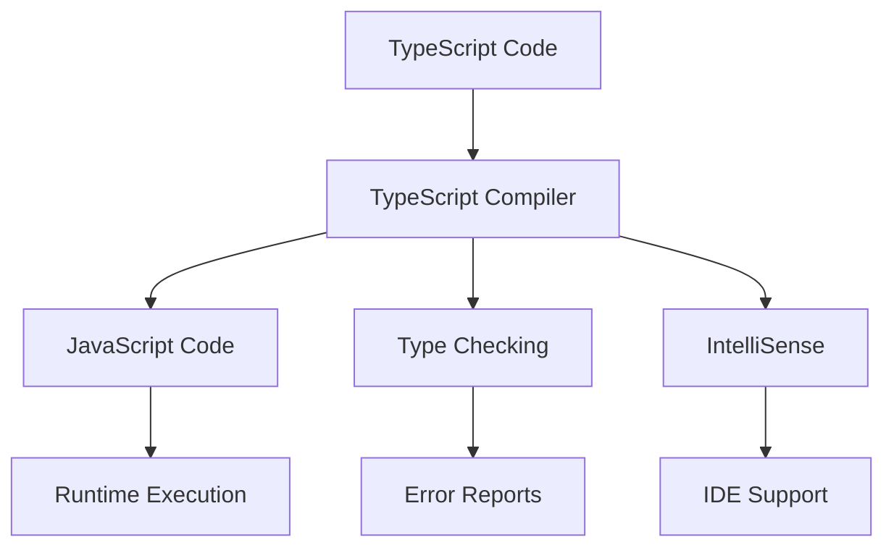

# 🚀 **TypeScript Introduction & Setup**

> **Complete guide to understanding TypeScript, its benefits, installation, and initial project setup**

<link rel="stylesheet" href="../../common-styles.css">

---

## 📚 **Table of Contents**

- [What is TypeScript?](#what-is-typescript)
- [Why Use TypeScript?](#why-use-typescript)
- [TypeScript vs JavaScript](#typescript-vs-javascript)
- [Installation & Setup](#installation--setup)
- [First TypeScript Project](#first-typescript-project)
- [TypeScript Compiler](#typescript-compiler)
- [Best Practices](#best-practices)
- [Common Interview Questions](#common-interview-questions)

---

## 🎯 **What is TypeScript?**

TypeScript is a strongly typed programming language that builds on JavaScript, giving you better tooling at any scale. It's developed and maintained by Microsoft.

### **Key Characteristics**

```typescript
// TypeScript adds static type checking to JavaScript
let message: string = "Hello, TypeScript!";
let count: number = 42;
let isActive: boolean = true;

// TypeScript catches errors at compile time
let userName: string = "John";
// userName = 123; // ❌ Error: Type 'number' is not assignable to type 'string'
```

### **TypeScript Architecture**



---

## 💡 **Why Use TypeScript?**

### **1. Type Safety**

```typescript
// JavaScript - Runtime Error
function calculateArea(width, height) {
  return width * height;
}

calculateArea("5", "10"); // Returns "510" (string concatenation)

// TypeScript - Compile Time Error
function calculateArea(width: number, height: number): number {
  return width * height;
}

// calculateArea("5", "10"); // ❌ Error: Argument of type 'string' is not assignable to parameter of type 'number'
```

### **2. Better IDE Support**

```typescript
interface User {
  id: number;
  name: string;
  email: string;
  isActive: boolean;
}

const user: User = {
  id: 1,
  name: "John Doe",
  email: "john@example.com",
  isActive: true
};

// IDE provides autocomplete and type checking
user. // IDE shows: id, name, email, isActive
```

### **3. Refactoring Safety**

```typescript
// When you rename a property, TypeScript ensures all references are updated
interface Product {
  productId: number; // Renamed from 'id'
  productName: string; // Renamed from 'name'
  price: number;
}

// TypeScript will show errors for all places using the old property names
```

---

## ⚖️ **TypeScript vs JavaScript**

| Feature | JavaScript | TypeScript |
|---------|------------|------------|
| **Type System** | Dynamic | Static |
| **Compilation** | Interpreted | Compiled |
| **Error Detection** | Runtime | Compile-time |
| **IDE Support** | Basic | Advanced |
| **Learning Curve** | Easy | Moderate |
| **Performance** | Runtime | Compile-time overhead |
| **Ecosystem** | Huge | Growing rapidly |

### **Code Comparison**

```javascript
// JavaScript
function greet(name) {
  return "Hello, " + name;
}

greet(123); // Works but unexpected result: "Hello, 123"
```

```typescript
// TypeScript
function greet(name: string): string {
  return "Hello, " + name;
}

// greet(123); // ❌ Error: Argument of type 'number' is not assignable to parameter of type 'string'
greet("World"); // ✅ Correct usage
```

---

## 🛠️ **Installation & Setup**

### **1. Install TypeScript Globally**

```bash
# Install TypeScript globally
npm install -g typescript

# Verify installation
tsc --version
```

### **2. Install TypeScript in Project**

```bash
# Initialize npm project
npm init -y

# Install TypeScript as dev dependency
npm install --save-dev typescript

# Install type definitions for Node.js
npm install --save-dev @types/node
```

### **3. Create tsconfig.json**

```json
{
  "compilerOptions": {
    "target": "ES2020",
    "module": "commonjs",
    "outDir": "./dist",
    "rootDir": "./src",
    "strict": true,
    "esModuleInterop": true,
    "skipLibCheck": true,
    "forceConsistentCasingInFileNames": true
  },
  "include": ["src/**/*"],
  "exclude": ["node_modules", "dist"]
}
```

---

## 🎯 **First TypeScript Project**

### **Project Structure**

```
my-typescript-project/
├── src/
│   ├── index.ts
│   ├── utils.ts
│   └── types.ts
├── dist/
├── package.json
├── tsconfig.json
└── README.md
```

### **Basic TypeScript File**

```typescript
// src/index.ts
interface Person {
  name: string;
  age: number;
  email?: string; // Optional property
}

function createPerson(name: string, age: number, email?: string): Person {
  return {
    name,
    age,
    email
  };
}

const person = createPerson("Alice", 30, "alice@example.com");
console.log(person);
```

### **Compile and Run**

```bash
# Compile TypeScript to JavaScript
tsc

# Run the compiled JavaScript
node dist/index.js
```

---

## 🔧 **TypeScript Compiler**

### **Compiler Options**

```json
{
  "compilerOptions": {
    // Target JavaScript version
    "target": "ES2020",
    
    // Module system
    "module": "commonjs",
    
    // Output directory
    "outDir": "./dist",
    
    // Root directory
    "rootDir": "./src",
    
    // Strict type checking
    "strict": true,
    
    // Additional strict options
    "noImplicitAny": true,
    "strictNullChecks": true,
    "strictFunctionTypes": true,
    
    // Module resolution
    "moduleResolution": "node",
    "esModuleInterop": true,
    "allowSyntheticDefaultImports": true,
    
    // Source maps for debugging
    "sourceMap": true,
    
    // Declaration files
    "declaration": true,
    "declarationMap": true
  }
}
```

### **Watch Mode**

```bash
# Compile and watch for changes
tsc --watch

# Or use the short form
tsc -w
```

---

## ✅ **Best Practices**

### **1. Use Strict Mode**

```json
{
  "compilerOptions": {
    "strict": true,
    "noImplicitAny": true,
    "strictNullChecks": true,
    "strictFunctionTypes": true,
    "strictBindCallApply": true,
    "strictPropertyInitialization": true,
    "noImplicitReturns": true,
    "noFallthroughCasesInSwitch": true
  }
}
```

### **2. Organize Your Code**

```typescript
// ✅ Good: Separate types, interfaces, and implementations
// types.ts
export interface User {
  id: number;
  name: string;
  email: string;
}

// utils.ts
export function formatUserName(user: User): string {
  return `${user.name} (${user.email})`;
}

// index.ts
import { User } from './types';
import { formatUserName } from './utils';
```

### **3. Use Meaningful Type Names**

```typescript
// ✅ Good: Descriptive type names
interface DatabaseConnection {
  host: string;
  port: number;
  username: string;
  password: string;
}

// ❌ Bad: Generic type names
interface Config {
  a: string;
  b: number;
  c: string;
  d: string;
}
```

---

## ❓ **Common Interview Questions**

### **1. What is TypeScript and why would you use it?**

**Answer:**
TypeScript is a strongly typed programming language that builds on JavaScript. It provides:
- Static type checking
- Better IDE support with autocomplete and error detection
- Refactoring safety
- Better documentation through types
- Catches errors at compile time rather than runtime

### **2. What's the difference between TypeScript and JavaScript?**

**Answer:**
- **Type System**: JavaScript is dynamically typed, TypeScript is statically typed
- **Compilation**: JavaScript runs directly, TypeScript compiles to JavaScript
- **Error Detection**: JavaScript errors occur at runtime, TypeScript catches errors at compile time
- **Tooling**: TypeScript provides better IDE support and developer experience

### **3. How do you install and set up TypeScript?**

**Answer:**
```bash
# Install globally
npm install -g typescript

# Install in project
npm install --save-dev typescript @types/node

# Create tsconfig.json
tsc --init

# Compile
tsc
```

### **4. What is the TypeScript compiler and how does it work?**

**Answer:**
The TypeScript compiler (tsc) converts TypeScript code to JavaScript. It:
- Performs type checking
- Transpiles TypeScript syntax to JavaScript
- Generates source maps for debugging
- Produces declaration files (.d.ts)
- Handles module resolution and bundling

### **5. What are the benefits of using strict mode in TypeScript?**

**Answer:**
Strict mode enables additional type checking options:
- `noImplicitAny`: Prevents implicit any types
- `strictNullChecks`: Prevents null/undefined errors
- `strictFunctionTypes`: Ensures function type safety
- `noImplicitReturns`: Ensures all code paths return a value
- `noFallthroughCasesInSwitch`: Prevents switch statement fallthrough

---

## 🧭 Navigation

<div class="navigation">
  <a href="../TypeScript.md" class="nav-button">← Previous: TypeScript Master Index</a>
  <a href="01-Basic-Types-Type-Annotations.md" class="nav-button">Next: Basic Types & Type Annotations →</a>
</div>

*Last updated: December 2025*

