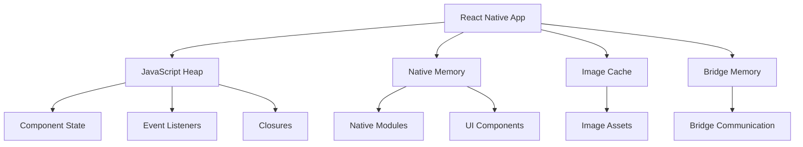

# 🧠 **Memory Optimization**

> **Master memory optimization techniques, profiling, and best practices for React Native applications**

<link rel="stylesheet" href="../../common-styles.css">

---

## 📚 **Table of Contents**

- [Memory Optimization Overview](#-memory-optimization-overview)
- [Memory Profiling](#-memory-profiling)
- [Memory Leak Prevention](#-memory-leak-prevention)
- [Image Memory Management](#-image-memory-management)
- [List Memory Optimization](#-list-memory-optimization)
- [Best Practices](#-best-practices)
- [Interview Questions](#-interview-questions)

---

## 🧠 **Memory Optimization Overview**

### **Memory Management Architecture**







### **Key Areas**
- **JavaScript Heap**: Component state, closures, event listeners
- **Native Memory**: Native modules, UI components
- **Image Cache**: Image assets and caching
- **Bridge Memory**: Communication between JS and native

---

## 📊 **Memory Profiling**

### **Memory Profiling Tools**

<button onclick="copyCode(this)" class="copy-btn">📋 Copy</button>


```javascript
import React, { useState, useCallback, useEffect } from 'react';
import { View, Text, TouchableOpacity, StyleSheet, Alert } from 'react-native';

// Memory profiling utilities
const MemoryProfiler = {
  // Get memory usage
  getMemoryUsage: () => {
    if (performance.memory) {
      return {
        usedJSHeapSize: performance.memory.usedJSHeapSize,
        totalJSHeapSize: performance.memory.totalJSHeapSize,
        jsHeapSizeLimit: performance.memory.jsHeapSizeLimit,
        usagePercentage: (performance.memory.usedJSHeapSize / performance.memory.jsHeapSizeLimit) * 100
      };
    }
    return null;
  },

  // Monitor memory usage
  startMonitoring: (interval = 1000) => {
    const memoryData = [];
    let isMonitoring = false;

    const monitor = () => {
      if (isMonitoring) {
        const memoryUsage = MemoryProfiler.getMemoryUsage();
        if (memoryUsage) {
          memoryData.push({
            ...memoryUsage,
            timestamp: new Date().toISOString()
          });
        }
        setTimeout(monitor, interval);
      }
    };

    return {
      start: () => {
        isMonitoring = true;
        monitor();
      },
      stop: () => {
        isMonitoring = false;
        return memoryData;
      },
      getData: () => memoryData
    };
  },

  // Force garbage collection (if available)
  forceGC: () => {
    if (global.gc) {
      global.gc();
      return true;
    }
    return false;
  },

  // Memory leak detection
  detectMemoryLeaks: (componentName, initialMemory) => {
    const currentMemory = MemoryProfiler.getMemoryUsage();
    if (currentMemory && initialMemory) {
      const memoryIncrease = currentMemory.usedJSHeapSize - initialMemory.usedJSHeapSize;
      const threshold = 10 * 1024 * 1024; // 10MB threshold
      
      if (memoryIncrease > threshold) {
        console.warn(`Potential memory leak detected in ${componentName}: ${memoryIncrease} bytes increase`);
        return {
          component: componentName,
          memoryIncrease,
          threshold,
          isLeak: true
        };
      }
    }
    return { isLeak: false };
  }
};

// Memory profiling demo component
const MemoryProfilingDemo = () => {
  const [memoryUsage, setMemoryUsage] = useState(null);
  const [monitoring, setMonitoring] = useState(false);
  const [memoryData, setMemoryData] = useState([]);
  const [leakDetection, setLeakDetection] = useState(null);
  const [monitor, setMonitor] = useState(null);

  // Update memory usage
  const updateMemoryUsage = useCallback(() => {
    const usage = MemoryProfiler.getMemoryUsage();
    setMemoryUsage(usage);
  }, []);

  // Start monitoring
  const handleStartMonitoring = () => {
    const newMonitor = MemoryProfiler.startMonitoring(1000);
    newMonitor.start();
    setMonitor(newMonitor);
    setMonitoring(true);
  };

  // Stop monitoring
  const handleStopMonitoring = () => {
    if (monitor) {
      const data = monitor.stop();
      setMemoryData(data);
      setMonitoring(false);
    }
  };

  // Force garbage collection
  const handleForceGC = () => {
    const success = MemoryProfiler.forceGC();
    if (success) {
      Alert.alert('Success', 'Garbage collection forced');
      updateMemoryUsage();
    } else {
      Alert.alert('Info', 'Garbage collection not available');
    }
  };

  // Detect memory leaks
  const handleDetectLeaks = () => {
    const initialMemory = MemoryProfiler.getMemoryUsage();
    
    // Simulate some operations that might cause memory leaks
    setTimeout(() => {
      const leakResult = MemoryProfiler.detectMemoryLeaks('MemoryProfilingDemo', initialMemory);
      setLeakDetection(leakResult);
    }, 2000);
  };

  // Simulate memory-intensive operations
  const handleMemoryIntensiveOperation = () => {
    const largeArray = [];
    for (let i = 0; i < 100000; i++) {
      largeArray.push({
        id: i,
        data: new Array(100).fill('data'),
        timestamp: new Date().toISOString()
      });
    }
    
    // Keep reference to prevent immediate GC
    setTimeout(() => {
      largeArray.length = 0;
      updateMemoryUsage();
    }, 5000);
    
    updateMemoryUsage();
  };

  // Update memory usage on mount and periodically
  useEffect(() => {
    updateMemoryUsage();
    const interval = setInterval(updateMemoryUsage, 2000);
    return () => clearInterval(interval);
  }, [updateMemoryUsage]);

  return (
    <View style={styles.container}>
      <Text style={styles.title}>Memory Profiling Demo</Text>
      
      {memoryUsage && (
        <View style={styles.memoryContainer}>
          <Text style={styles.memoryTitle}>Memory Usage:</Text>
          <Text style={styles.memoryText}>
            Used: {(memoryUsage.usedJSHeapSize / 1024 / 1024).toFixed(2)} MB
          </Text>
          <Text style={styles.memoryText}>
            Total: {(memoryUsage.totalJSHeapSize / 1024 / 1024).toFixed(2)} MB
          </Text>
          <Text style={styles.memoryText}>
            Limit: {(memoryUsage.jsHeapSizeLimit / 1024 / 1024).toFixed(2)} MB
          </Text>
          <Text style={styles.memoryText}>
            Usage: {memoryUsage.usagePercentage.toFixed(2)}%
          </Text>
        </View>
      )}

      <View style={styles.buttonContainer}>
        <TouchableOpacity 
          style={[styles.button, monitoring && styles.buttonDisabled]}
          onPress={handleStartMonitoring}
          disabled={monitoring}
        >
          <Text style={styles.buttonText}>
            {monitoring ? 'Monitoring...' : 'Start Monitoring'}
          </Text>
        </TouchableOpacity>

        <TouchableOpacity 
          style={[styles.button, !monitoring && styles.buttonDisabled]}
          onPress={handleStopMonitoring}
          disabled={!monitoring}
        >
          <Text style={styles.buttonText}>Stop Monitoring</Text>
        </TouchableOpacity>

        <TouchableOpacity 
          style={styles.button}
          onPress={handleForceGC}
        >
          <Text style={styles.buttonText}>Force GC</Text>
        </TouchableOpacity>

        <TouchableOpacity 
          style={styles.button}
          onPress={handleDetectLeaks}
        >
          <Text style={styles.buttonText}>Detect Leaks</Text>
        </TouchableOpacity>

        <TouchableOpacity 
          style={styles.button}
          onPress={handleMemoryIntensiveOperation}
        >
          <Text style={styles.buttonText}>Memory Intensive Op</Text>
        </TouchableOpacity>
      </View>

      {leakDetection && (
        <View style={styles.leakContainer}>
          <Text style={styles.leakTitle}>Leak Detection:</Text>
          <Text style={styles.leakText}>
            {leakDetection.isLeak ? 'Potential leak detected' : 'No leaks detected'}
          </Text>
          {leakDetection.isLeak && (
            <Text style={styles.leakText}>
              Memory increase: {(leakDetection.memoryIncrease / 1024 / 1024).toFixed(2)} MB
            </Text>
          )}
        </View>
      )}

      {memoryData.length > 0 && (
        <View style={styles.dataContainer}>
          <Text style={styles.dataTitle}>Monitoring Data:</Text>
          <Text style={styles.dataText}>
            Samples: {memoryData.length}
          </Text>
          <Text style={styles.dataText}>
            Average Usage: {(memoryData.reduce((sum, d) => sum + d.usagePercentage, 0) / memoryData.length).toFixed(2)}%
          </Text>
        </View>
      )}
    </View>
  );
};

const styles = StyleSheet.create({
  container: {
    flex: 1,
    padding: 20,
    backgroundColor: '#fff',
  },
  title: {
    fontSize: 24,
    fontWeight: 'bold',
    marginBottom: 20,
    color: '#333',
  },
  memoryContainer: {
    backgroundColor: '#e3f2fd',
    padding: 15,
    borderRadius: 8,
    marginBottom: 20,
  },
  memoryTitle: {
    fontSize: 16,
    fontWeight: 'bold',
    color: '#1976d2',
    marginBottom: 5,
  },
  memoryText: {
    fontSize: 14,
    color: '#1976d2',
    marginBottom: 2,
  },
  buttonContainer: {
    marginBottom: 20,
  },
  button: {
    backgroundColor: '#007bff',
    padding: 15,
    borderRadius: 8,
    marginBottom: 10,
    alignItems: 'center',
  },
  buttonDisabled: {
    backgroundColor: '#6c757d',
  },
  buttonText: {
    color: '#fff',
    fontSize: 16,
    fontWeight: 'bold',
  },
  leakContainer: {
    backgroundColor: '#fff3cd',
    padding: 15,
    borderRadius: 8,
    marginBottom: 10,
  },
  leakTitle: {
    fontSize: 16,
    fontWeight: 'bold',
    color: '#856404',
    marginBottom: 5,
  },
  leakText: {
    fontSize: 14,
    color: '#856404',
    marginBottom: 2,
  },
  dataContainer: {
    backgroundColor: '#d4edda',
    padding: 15,
    borderRadius: 8,
    marginBottom: 10,
  },
  dataTitle: {
    fontSize: 16,
    fontWeight: 'bold',
    color: '#155724',
    marginBottom: 5,
  },
  dataText: {
    fontSize: 14,
    color: '#155724',
    marginBottom: 2,
  },
});

export { MemoryProfiler, MemoryProfilingDemo };
```



---

## 🔒 **Memory Leak Prevention**

### **Memory Leak Prevention Patterns**

<button onclick="copyCode(this)" class="copy-btn">📋 Copy</button>


```javascript
import React, { useState, useCallback, useEffect, useRef } from 'react';
import { View, Text, TouchableOpacity, StyleSheet, Alert } from 'react-native';

// Memory leak prevention utilities
const MemoryLeakPrevention = {
  // Cleanup event listeners
  cleanupEventListeners: (listeners) => {
    listeners.forEach(listener => {
      if (listener && typeof listener.remove === 'function') {
        listener.remove();
      }
    });
  },

  // Cleanup timers
  cleanupTimers: (timers) => {
    timers.forEach(timer => {
      if (timer) {
        clearTimeout(timer);
        clearInterval(timer);
      }
    });
  },

  // Cleanup subscriptions
  cleanupSubscriptions: (subscriptions) => {
    subscriptions.forEach(subscription => {
      if (subscription && typeof subscription.unsubscribe === 'function') {
        subscription.unsubscribe();
      }
    });
  },

  // Weak reference utility
  createWeakRef: (object) => {
    if (typeof WeakRef !== 'undefined') {
      return new WeakRef(object);
    }
    // Fallback for environments without WeakRef
    return { deref: () => object };
  },

  // Memory-efficient object pool
  createObjectPool: (createFn, resetFn, maxSize = 100) => {
    const pool = [];
    let currentSize = 0;

    return {
      acquire: () => {
        if (pool.length > 0) {
          return pool.pop();
        }
        if (currentSize < maxSize) {
          currentSize++;
          return createFn();
        }
        return createFn();
      },
      
      release: (obj) => {
        if (pool.length < maxSize) {
          resetFn(obj);
          pool.push(obj);
        }
      },
      
      clear: () => {
        pool.length = 0;
        currentSize = 0;
      }
    };
  }
};

// Memory leak prevention demo component
const MemoryLeakPreventionDemo = () => {
  const [count, setCount] = useState(0);
  const [listeners, setListeners] = useState([]);
  const [timers, setTimers] = useState([]);
  const [subscriptions, setSubscriptions] = useState([]);
  const [objectPool, setObjectPool] = useState(null);
  const [pooledObjects, setPooledObjects] = useState([]);

  // Create object pool
  useEffect(() => {
    const pool = MemoryLeakPrevention.createObjectPool(
      () => ({ id: Date.now(), data: new Array(1000).fill('data') }),
      (obj) => { obj.data.length = 0; },
      10
    );
    setObjectPool(pool);
  }, []);

  // Cleanup on unmount
  useEffect(() => {
    return () => {
      // Cleanup event listeners
      MemoryLeakPrevention.cleanupEventListeners(listeners);
      
      // Cleanup timers
      MemoryLeakPrevention.cleanupTimers(timers);
      
      // Cleanup subscriptions
      MemoryLeakPrevention.cleanupSubscriptions(subscriptions);
      
      // Clear object pool
      if (objectPool) {
        objectPool.clear();
      }
    };
  }, [listeners, timers, subscriptions, objectPool]);

  // Add event listener
  const handleAddEventListener = () => {
    const listener = {
      remove: () => {
        console.log('Event listener removed');
      }
    };
    setListeners(prev => [...prev, listener]);
    setCount(prev => prev + 1);
  };

  // Add timer
  const handleAddTimer = () => {
    const timer = setTimeout(() => {
      console.log('Timer executed');
    }, 5000);
    setTimers(prev => [...prev, timer]);
    setCount(prev => prev + 1);
  };

  // Add subscription
  const handleAddSubscription = () => {
    const subscription = {
      unsubscribe: () => {
        console.log('Subscription unsubscribed');
      }
    };
    setSubscriptions(prev => [...prev, subscription]);
    setCount(prev => prev + 1);
  };

  // Acquire object from pool
  const handleAcquireObject = () => {
    if (objectPool) {
      const obj = objectPool.acquire();
      setPooledObjects(prev => [...prev, obj]);
      setCount(prev => prev + 1);
    }
  };

  // Release object to pool
  const handleReleaseObject = () => {
    if (objectPool && pooledObjects.length > 0) {
      const obj = pooledObjects[pooledObjects.length - 1];
      objectPool.release(obj);
      setPooledObjects(prev => prev.slice(0, -1));
      setCount(prev => prev + 1);
    }
  };

  // Clear all resources
  const handleClearAll = () => {
    MemoryLeakPrevention.cleanupEventListeners(listeners);
    MemoryLeakPrevention.cleanupTimers(timers);
    MemoryLeakPrevention.cleanupSubscriptions(subscriptions);
    
    if (objectPool) {
      objectPool.clear();
    }
    
    setListeners([]);
    setTimers([]);
    setSubscriptions([]);
    setPooledObjects([]);
    setCount(0);
    
    Alert.alert('Success', 'All resources cleared');
  };

  return (
    <View style={styles.container}>
      <Text style={styles.title}>Memory Leak Prevention Demo</Text>
      
      <View style={styles.statsContainer}>
        <Text style={styles.statsTitle}>Resource Count:</Text>
        <Text style={styles.statsText}>Total: {count}</Text>
        <Text style={styles.statsText}>Event Listeners: {listeners.length}</Text>
        <Text style={styles.statsText}>Timers: {timers.length}</Text>
        <Text style={styles.statsText}>Subscriptions: {subscriptions.length}</Text>
        <Text style={styles.statsText}>Pooled Objects: {pooledObjects.length}</Text>
      </View>

      <View style={styles.buttonContainer}>
        <TouchableOpacity 
          style={styles.button}
          onPress={handleAddEventListener}
        >
          <Text style={styles.buttonText}>Add Event Listener</Text>
        </TouchableOpacity>

        <TouchableOpacity 
          style={styles.button}
          onPress={handleAddTimer}
        >
          <Text style={styles.buttonText}>Add Timer</Text>
        </TouchableOpacity>

        <TouchableOpacity 
          style={styles.button}
          onPress={handleAddSubscription}
        >
          <Text style={styles.buttonText}>Add Subscription</Text>
        </TouchableOpacity>

        <TouchableOpacity 
          style={styles.button}
          onPress={handleAcquireObject}
        >
          <Text style={styles.buttonText}>Acquire Object</Text>
        </TouchableOpacity>

        <TouchableOpacity 
          style={styles.button}
          onPress={handleReleaseObject}
        >
          <Text style={styles.buttonText}>Release Object</Text>
        </TouchableOpacity>

        <TouchableOpacity 
          style={styles.clearButton}
          onPress={handleClearAll}
        >
          <Text style={styles.buttonText}>Clear All</Text>
        </TouchableOpacity>
      </View>
    </View>
  );
};

const styles = StyleSheet.create({
  container: {
    flex: 1,
    padding: 20,
    backgroundColor: '#fff',
  },
  title: {
    fontSize: 24,
    fontWeight: 'bold',
    marginBottom: 20,
    color: '#333',
  },
  statsContainer: {
    backgroundColor: '#e3f2fd',
    padding: 15,
    borderRadius: 8,
    marginBottom: 20,
  },
  statsTitle: {
    fontSize: 16,
    fontWeight: 'bold',
    color: '#1976d2',
    marginBottom: 5,
  },
  statsText: {
    fontSize: 14,
    color: '#1976d2',
    marginBottom: 2,
  },
  buttonContainer: {
    marginBottom: 20,
  },
  button: {
    backgroundColor: '#007bff',
    padding: 15,
    borderRadius: 8,
    marginBottom: 10,
    alignItems: 'center',
  },
  clearButton: {
    backgroundColor: '#dc3545',
    padding: 15,
    borderRadius: 8,
    marginBottom: 10,
    alignItems: 'center',
  },
  buttonText: {
    color: '#fff',
    fontSize: 16,
    fontWeight: 'bold',
  },
});

export { MemoryLeakPrevention, MemoryLeakPreventionDemo };
```



---

## 🖼️ **Image Memory Management**

### **Image Memory Optimization**

<button onclick="copyCode(this)" class="copy-btn">📋 Copy</button>


```javascript
import React, { useState, useCallback, useEffect } from 'react';
import { View, Text, TouchableOpacity, StyleSheet, Image, Dimensions } from 'react-native';

// Image memory management utilities
const ImageMemoryManager = {
  // Image cache management
  imageCache: new Map(),
  maxCacheSize: 50 * 1024 * 1024, // 50MB
  currentCacheSize: 0,

  // Add image to cache
  addToCache: (uri, imageData) => {
    const size = imageData.length || 0;
    
    // Check if cache is full
    if (ImageMemoryManager.currentCacheSize + size > ImageMemoryManager.maxCacheSize) {
      ImageMemoryManager.cleanupCache();
    }
    
    ImageMemoryManager.imageCache.set(uri, {
      data: imageData,
      size,
      timestamp: Date.now(),
      accessCount: 0
    });
    
    ImageMemoryManager.currentCacheSize += size;
  },

  // Get image from cache
  getFromCache: (uri) => {
    const cached = ImageMemoryManager.imageCache.get(uri);
    if (cached) {
      cached.accessCount++;
      cached.lastAccessed = Date.now();
      return cached.data;
    }
    return null;
  },

  // Cleanup cache
  cleanupCache: () => {
    const entries = Array.from(ImageMemoryManager.imageCache.entries());
    
    // Sort by access count and last accessed time
    entries.sort((a, b) => {
      const [, cacheA] = a;
      const [, cacheB] = b;
      
      // Prioritize recently accessed and frequently accessed items
      const scoreA = cacheA.accessCount * 0.7 + (Date.now() - cacheA.lastAccessed) * 0.3;
      const scoreB = cacheB.accessCount * 0.7 + (Date.now() - cacheB.lastAccessed) * 0.3;
      
      return scoreA - scoreB;
    });
    
    // Remove least important items
    const toRemove = entries.slice(0, Math.floor(entries.length * 0.3));
    toRemove.forEach(([uri, cache]) => {
      ImageMemoryManager.imageCache.delete(uri);
      ImageMemoryManager.currentCacheSize -= cache.size;
    });
  },

  // Clear cache
  clearCache: () => {
    ImageMemoryManager.imageCache.clear();
    ImageMemoryManager.currentCacheSize = 0;
  },

  // Get cache statistics
  getCacheStats: () => {
    const entries = Array.from(ImageMemoryManager.imageCache.values());
    const totalSize = entries.reduce((sum, entry) => sum + entry.size, 0);
    const averageSize = entries.length > 0 ? totalSize / entries.length : 0;
    
    return {
      count: entries.length,
      totalSize,
      averageSize,
      maxSize: ImageMemoryManager.maxCacheSize,
      usagePercentage: (totalSize / ImageMemoryManager.maxCacheSize) * 100
    };
  },

  // Optimize image size
  optimizeImageSize: (uri, maxWidth, maxHeight) => {
    return new Promise((resolve, reject) => {
      Image.getSize(uri, (width, height) => {
        const aspectRatio = width / height;
        let newWidth = width;
        let newHeight = height;
        
        if (width > maxWidth) {
          newWidth = maxWidth;
          newHeight = newWidth / aspectRatio;
        }
        
        if (newHeight > maxHeight) {
          newHeight = maxHeight;
          newWidth = newHeight * aspectRatio;
        }
        
        resolve({ width: newWidth, height: newHeight });
      }, reject);
    });
  }
};

// Image memory management demo component
const ImageMemoryManagementDemo = () => {
  const [images, setImages] = useState([]);
  const [cacheStats, setCacheStats] = useState(null);
  const [loading, setLoading] = useState(false);

  // Update cache statistics
  const updateCacheStats = useCallback(() => {
    const stats = ImageMemoryManager.getCacheStats();
    setCacheStats(stats);
  }, []);

  // Load image
  const handleLoadImage = async () => {
    setLoading(true);
    
    try {
      // Simulate loading an image
      const imageUri = `https://picsum.photos/400/300?random=${Date.now()}`;
      
      // Check cache first
      let imageData = ImageMemoryManager.getFromCache(imageUri);
      
      if (!imageData) {
        // Simulate image data
        imageData = new Array(1000).fill('image-data');
        ImageMemoryManager.addToCache(imageUri, imageData);
      }
      
      setImages(prev => [...prev, { uri: imageUri, id: Date.now() }]);
      updateCacheStats();
    } catch (error) {
      console.error('Error loading image:', error);
    } finally {
      setLoading(false);
    }
  };

  // Clear cache
  const handleClearCache = () => {
    ImageMemoryManager.clearCache();
    updateCacheStats();
  };

  // Optimize images
  const handleOptimizeImages = async () => {
    setLoading(true);
    
    try {
      const optimizedImages = [];
      
      for (const image of images) {
        try {
          const optimizedSize = await ImageMemoryManager.optimizeImageSize(
            image.uri, 
            200, 
            200
          );
          optimizedImages.push({
            ...image,
            optimizedSize
          });
        } catch (error) {
          console.error('Error optimizing image:', error);
          optimizedImages.push(image);
        }
      }
      
      setImages(optimizedImages);
    } catch (error) {
      console.error('Error optimizing images:', error);
    } finally {
      setLoading(false);
    }
  };

  // Remove image
  const handleRemoveImage = (id) => {
    setImages(prev => prev.filter(img => img.id !== id));
  };

  // Update cache stats on mount and when images change
  useEffect(() => {
    updateCacheStats();
  }, [updateCacheStats, images]);

  return (
    <View style={styles.container}>
      <Text style={styles.title}>Image Memory Management Demo</Text>
      
      {cacheStats && (
        <View style={styles.statsContainer}>
          <Text style={styles.statsTitle}>Cache Statistics:</Text>
          <Text style={styles.statsText}>Images: {cacheStats.count}</Text>
          <Text style={styles.statsText}>
            Size: {(cacheStats.totalSize / 1024 / 1024).toFixed(2)} MB
          </Text>
          <Text style={styles.statsText}>
            Usage: {cacheStats.usagePercentage.toFixed(2)}%
          </Text>
          <Text style={styles.statsText}>
            Average Size: {(cacheStats.averageSize / 1024).toFixed(2)} KB
          </Text>
        </View>
      )}

      <View style={styles.buttonContainer}>
        <TouchableOpacity 
          style={[styles.button, loading && styles.buttonDisabled]}
          onPress={handleLoadImage}
          disabled={loading}
        >
          <Text style={styles.buttonText}>
            {loading ? 'Loading...' : 'Load Image'}
          </Text>
        </TouchableOpacity>

        <TouchableOpacity 
          style={styles.button}
          onPress={handleOptimizeImages}
          disabled={loading || images.length === 0}
        >
          <Text style={styles.buttonText}>Optimize Images</Text>
        </TouchableOpacity>

        <TouchableOpacity 
          style={styles.clearButton}
          onPress={handleClearCache}
        >
          <Text style={styles.buttonText}>Clear Cache</Text>
        </TouchableOpacity>
      </View>

      <View style={styles.imagesContainer}>
        <Text style={styles.imagesTitle}>Loaded Images:</Text>
        {images.map((image, index) => (
          <View key={image.id} style={styles.imageItem}>
            <Image 
              source={{#123;{{#123; uri: image.uri }}#125;}}#125; 
              style={styles.image}
              resizeMode="cover"
            />
            <View style={styles.imageInfo}>
              <Text style={styles.imageText}>Image {index + 1}</Text>
              {image.optimizedSize && (
                <Text style={styles.imageText}>
                  Optimized: {image.optimizedSize.width}x{image.optimizedSize.height}
                </Text>
              )}
              <TouchableOpacity 
                style={styles.removeButton}
                onPress={() => handleRemoveImage(image.id)}
              >
                <Text style={styles.removeButtonText}>Remove</Text>
              </TouchableOpacity>
            </View>
          </View>
        ))}
      </View>
    </View>
  );
};

const styles = StyleSheet.create({
  container: {
    flex: 1,
    padding: 20,
    backgroundColor: '#fff',
  },
  title: {
    fontSize: 24,
    fontWeight: 'bold',
    marginBottom: 20,
    color: '#333',
  },
  statsContainer: {
    backgroundColor: '#e3f2fd',
    padding: 15,
    borderRadius: 8,
    marginBottom: 20,
  },
  statsTitle: {
    fontSize: 16,
    fontWeight: 'bold',
    color: '#1976d2',
    marginBottom: 5,
  },
  statsText: {
    fontSize: 14,
    color: '#1976d2',
    marginBottom: 2,
  },
  buttonContainer: {
    marginBottom: 20,
  },
  button: {
    backgroundColor: '#007bff',
    padding: 15,
    borderRadius: 8,
    marginBottom: 10,
    alignItems: 'center',
  },
  buttonDisabled: {
    backgroundColor: '#6c757d',
  },
  clearButton: {
    backgroundColor: '#dc3545',
    padding: 15,
    borderRadius: 8,
    marginBottom: 10,
    alignItems: 'center',
  },
  buttonText: {
    color: '#fff',
    fontSize: 16,
    fontWeight: 'bold',
  },
  imagesContainer: {
    flex: 1,
  },
  imagesTitle: {
    fontSize: 18,
    fontWeight: 'bold',
    marginBottom: 10,
    color: '#333',
  },
  imageItem: {
    flexDirection: 'row',
    marginBottom: 10,
    padding: 10,
    backgroundColor: '#f8f9fa',
    borderRadius: 8,
  },
  image: {
    width: 80,
    height: 80,
    borderRadius: 4,
    marginRight: 10,
  },
  imageInfo: {
    flex: 1,
    justifyContent: 'center',
  },
  imageText: {
    fontSize: 14,
    color: '#333',
    marginBottom: 5,
  },
  removeButton: {
    backgroundColor: '#dc3545',
    padding: 5,
    borderRadius: 4,
    alignSelf: 'flex-start',
  },
  removeButtonText: {
    color: '#fff',
    fontSize: 12,
    fontWeight: 'bold',
  },
});

export { ImageMemoryManager, ImageMemoryManagementDemo };
```



---

## 🎯 **Best Practices**

### **1. Memory Optimization**
- Monitor memory usage regularly
- Use memory profiling tools
- Implement proper cleanup
- Optimize image handling

### **2. Memory Leak Prevention**
- Clean up event listeners
- Clear timers and intervals
- Unsubscribe from observables
- Use object pools for frequent allocations

### **3. Image Memory Management**
- Implement image caching
- Optimize image sizes
- Use appropriate image formats
- Clear unused images

---

## ❓ **Interview Questions**

### **Basic Questions**
1. **How do you optimize memory usage in React Native?**
2. **What are common memory leaks in React Native?**
3. **How do you handle image memory management?**

### **Advanced Questions**
1. **How would you implement memory profiling?**
2. **Explain different memory optimization techniques.**
3. **How do you prevent memory leaks in components?**

### **Practical Questions**
1. **Implement memory profiling tools.**
2. **Create an image memory management system.**
3. **Design a memory leak prevention strategy.**

---

## 🧭 Navigation

<div class="navigation">
    <a href="../15-Error-Handling-Recovery/04-Error-Reporting-Analytics.md" class="nav-link prev">⬅️ Previous: Error Reporting & Analytics</a>
    <a href="./02-Memory-Leak-Detection.md" class="nav-link next">Next: Memory Leak Detection ➡️</a>
</div>

---

<script src="../../common-scripts.js"></script>

*Last updated: December 2024*

